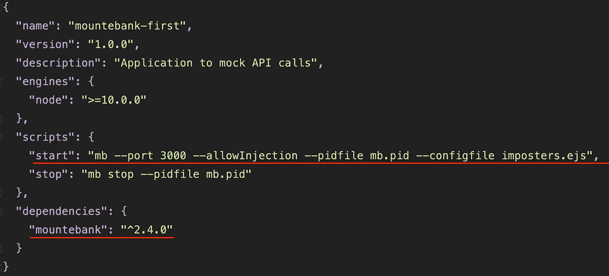
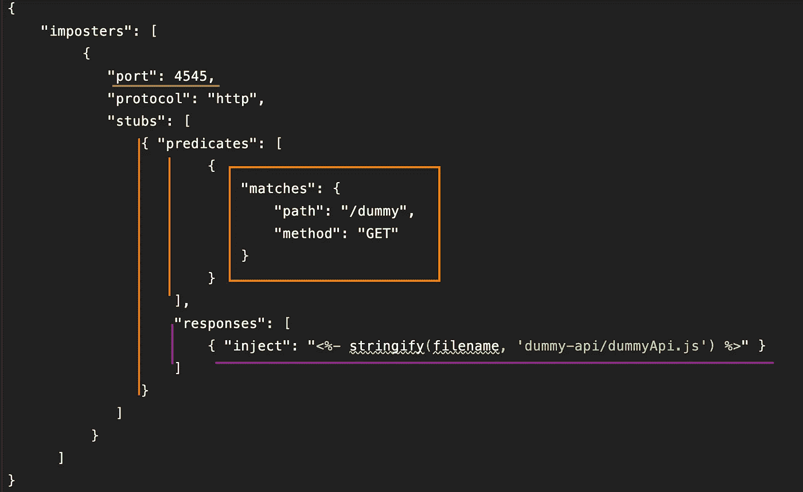
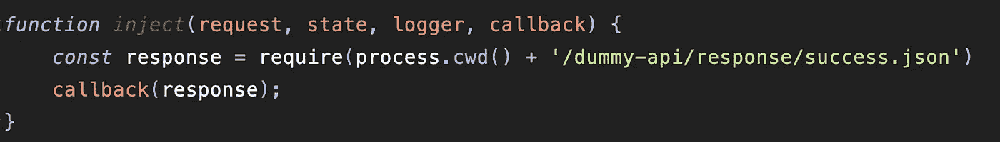
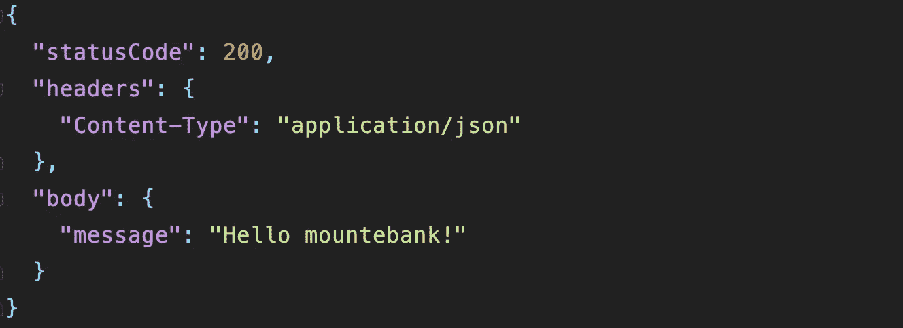
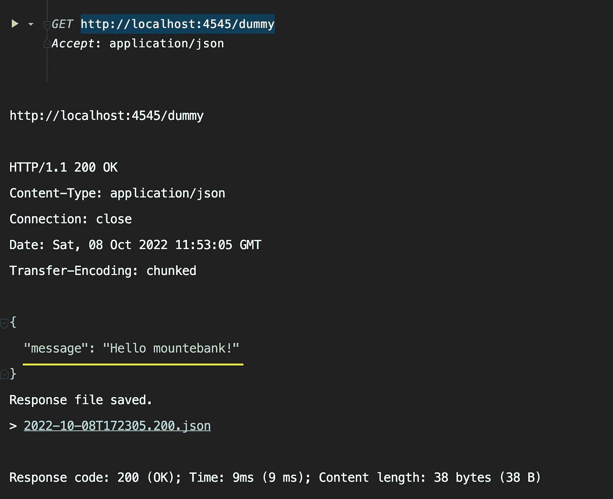

# 使用 JavaScript 的最简单的 Mountebank 设置

> 原文：<https://medium.com/geekculture/simplest-mountebank-setup-using-javascript-ccde1b7ef07?source=collection_archive---------10----------------------->

Mountebank 工具广泛用于为我们不想使用实际 API 的较低环境设置模拟 API。

**这里是如何，最基本的安装程序可以做-**

*   使用添加了 mountebank 依赖项的`package.json`创建一个空项目。
*   添加用于启动 mountebank 实例的启动脚本。参考以下链接，了解如何配置命令`mb start`。

 [## mountebank -命令行

### 启动 mountebank 的命令行参数

www.mbtest.org](https://www.mbtest.org/docs/commandLine) 

sample package.json

*   创建一个`imposters.ejs`文件，它将成为 mountebank 查找请求谓词及其响应的入口点。

sample imposters.ejs

在上面的冒名顶替文件中，我们指定了-

1.  **端口**:来自这个指定端口的请求将被 mountebank 监听和处理。
2.  **协议**:将被监听和处理的请求协议。
3.  **存根**:不同请求的请求谓词和响应可以作为这个数组的一部分添加。
4.  **谓词**:满足这些特定谓词(条件)的请求将得到相应的响应。
5.  **responses** :满足指定谓词的请求将由该键下定义的响应提供服务。

有关这些密钥的更多信息，请访问-

 [## 江湖骗子谓词

### 在没有谓词的情况下，网络上的测试加倍，存根总是匹配的，并且从来没有…

www.mbtest.org](https://www.mbtest.org/docs/api/predicates) 

我们可以看到响应是从文件`dummyApi.js`中注入的，如下所示

dummyApi.js

success.json

在 javascript 文件中，我们注入了`success.json`响应，并用该响应调用由 mountebank 提供的**回调方法。**

回调方法将这个响应返回给调用者。

关于`inject`函数参数的信息可在以下位置找到-

 [## 江湖骗子注入

### 使用自定义 JavaScript 脚本扩展 mountebank

www.mbtest.org](http://www.mbtest.org/docs/api/injection) 

现在，当我们执行`yarn start`并尝试访问 mountebank 正在监听的端点`[http://localhost:4545/dummy](http://localhost:4545/dummy)`时，它**应该会返回我们已经为这个特定 GET 请求配置的成功响应**。

The mock API call

因此，我们可以通过这些简单的步骤用 javascript 设置 mountebank。通过阅读 mountebank 文档并根据我们的需要进行调整，可以在这个基本设置的基础上做很多事情。

这是上面项目的 github 链接，你可以随意克隆它并做自己的实验

 [## GitHub-yogeshnikam 671/Mountebank-first:Mountebank POC

### 此时您不能执行该操作。您已使用另一个标签页或窗口登录。您已在另一个选项卡中注销，或者…

github.com](https://github.com/yogeshnikam671/mountebank-first)