# 使用 Python 简单地删除 PDF 密码

> 原文：<https://medium.com/geekculture/simply-removing-pdf-password-using-python-8966700089c9?source=collection_archive---------0----------------------->


Photo by [eelias](https://unsplash.com/@eelias?utm_source=unsplash&utm_medium=referral&utm_content=creditCopyText) on [Unsplash](https://unsplash.com/s/photos/locked?utm_source=unsplash&utm_medium=referral&utm_content=creditCopyText)

可移植文档格式(PDF)是作为 ISO 32000 标准化的标准文件文档。文件。它通常用于用户手册、电子书、申请表、扫描文档等。PDF 可以使用密码保护，所以不是每个人都可以访问它。

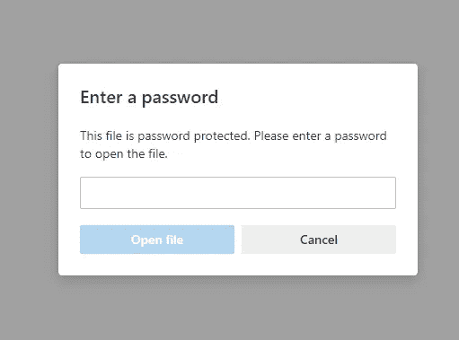

The standard look of PDF protected file

密码的目的是为了安全。但是现在，我们需要记住的密码太多了，对吗？此外，并不是所有东西都需要保护。所以我们需要选择我们应该保护什么或者不保护什么。为什么？因为作为人类，我们容易被遗忘。你有没有遇到过想打开一个文件却忘记密码的情况？它困扰你的生活吗？

我也经历过那样的情况。从那以后，我喜欢决定某样东西是否需要保护。在这篇文章中，我想分享我关于删除 PDF 密码的知识，这样它们就不会再打扰你的生活了。以防你忘记，我最后一次提醒。

> 这不是破解 PDF 密码教程，这是移除 PDF 密码教程，所以你至少需要密码才能先打开文件。

经过一些研究，我将向您展示您应该知道的关于删除 PDF 密码的三大解决方案。

# 解决方案一:使用浏览器删除 PDF 密码

这个解决方案只需要一个浏览器来完成。在受保护的文档中，您将被告知该文件具有有限的权限。要查看详细信息，请单击查看权限。

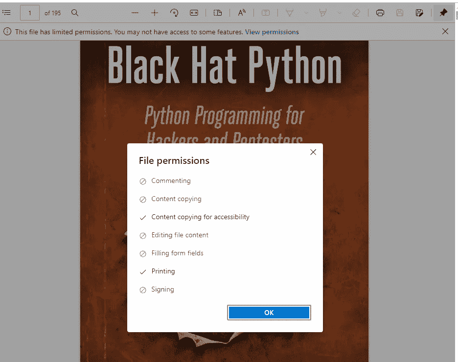

PDF file permissions

文件权限五花八门，有时只是保护打开过程，但有时就像上图一样，我们无法复制文档内部的内容或注释。只要打印选项可用，这个解决方案就有效。让我们清除密码。

你在浏览器的右上角看到文件的打印选项了吗？只要点击它。

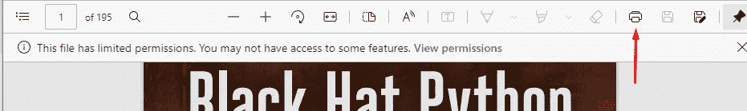

Clear PDF password using the print method

与其选择您的打印机选项，不如将其更改为“另存为 PDF”，然后单击“保存”。

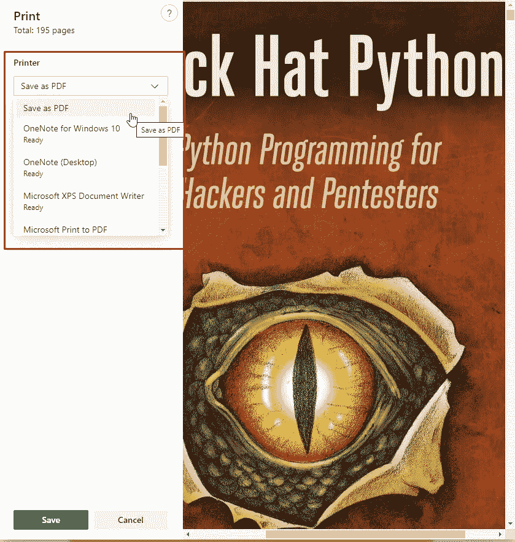

Change the printer options into Save as PDF

将弹出一个新窗口。以您想要的名称保存 PDF 文件。

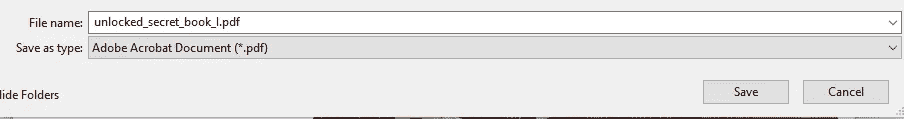

Saving PDF file with a new name

恭喜你，你再也不需要在打开文件时输入密码了。

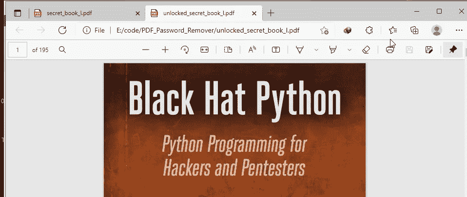

Your PDF file password will not ask the password from you anymore

这种解决方案只有在打印机选项在 PDF 文件中可用时才有效，因为如果选项不可用，这种方式就没用了。

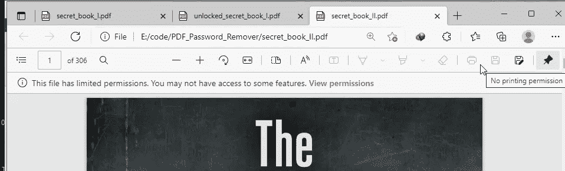

Print options are not available in the PDF file.

# 解决方案二:删除 PDF 密码 PDF-XChange Viewer

在第二个解决方案中，我们可以使用 PDF-Xchange Viewer 删除 PDF 密码。此应用程序是 Adobe Acrobat DC 的替代产品。你可以在这里下载[。打开您想要清除密码的 PDF 文档。](https://drive.google.com/drive/folders/1p2CJIoKi7oIHqxBmCuvdMI6UobuETnvV?usp=sharing)

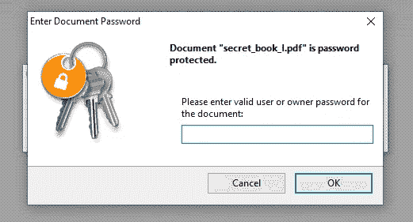

Input the PDF Password to open the document

您将找到带有[安全]名称的文件标题。这意味着文档是受保护的。

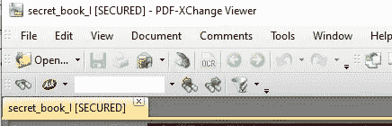

The PDF file is secured.

要清除密码，请在键盘上按 CTRL+D。然后在“安全类别”的“安全方法”中选择“无安全”。

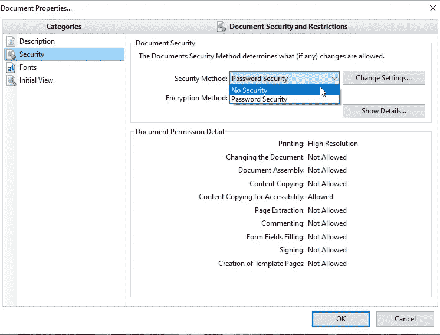

Change the Security Method with No Security to remove the password

您将再次被询问密码；如果您知道更改文档的密码，您可以删除该密码。请记住，此密码不同于您在打开文档时使用的密码。

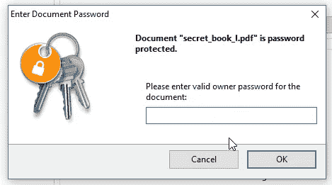

Input the changing password permissions

将有一个最终通知，以确保您要清除 PDF 文件的安全性。只需点击是

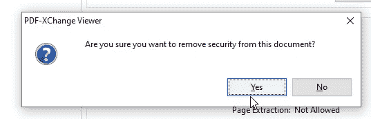

Final notifications for removing PDF password

最后，保存您的文件，PDF 文件将不再要求您输入密码。

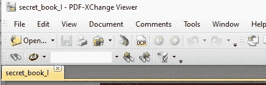

The PDF file is not secured

注意，这个解决方案需要你知道**打开**和**更改**文档的密码。如果你只知道打开文档的密码，这些解决方案就不起作用。

# 解决方案三:使用 Python 删除 PDF 密码

最终的解决方案是使用 Python 这些解决方案绕过了之前两种解决方案的所有缺点。唯一的要求是你知道如何运行 Python 脚本。这是我创建的脚本。

从代码中，我们需要一个名为`pikepdf` this library 的库来修改 PDF 文件；你可以在这里阅读完整的文档[。这个脚本的优点是，您可以删除 PDF 密码只有开放的密码。要安装该库，请在命令行中写入以下内容。](https://pypi.org/project/pikepdf/)

```
pip install pikepdf
```

下面这个视频是我从一个名为“secret_book_II.pdf”的受保护文件中清除密码的文档。您已经知道该文件受打印保护。

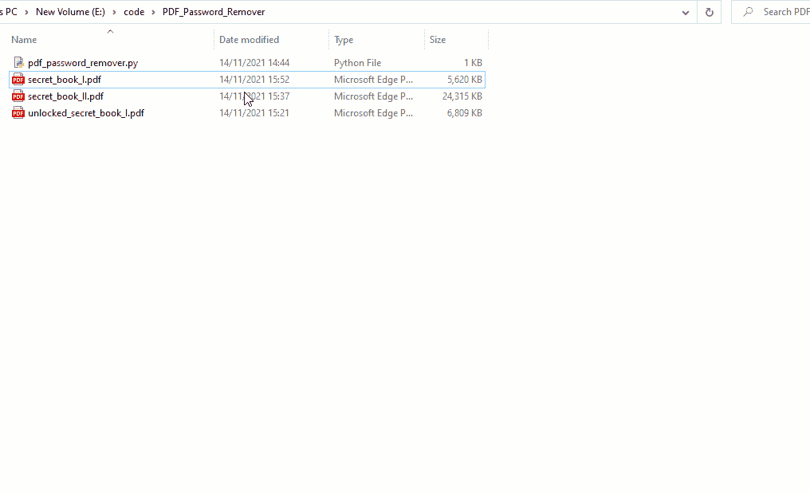

恭喜你，现在，你可以打开 PDF 文件，而不用担心密码。

# 结论

最后，我们进入结论部分；在这篇文章中，我已经告诉了你三种删除 PDF 密码的方法，这样无论何时你登录到这个文件，你都不会感到麻烦。此外，在最终的解决方案中，我分享了关于使用 Python 删除密码的内容。使用 Python 方式，我们可以绕过打印机限制，更改密码权限来清除密码。那么你最喜欢哪种方式呢？

谢谢，如果可以的话，请支持我为这篇文章制作的知识库。

[](https://github.com/theDreamer911/PDF_Password_Remover) [## GitHub-the dreamer 911/PDF _ Password _ Remover:这个库用于清除 PDF 密码，使用…

### 这个库用于使用 Python 清除 PDF 密码，这是一个开源项目，可以随意使用。首先…

github.com](https://github.com/theDreamer911/PDF_Password_Remover) 

祝你代码✌愉快