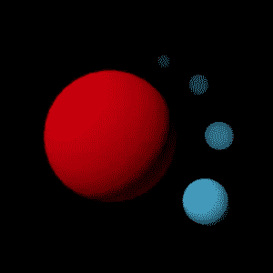

# 用一些卫星模拟一个基本的牛顿系统

> 原文：<https://medium.com/geekculture/simulating-a-basic-newtonian-system-with-some-moons-26680be8e9c8?source=collection_archive---------21----------------------->

## 这是我接受 2019《代码降临》挑战的另一个故事:)

[上周](/geekculture/exploring-and-traversing-a-maze-c822790506a9)，我谈了一点关于 [**代码**](https://adventofcode.com/2020/about) **(AoC)挑战**的来临，以及我如何在 2019 年对它产生兴趣。所以今天，我将分享另一个 AoC 的故事:我对**“N 体问题”**的看法。