# 模拟真实的 SQL 环境

> 原文：<https://medium.com/geekculture/simulating-a-real-world-sql-environment-63784f7f37ae?source=collection_archive---------38----------------------->

## 使用 PostgreSQL、pgAdmin 4 和 Pagila 数据集的教程。


Postgres is an open-source project under a liberal Open Source license. [You can find the PostgreSQL licence here](https://www.postgresql.org/about/licence/)

以下教程将引导您完成以下任务:

1.  将 PostgreSQL 和 pgAdmin 4 下载到您自己的 PC 或环境中。
2.  连接到 PostgreSQL 服务器
3.  下载并加载 Pagila 数据库集(基于著名的 Sakila 训练数据库)。
4.  提供详细描述这些步骤的资源和 Github 资源库的链接。将包括数据和问题集。

当我很快通过许多不同的方法自学 SQL 时，我开始注意到它们中很少真正体现出在野外使用数据库查询语言的真实感受。我也渴望了解 SQL 和使用它的数据库管理系统(DBMS)之间更深层次的关系。这让我想到，肯定有一个数据集可以让我创建一个真实世界的环境来练习。令我高兴的是，有。Sakila 是为培训 MySQL 用户而创建的，不久之后 Pagila 是为培训 PostgreSQL 新用户而创建的。稍后我将介绍我是在哪里找到以及如何使用 Pagila 数据的。你也可以在下面的电影图片下找到它的链接。


The Pagila Database is a copy of the Sakila database and is designed more specifically for Postgre SQL learning. You can find the version of the database that I used here: [Pagila Database by Devrim Gündüz](https://github.com/devrimgunduz/pagila). There is another Github repository that may also be helpful found here: Pagila by [Robert Treat](https://github.com/xzilla).

Pagila 数据库是一组模拟的表，模拟了一家音像店连锁店的操作和数据。想想大约 20 世纪 90 年代的 Blockbuster 视频。乍一看，视频商店的用例可能与后 Blockbuster 世界不太相关，但我向您保证，这个数据集仍然可以很好地模拟许多零售环境或有收入、客户和产品的环境。

# 1.让我们开始吧:下载 PostgreSQL

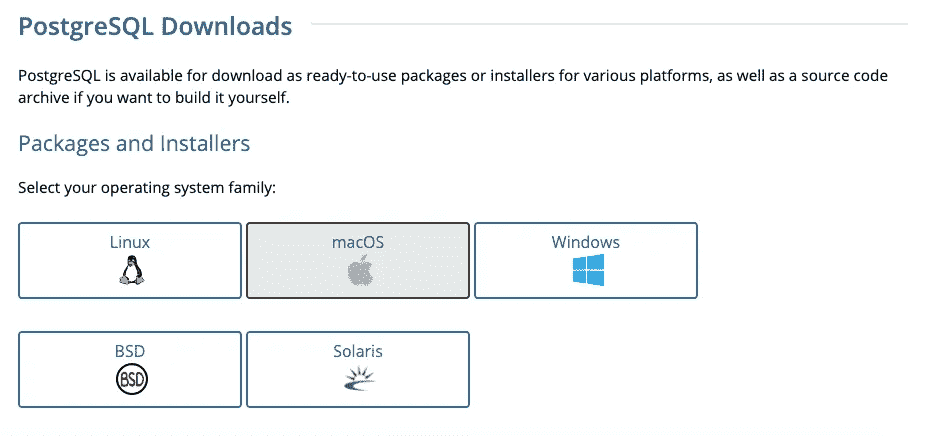

[Download PostgreSQL](https://www.postgresql.org/download/)

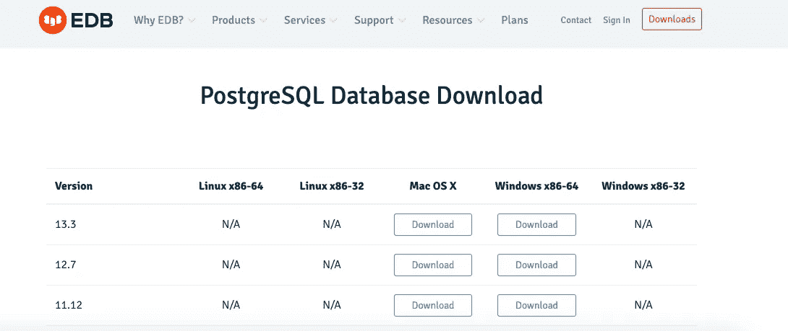

I downloaded the Mac installer from EDB for PostgreSQL Version 13.3 here: [PostgreSQL 13.3 from EDB](https://www.postgresql.org/download/)

[下载 PostgreSQL](https://www.postgresql.org/download/) 。您可以通过多种方式做到这一点(所有方式都包含在链接中)。我选择使用 EDB 的交互式安装程序，但可能有一些选项更容易，事实上更好。如果我花时间重新来过，我可能会选择 postgres.app。postgres.app 安装不仅允许简单的下载和安装，甚至可能有比 pgAdmin 4 更直观的 GUI。尽管如此，pgAdmin 工作得很好，如果您喜欢命令行的使用，我相信所有这些实现也允许在 CLI 上使用 SQL。

*   我用的是 Mac，所以我从 EDB 下载了[安装程序。](https://www.postgresql.org/download/macosx/)安装程序会将图像保存到您的电脑上，并打开一个文件夹。
*   点击文件夹，会弹出一个安装程序。按照提示操作。

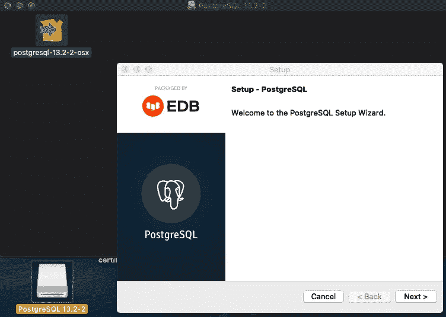

You can see the You can see the PostgreSQL 13.2–2 image file in the top left of this pic. Click on that box with the arrow going right and then the PostgreSQL 13.2–2 app image (bottom-left of pic) will pop up. Click on that disk-drive looking file and the installer will open up. Follow the prompts on the setup wizard. Click “Next”.

在安装过程中，会出现一个提示，要求您选择您的语言环境。这是您设置包括语言在内的文化偏好的地方。选择正确的地区是很重要的**。**例如，如果你在美国，你会选择 en_US。UTF-8。

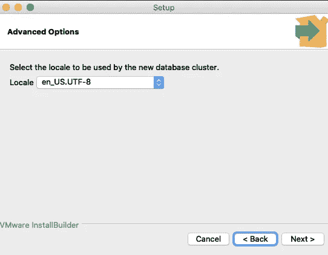

It is important that you select the right locale here. If in United States then select the one pictured above.

*   然后，安装程序会显示您的安装配置摘要。


Pre-install summary. Your configurations should look fairly similar.

*   单击“下一步”进行安装。

# 2.设置 Postgre SQL Server

这里有一个非常好的教程，可以带你完成 Postgre SQL 服务器的设置:[连接到一个 PostgreSQL 服务器数据库。或者你也可以按照我下面快速而不太彻底的指示去做。](https://www.postgresqltutorial.com/connect-to-postgresql-database/)

## 在 Mac 上连接的两种方式(基于应用程序或基于终端)

**基于终端的服务器连接(使用 psql)**

一种连接方式是使用 psql SQL shell，特别是如果您喜欢使用命令行的话。

1.  对于基于终端的应用程序，您需要打开 psql 应用程序，该应用程序应该已经在前面的步骤中作为 PostgreSQL 包的一部分下载。这将打开一个 SQL Shell。在 mac 上，我只需在搜索栏中输入“psql ”,或者你可以去应用程序文件夹中找到它。
2.  然后，您将输入服务器名称、数据库名称、端口、您的用户名和密码。您也可以按回车键，默认值将被填入。默认值显示在每个提示旁边的括号中。
3.  最后，您可以通过编写 SQL 语句直接与 PostgreSQL 数据库服务器交互。以下语句显示了 PostgreSQL 中的所有数据库。通常只有一个模板数据库可以启动。

```
\l 
```

**基于应用的服务器连接(使用 pgAdmin 4)**

您也可以使用 pgAdmin 4 web-app。这允许您通过用户友好的 GUI 连接 PostgreSQL 数据库服务器并与之交互。

1.  启动 pgAdmin 应用程序。同样，我只是在 mac 上使用了搜索栏，但你也可以通过命令行和应用程序文件夹找到它。
2.  我看过的一个教程说，pgAdmin 将在网络浏览器中打开，但当我打开它时，pgAdmin 实际上是在 Mac dock 上自己的应用程序中打开的。

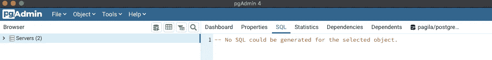

When you launch pgAdmin it will open in its own application window on Mac. It will look something like this.

3.右键单击“服务器”并选择**创建>服务器**

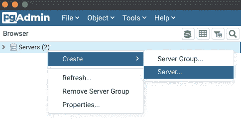

This will create a server in pgAdmin 4

4.输入服务器名称(您希望的任何名称)

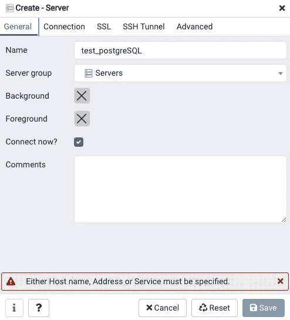

I used “test_postgreSQL” as my server name. After this step click the “Connection” tab up top.

5.单击连接选项卡并输入主机和密码。这是您在 PostgreSQL 安装过程中创建的用户名和密码。

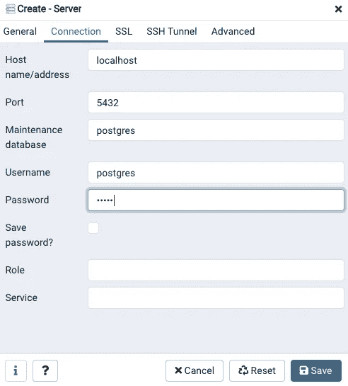

This will be the username and password you created in the PostgreSQL installation process.

6.展开 servers 集群，然后展开 databases 节点，您会看到已经安装了一个名为 postgres 的默认数据库。忽略下图中的 Pagila 数据库。我已经下载了，所以它显示一个未连接的数据库。

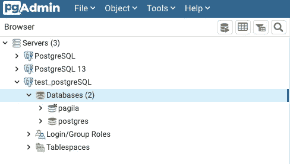

Ignore the pagila database here. I already had it installed at time of pic.

导航到所需的数据库后，您可以单击它，然后单击查询工具。你可以用两种方法来做这件事。单击“工具”下拉菜单，然后单击“查询工具”选项，或者单击看起来像带有“播放”标志的数据库的图标。

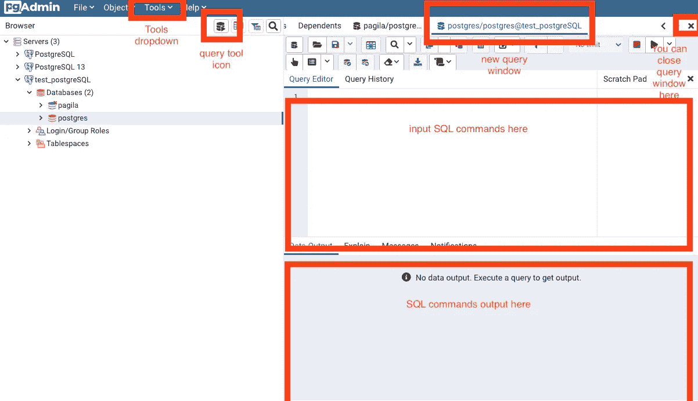

diagram describing how to access and use the query tool

7.在编辑器中输入一个查询，然后单击执行按钮

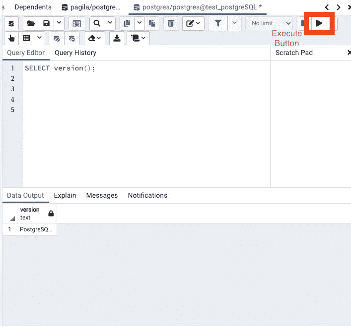

Click execute button to run query. Result will output below in the Data Output field.

# 3.下载并加载 Pagila 数据库

我发现有两个很好的 githubs 存放着 Pagila 数据库。我用的是 Devrim Gündüz 的 [Pagila 数据库。这是我发现的第一个有数据库和关于它是什么和它如何工作的清楚说明的。如果你喜欢使用容器化的环境，他也有一个在 Docker 中实现数据库的教程。在这个过程中，我假设你已经有一个 github 帐户，并知道如何使用 git。如果你没有，那么你可以](https://github.com/devrimgunduz/pagila)[在这里创建一个 github 账户](https://github.com/join)并熟悉 [github 教程](https://guides.github.com/)。

## 分叉储存库

从存储库中复制 https 或 ssh 链接以克隆它

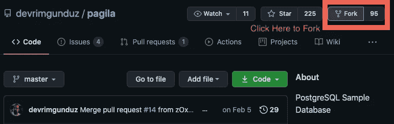

This will create a forked copy of this repository into your own github repository. It will also navigate the page to your new forked repository.

## 克隆存储库

您可以在图像中看到，屏幕左上角的存储库地址现在是我的存储库。从您的分叉存储库中，您将该存储库克隆到您的 PC 上。单击代码并复制 https 或 SSH url。

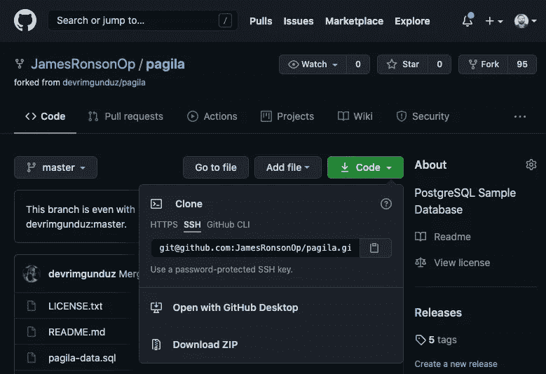

Copy the url from the code button. You will insert this into the command line to create a local repository on your own computer.

启动新的命令行终端。您可以在 Mac 上的搜索栏中键入“终端”,或者在 Finder 中打开“/应用程序/实用工具”文件夹，然后连按“终端”。


Finder

“终端”打开后，您可以导航到您想要存储 Pagila 目录的文件夹/目录。在这里学习如何浏览命令行:[浏览命令行](https://computers.tutsplus.com/tutorials/navigating-the-terminal-a-gentle-introduction--mac-3855)。然后将链接复制到所需目录下的命令行中，将创建一个新目录，其中包含 github 中的所有 pagila 数据库文件。

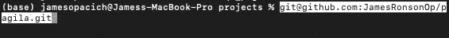

I chose to save my directory into a folder/directory that I call projects.

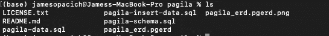

The ```ls``` command lists out all the files in my new Pagila directory.

至此，您已经有了一个 Pagila 目录，其中包含了您自己计算机上的 Pagila 数据库。我们不会使用 pgAdmin 4 将 Pagila 文件拉入 PostgreSQL 服务器。在此之前，我强烈建议阅读 Devrim Gündüz 的 Pagila github 存储库中的 README.md 文件。

## 在 pgAdmin 4 中创建一个新数据库

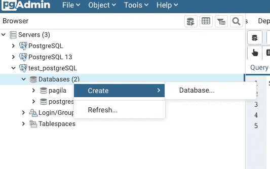

Right click on “Databases”, click “Create” and then “Database”.

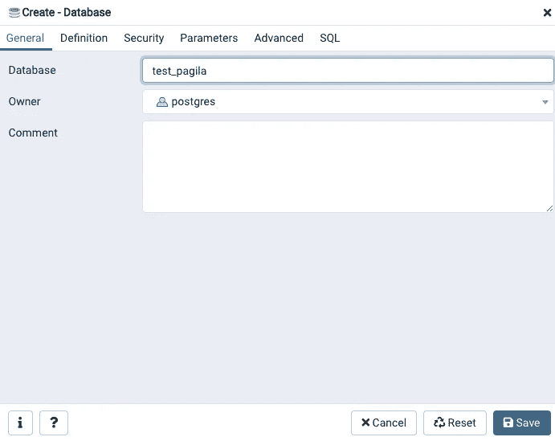

Name your database, I named mine “test_pagila.” Click on the save button.

此时，一个新的数据库应该出现在左侧浏览器的数据库标题下。单击新的数据库(在我的例子中是 test_pagila)，然后单击查询工具，进入新的查询编辑器，在编辑器的左上角找到文件图标，然后单击该图标搜索 Pagila SQL 文件。

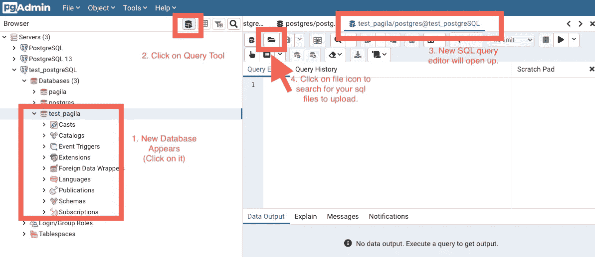

These are the steps you will take to find your Pagila SQL files.

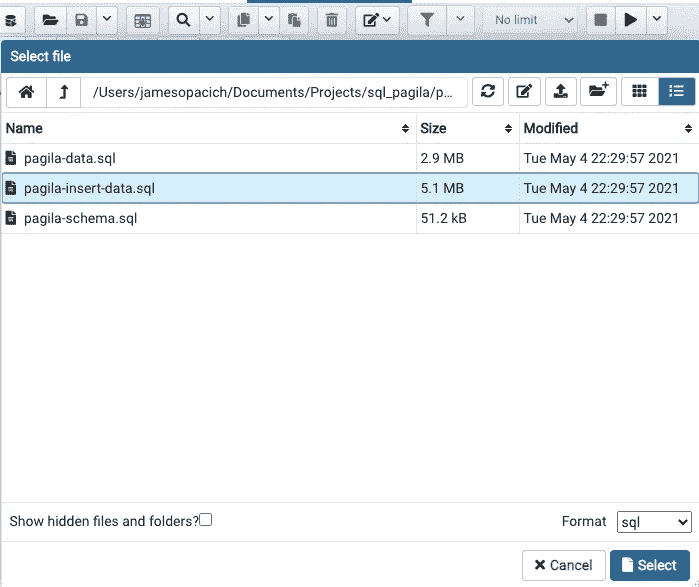

Choose the pagila-insert-data.sql file and click select

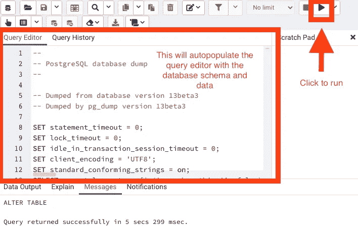

The schema and data for the database will autofill into the query editor. Click the run icon and you should see a message that says “ALTER TABLE” below in the Data Ouput box.

现在您的数据库已经创建好了。您可以运行查询并将其用于您现在想要的任何目的。查询愉快！

# 4.使用 Pagila 的参考资料

有许多方法可以使用 Pagila 数据库进行训练。您可以构建自己的查询，并像使用真实世界的数据库一样使用它，也可以使用问题集来测试您使用真实数据和数据结构进行查询的能力。这个来自 [Robert Treat](https://github.com/xzilla) 的知识库非常有帮助。它包含 Pagila 设置信息和文件，以及许多到 Pagila 教程的链接，这些教程指向各种任务，例如从 Pagila 数据构建应用程序、使用 REST API、执行电子邮件验证、创建报告以及构建到遗留应用程序的 rails。

我还在网上搜索了各种与 Pagila 和 Sakila 有关的问题(大多数情况下都有解决方案),并将它们汇编成一组 Jupyter 笔记本。你也可以用这些问题来测试你的能力。在此找到它们:

我还使用 Pagila 创建了一个实体关系图(ERD)。你可以在这里找到我的教程:[创建 SQL 实体关系图](https://jamesopacich.medium.com/creating-a-sql-entity-relationship-diagram-erd-ced5ad1239d0) (ERD)和下面的实际 ERD 图片供你参考:

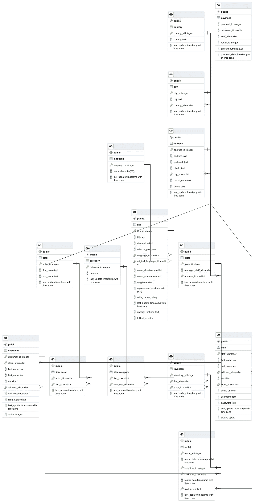

Pagila ERD generated by pgAdmin 4

此外，我从以下网站收集了大量信息来完成这项任务:

*   [Devrim gündüz Github](https://github.com/devrimgunduz/pagila)Devrim 是 PostgreSQL 的主要贡献者。这是我在本教程中使用的数据库文件。
*   Github 上的 Pagila 项目页面在我已经开始创建这个教程之后，我发现了这个，但这可能是 Pagila 的创建者。我不确定。但是这个项目的创建者似乎是各种项目的主要开源贡献者。
*   [连接到 PostgreSQL 数据库](https://www.postgresqltutorial.com/connect-to-postgresql-database/)这是我用来连接到 PostgreSQL 数据库的资源。这个网站[Postgresqltutorial.com](http://www.Postgresqltutorial.com)也是其他 PostgreSQL 信息的有用资源。
*   [PostgreSQL 官方网站](https://www.postgresql.org/download/))这是我下载 PostgreSQL 的地方。
*   [使用 Amazon RDS、CloudFormation、pgAdmin 和 Python 开始使用 PostgreSQL】这是一个我没有使用过的资源，但我想在某个时候使用它。本教程将 PostgreSQL 与 Amazon AWS 服务结合起来，创建了一个双重目的的学习体验。](https://programmaticponderings.com/2019/08/09/getting-started-with-postgresql-using-amazon-rds-cloudformation-pgadmin-and-python/)

我希望你喜欢这个教程，它帮助你开始使用 Postgres 和 Pagila。如果您有任何问题或发现任何需要澄清的地方，请在媒体上给我发消息。你也可以在 Github 上找到很多这样的信息:[James Opacich 的 SQL _ Training _ with _ pagi la](https://github.com/JamesRonsonOp/SQL_Training_with_Pagila)