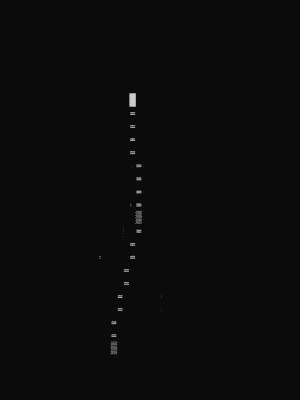
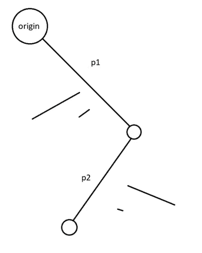
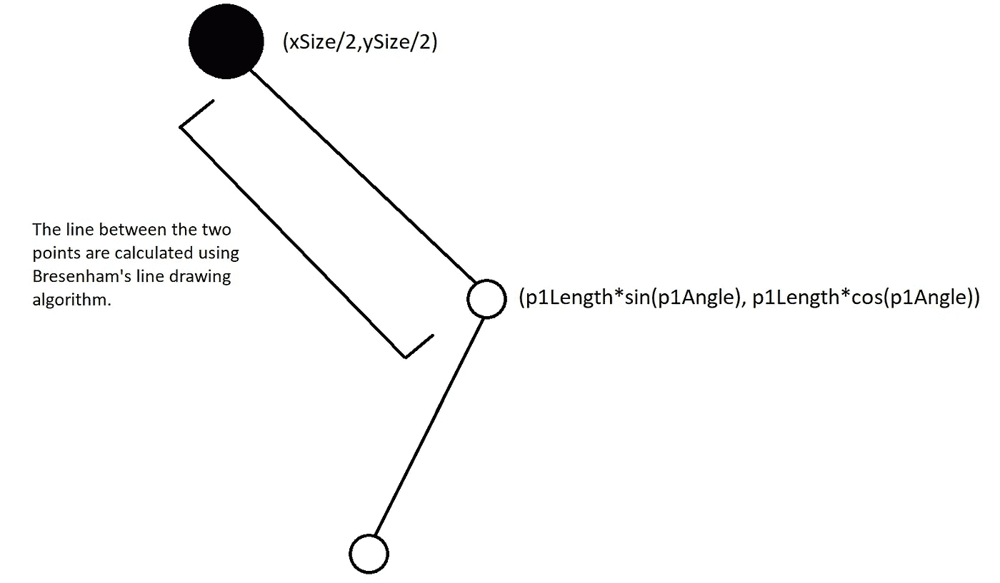
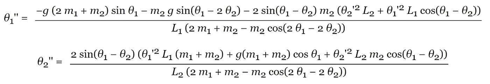
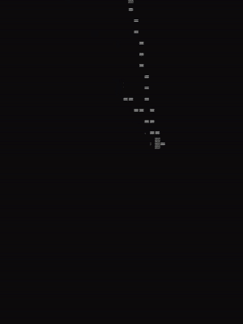
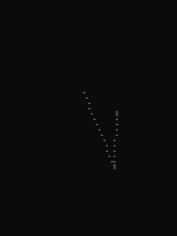

# 用 C++模拟 ASCII 双摆

> 原文：<https://medium.com/geekculture/simulating-ascii-double-pendulums-in-c-c8a1b948fe8c?source=collection_archive---------2----------------------->



结束了我早期文章中坚持的“混沌”主题，我想探索如何使用控制台和 C++模拟双摆的运动。这个实现紧跟在这个资源之后，所以我强烈推荐看一看这个资源。为了使事情更简单，我不会使用时间库来计算每一帧运动。你还需要一台 Windows 机器来完成这项工作，因为它依赖于 Windows。来绘制到控制台。

# 什么是双摆？

我们认为[双摆](https://en.wikipedia.org/wiki/Double_pendulum)是演示混沌运动的简单方法。你可以把它想象成一组任意长度的两根弦，每根弦的末端都连着一个质量不同的球。给定一些初始条件，我们可以使用一个方程，利用这些条件预测下一帧的运动。



# 履行

## 全局变量

为了将字符写入控制台，我们将需要一些全局变量和一些其他常量，这些将在程序的后面使用。(也就是说，一定要包含 Windows.h！)

```
// These two variables control the size of the window.
int xSize = 100;
int ySize = 100;// These two variables control the position of the pendulum within the window.
int offsetx = 25;
int offsety = -32;// This is the gravity constant.
float g = 1;// These two variables control the time-step and dampening, respectively.
float dt = 0.3;
float DAMPENING = 0.997;// These variables handle writing characters directly to the console.
HANDLE hOutput = GetStdHandle(STD_OUTPUT_HANDLE);
DWORD dwWritten;
HWND myconsole = GetConsoleWindow();
HDC dc = GetDC(myconsole);
```

接下来，让我们定义一个叫做钟摆的结构。在它里面，我们将添加一些变量，我们想要修改上面的介绍。这些包括每个钟摆的长度、角度、位置、速度和加速度值。我们还存储了每个摆末端圆圈的质量。为了实现这个目的，“p1”代表第一个摆，“p2”代表第二个摆。

```
struct Pendulum
{
    float p1Length = 10;
    float p2Length = 15; float p1angle = M_PI/2;
    float p2angle = M_PI/2; float p1x = p1Length*sin(p1angle);
    float p1y = p1Length*cos(p1angle); float p2x = p2Length*sin(p2angle);
    float p2y = p2Length*cos(p2angle); float p1v = 0;
    float p2v = 0; float p1a = 0;
    float p2a = 0; float m1 = 2;
    float m2 = 2;
};
```

## 更新功能

现在我们需要一个在 while(真)循环中运行的更新函数，它将计算两个摆的位置、速度和加速度的值。它还控制钟摆在控制台中的显示方式。展示背后的基本理念如下:



使用 Windows 的 FillConsoleOutputCharacter 函数和 [Bresenham 的画线算法](https://en.wikipedia.org/wiki/Bresenham%27s_line_algorithm)，我们可以很容易地通过用公式输出的更新值重画每一帧来完成这种显示，我稍后会谈到这些公式。然而，有一个小问题。一旦一个运动画面被画在屏幕上，它就会永远留在那里，因为没有什么可以替代它。我们需要一些方法来处理最后一帧的清理，所以它看起来不像这样:


为此，我们可以用 std::pair <int>存储每次迭代的 X 和 Y 坐标，并将每一对存储在 std::vector 中。对两个钟摆都这样做，可以让我们遍历两个向量，并在每次迭代结束时用一个空格替换掉每个字符。该函数的其余部分只是使用下面的公式更新每个值。</int>



Equations of motion for the double pendulum. (source: [https://www.myphysicslab.com/pendulum/double-pendulum-en.html](https://www.myphysicslab.com/pendulum/double-pendulum-en.html))

这个运动方程计算出每个钟摆的加速度，加速度被加到速度上。速度改变了钟摆的角度，所有这些值用上面讨论的方法再次显示出来。不过，还有一个问题。while(true)循环迭代非常快，因此加速很容易失去控制，导致程序由于 NaN 错误而崩溃。我们需要某种方法来缩小方程，因此我们将每个输出乘以某个值，该值称为 dt(我们可以将其视为时间步长)。我发现 0.3 效果最好。


Pendulum exploding.

我也将速度乘以一个阻尼因子，这样它会逐渐停止。我发现 0.997 相当好用。在显示每次迭代时，程序还是有点太快，所以一个快速的临时解决方案是添加一个 Sleep 命令。我不会详细介绍如何实现 Bresenham，但我的建议是将它作为一个方法添加到钟摆结构中，以便像我最后做的那样在更新函数中使用它。我认为这涵盖了 update 函数中的所有内容，所以下面是代码:

```
void update(Pendulum *pendulum)
{while (true)
    {
        vector<pair<int,int>> v;
        vector<pair<int,int>> v2; pendulum->p1x = pendulum->p1Length*sin(pendulum->p1angle);
        pendulum->p1y = pendulum->p1Length*cos(pendulum->p1angle); pendulum->p2x = pendulum->p2Length*sin(pendulum->p2angle);
        pendulum->p2y = pendulum->p2Length*cos(pendulum->p2angle); v = pendulum->bresenham(0,pendulum->p1x,0,pendulum-    >p1y);
        v2 = pendulum->bresenham2(pendulum->p1x,pendulum->p2x+pendulum->p1x,pendulum->p1y,pendulum->p2y+pendulum->p1y); FillConsoleOutputCharacter(hOutput, char(219), 1,   {offsetx+xSize/2,(ySize/2)+offsety}, &dwWritten); pendulum->p1v += pendulum->p1a;
        pendulum->p2v += pendulum->p2a; pendulum->p1angle += pendulum->p1v;
        pendulum->p2angle += pendulum->p2v; float num1 = -g*(2*pendulum->m1+pendulum->m2)*sin(pendulum-  >p1angle)-pendulum->m2*g*sin(pendulum->p1angle-2*pendulum->p2angle)
                     -2*sin(pendulum->p1angle-pendulum- >p2angle)*pendulum->m2*(pendulum->p2v*pendulum->p2v*pendulum->p2Length+pendulum->p1v*pendulum->p1v*pendulum->p1Length*cos(pendulum->p1angle-pendulum->p2angle)); float den1 = pendulum->p1Length*(2*pendulum->m1+pendulum->m2-pendulum->m2*cos(2*pendulum->p1angle-2*pendulum->p2angle)); float num2 = 2*sin(pendulum->p1angle-pendulum->p2angle)*(pendulum->p1v*pendulum->p1v*pendulum->p1Length*(pendulum->m1+pendulum->m2)+g*(pendulum->m1+pendulum->m2)*cos(pendulum->p1angle)+pendulum->p2v*pendulum->p2v*pendulum->p2Length*pendulum->m2*cos(pendulum->p1angle-pendulum->p2angle)); float den2 = pendulum->p2Length*(2*pendulum->m1+pendulum->m2-pendulum->m2*cos(2*pendulum->p1angle-2*pendulum->p2angle)); pendulum->p1a = (num1/den1)*dt;
        pendulum->p2a = (num2/den2)*dt; pendulum->p1v = pendulum->p1v*DAMPENING;
        pendulum->p2v = pendulum->p2v*DAMPENING; Sleep(25); for (int i = 0; i < v.size(); i++)
        {
            FillConsoleOutputCharacter(hOutput, ' ', 1,     {(xSize/2)+v[i].first,(ySize/2)+v[i].second}, &dwWritten);
        } for (int i = 0; i < v2.size(); i++)
        {
            FillConsoleOutputCharacter(hOutput, ' ', 1, {(xSize/2)+v2[i].first,(ySize/2)+v2[i].second}, &dwWritten);
        }
    }
}
```

现在程序可以显示单摆。虽然这本身很酷，但我在搜索还有谁做过 ASCII 实现，并找到了 Dino1729 的这个[视频](https://www.youtube.com/watch?v=DMOK5BS6KJw)，其中他有添加多个摆的功能。我决定自己想办法实现它。



## 添加更多钟摆

一种方法是使用线程。使用 kbhit()和 while(true)循环，我们可以不断地检查某个特定的键是否被按下，并使用它来创建一个新的钟摆对象并产生一个新的线程来处理它。然后，我们将线程添加到 vector 容器中，并调用 update 函数，传入新对象。为了同步线程，我们将使用另一个 std::vector 和一个增强的 for 循环来连接 while 循环之后的每个线程。我们也将在 main()中这样做。

```
int main()
{ vector<thread> tv; while(true)
    {
        if(kbhit())
        {
            char ch = getch(); if (ch == 'g') // you can use whatever key you want here.
            {
                Pendulum *temp = new Pendulum();
                tv.emplace_back([&](){update(temp);});
            }
        }
    }
    for (auto& it : tv)
    {
        it.join();
    }
}
```

在本文的开头可以找到一个用多个钟摆运行的代码的例子。另一次运行如下所示。我们可以看到，即使新的钟摆彼此非常接近，随着时间的推移，它们的运动也会变得越来越不同。



# 结论

在你的头脑中巩固一个数学或物理概念的最好方法之一是找到一种用代码实现它的方法。话虽如此，我希望这篇文章能激励人们去实现它，并帮助人们更好地理解如何实现它的概念。对我来说，可能是时候放弃用 C++编写控制台模拟代码，转而使用更实用的库和语言来处理这类事情，比如使用 Java 或 JavaScript。