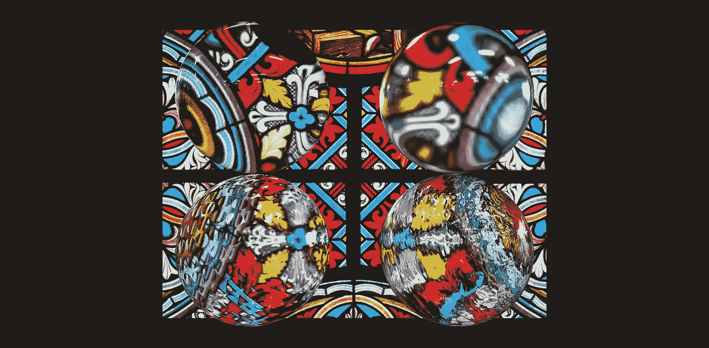
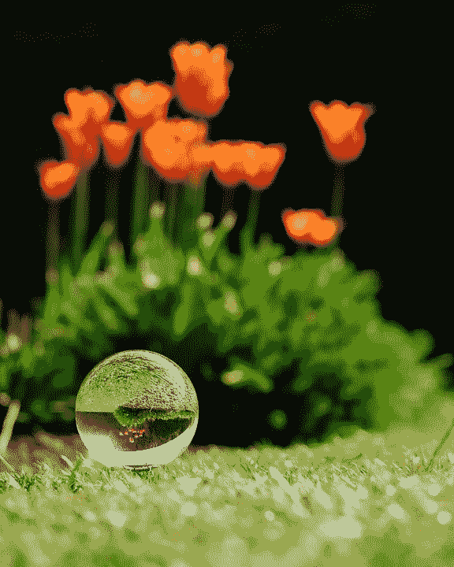
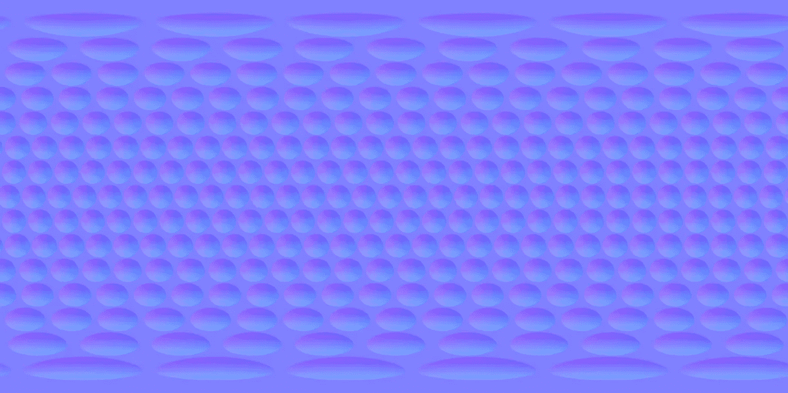
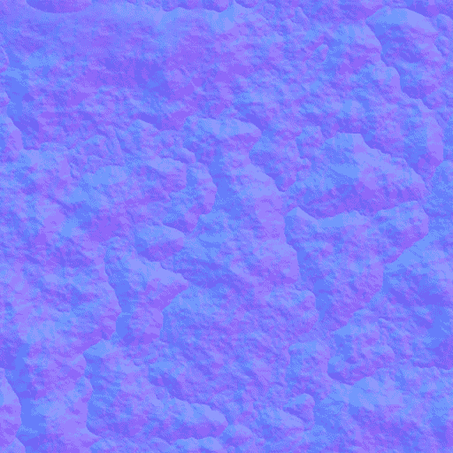

# 在 Three.js 中模拟折射

> 原文：<https://medium.com/geekculture/simulating-refraction-in-three-js-9e367753bf6d?source=collection_archive---------2----------------------->



Four magic orbs of refractive powers!

上次，[我在 Blender 里做了一个简单的酒杯，用 Three.js](/geekculture/using-three-js-to-create-a-crystal-clear-wine-glass-e2e2d1f64c6) 渲染。主要展示了`MeshPhysicalMaterial`的`transmission`属性。这次我将向你展示如何模拟`MeshPhysicalMaterial`的折射效果。

# Three.js 中折射的工作原理

其实比你想象的简单多了。

**在 Three.js 中模拟折射所需要的**就是设置这三个属性:

```
const material1 = new THREE.MeshPhysicalMaterial({
    roughness: 0,
    transmission: 1,
    thickness: 2
});
```

首先，将`transmission`设置为 1 使其具有透射性。然后，将`roughness`设置为 0 或一个非常低的值，这样材料表面就足够光滑，我们可以清楚地看到它。最后的魔法:给你的素材一个`thickness`，让它有放大镜的效果。厚度越大，材料的放大特性越高。

尝试下面的我的 codesandbox 嵌入并调整设置，看看它如何影响结果:

不过有一点需要注意。虽然效果看起来足够真实，但这实际上不是真实生活中折射的工作方式！

在现实生活的场景中，如果折射的景物或物体离玻璃球体足够远，你实际上应该会看到一个颠倒的折射。但是在 Three.js 中，这种上下颠倒的效果是无法通过在 PBR 材质中设置`thickness`来实现的。



real-life orb refraction

# 使用 normalMap 和 clearcoatNormalMap 的迭代

我还做了另外一个例子，有 4 个不同的玻璃球体来展示其他贴图属性如何以不同的有趣方式影响最终的折射结果。

首先，我在所有这些球体的`envMap`上加载了一个等矩形纹理，这样它们就有了更真实的反射。

对于第一个(左上)球体，它有最基本的设置。

对于第二个(右上)球体，我将`clearcoat`设置为 max，并设置了一个`clearcoatNormalMap`，这基本上是一个由划痕线组成的法线贴图。你应该能够在球体反射的最亮区域发现一些划痕。透明涂层模拟在表面上应用另一层反射涂层的效果。现实生活中的例子有车漆、磨光的地板和潮湿的表面。我还把它做得更粗糙更厚，以便更清晰地对比第一个球体。

```
const material2 = new THREE.MeshPhysicalMaterial({
    envMap: hdrEquirect,
    roughness: 0.15,
    clearcoat: 1,
    clearcoatNormalMap: clearcoatNormal,
    transmission: 1,
    thickness: 4
});
```

对于第三个球(左下角),我为属性`normalMap`应用了一个高尔夫球法线贴图，结果得到了这个漂亮的玻璃高尔夫球。我们在材质上应用法线贴图来指示 Three.js 根据法线贴图提供的法线值计算每个像素上的反射/折射。结果是，反射/折射看起来好像材质表面不平坦且凹凸不平，但实际上材质表面仍然根据几何体进行了平滑渲染。

为了使高尔夫球图案上的折射更加明显，我必须增加一点粗糙度。

```
const material3 = new THREE.MeshPhysicalMaterial({
    envMap: hdrEquirect,
    normalMap: golfNormal,
    roughness: 0.15,
    transmission: 1,
    thickness: 2
});
```



the normal map jpg file of a golf ball

对于最后一个球，我使用了有划痕的`clearcoatNormalMap`和不同的`normalMap`来对比高尔夫球。

```
const material4 = new THREE.MeshPhysicalMaterial({
    envMap: hdrEquirect,
    normalMap: roughNormal,
    clearcoat: 1,
    clearcoatNormalMap: clearcoatNormal,
    roughness: 0.15,
    transmission: 1,
    thickness: 2
});
```



the normal map jpg file of a rugged surface

本教程到此结束！请随意分叉我的 codesandbox 项目并四处乱搞。

大声喊出[https://tym pus . net/codrops/2021/10/27/creating-the-effect of-transparent-glass and-plastic-in-three-js/](https://tympanus.net/codrops/2021/10/27/creating-the-effect-of-transparent-glass-and-plastic-in-three-js/)这是一个很好的教程，也是我这次演示的灵感。