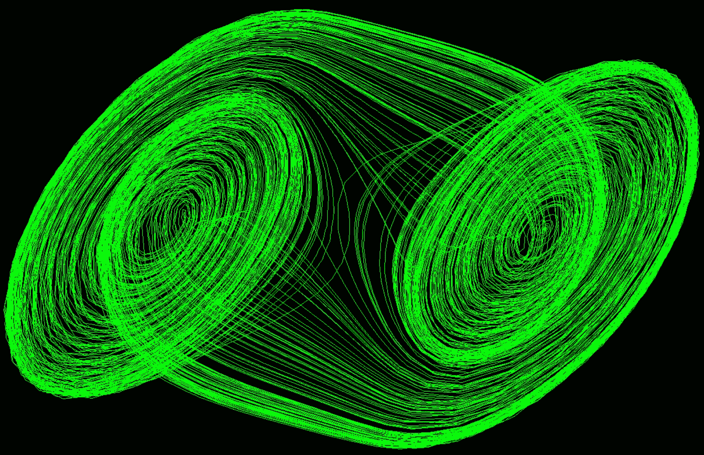
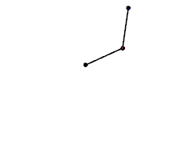
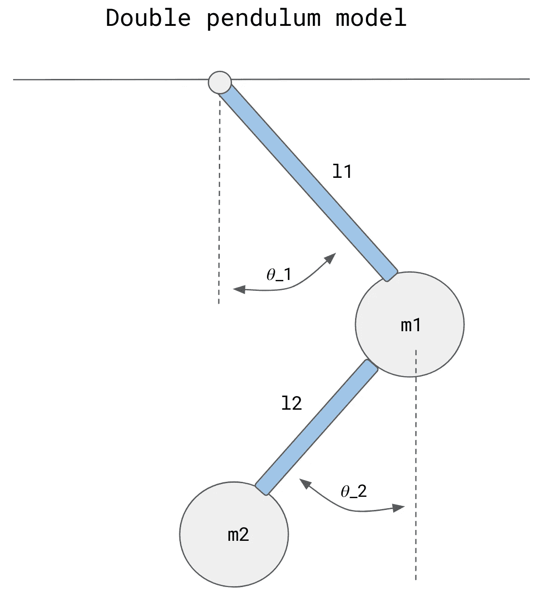
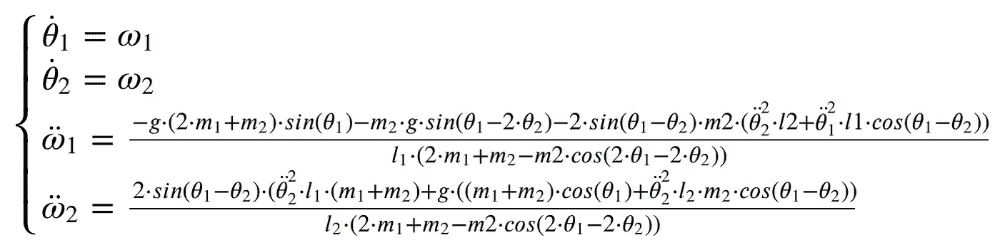
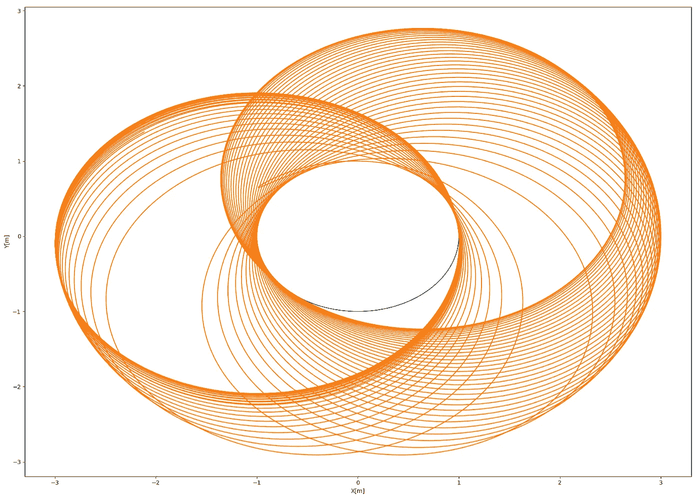
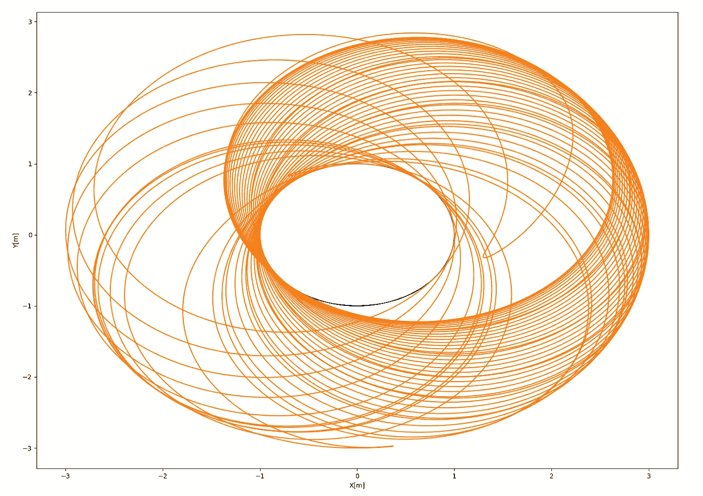
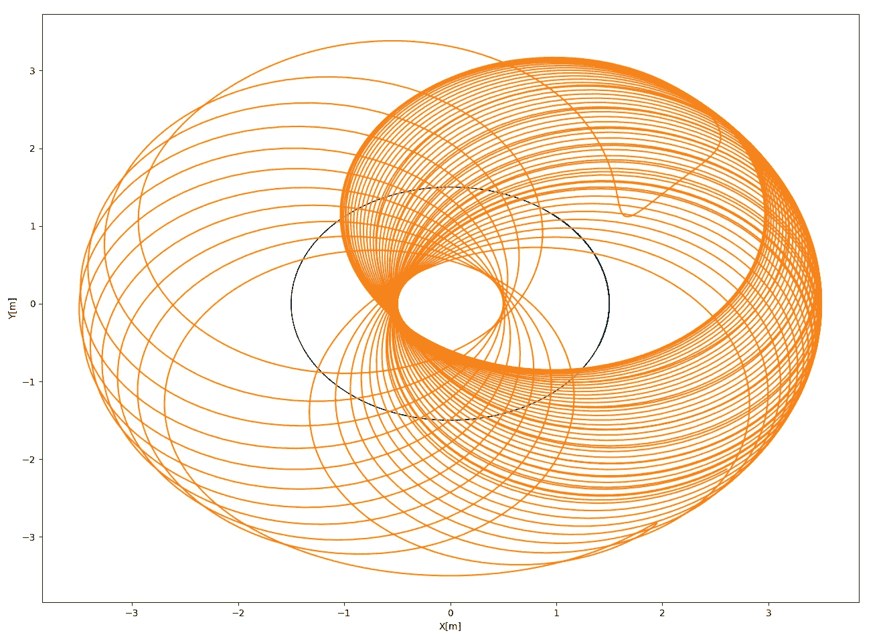

# C++中混沌振荡的模拟

> 原文：<https://medium.com/geekculture/simulation-of-chaotic-oscillations-in-c-bd289de62e21?source=collection_archive---------4----------------------->



Chaotic Circuit

下面这篇文章可以被认为是我之前的一篇文章的延续，在那篇文章中，我们讨论了混沌系统的原理。那一次我们能够看到不同动力系统的混沌反应。系统由简单的一阶微分方程描述，可以用数值欧拉方法求解。
在本文中，我们将看到如何解决由二阶微分方程描述的[双摆](https://en.wikipedia.org/wiki/Double_pendulum)问题。为了找到一个解决方案，我们将部署在我之前的[文章](/geekculture/dynamics-modelling-and-simulation-of-self-balancing-robot-in-c-d32a3b835bbf)中介绍的相同方法。为了解决数值微分方程，我使用了 Runene Kutta 的四阶方法。代码的实现是用 C++完成的。源代码可以在我的 [Github](https://github.com/markusbuchholz/Simulation_of_Chaotic_Oscillations_in_cpp) 上找到。

[头文件](https://github.com/lava/matplotlib-cpp)(用于绘图库)必须与你的 cpp(一个你可以从我的库克隆的文件)在同一个文件夹中。
你的程序可以编译如下:

```
//compile
g++ my_prog.cpp -o my_prog -I/usr/include/python3.8 -lpython3.8// //run
./my_prog//folder tree
├── my_prog
├── my_prog.cpp
├── matplotlibcpp.h
```



Wikipedia

毫无疑问，双摆是一个真正的自然奇迹。从单摆到双摆，复杂性的增加是非常显著的。直摆有规律地摆动。这些振荡是谐波，可以用正弦或余弦函数来解释微小的平衡偏差。非线性振荡的周期随振幅而变化，但运动仍是有规律的。换句话说，小振荡的近似表示精确地抓住了基本摆的基本特性。

正如我在以前的文章中指出的，混沌最重要的特征之一是对初始条件的敏感性(请看看我以前的文章，在那里我讨论了[洛伦兹吸引子】](/geekculture/lorenz-attractor-weather-forecast-explained-93703ad0ec6))。这些现象可以通过应用不同的初始条件来模拟。
尽管双摆可以完全由多个常微分方程系统确定性地建模，但混沌的出现似乎是非常例外的。这种情况类似于洛伦兹的情况。
尝试在不同的质量、摆的长度和起始角度下进行代码编译。

动态模型可以如下推导(符号如下图所示)。推荐访问一个[优秀的网站](https://www.myphysicslab.com/index-en.html)，里面有很多直接用来求解/模拟问题的物理模拟和方程。

一组微分方程已经在 C++中实现，并使用 Runene Kutta 的四阶方法求解。



double pendulum model (by author)



运行模拟(m1 = 2kg，m2 = 1kg，l1 = 1m，l2 = 2m)，初始值等于θ_ 1 = 40 度，θ_ 2 = 40 度，双摆的运动模拟如下(XY 坐标系)蓝色曲线显示质量 m1 的运动，橙色曲线显示质量 m2 的运动。



初始条件的微小变化(θ_ 1 = 39 度，θ_ 2 = 39 度)会影响模拟摆运动的可见变化。



我想分享的最后一个模拟是针对不同的动态参数(m1 = 2kg，m2 = 2.5kg，l1 = 1.5m，l2 = 2m)。正如所料，输出不同。



感谢您的阅读。