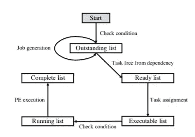

# 基于 DS3 框架和强化学习的芯片仿真

> 原文：<https://medium.com/geekculture/simulation-of-chips-using-gym-ds3-framework-and-reinforcement-learning-d0a697991c5e?source=collection_archive---------28----------------------->

Photo by [Jeremy Zero](https://unsplash.com/@jeremy0?utm_source=medium&utm_medium=referral) on [Unsplash](https://unsplash.com?utm_source=medium&utm_medium=referral)

*在快速计算和 IOT 时代，多功能芯片的需求增加。VLSI(****V****ery****L****arge****S****cale****I****integration)和 AI(****A****人工****I*在这篇文章中，我将分享人工智能如何帮助芯片设计前端工程师将芯片模拟速度提高 10 倍的信息。甚至，适当地描述每一个技术术语，可以帮助所有类型的读者。希望你会喜欢这篇文章。****

## **模拟是什么意思？**

模拟是这样一个过程，在该过程中，元件试图获得关于处理的知识，该处理涉及设计、其功能和性能的建模。仿真器用于硬件仿真，它采用软件仿真器调试和编译的程序。芯片设计中的仿真用于设计验证。

## **VLSI 中仿真的需求是什么？**

芯片被设计成具有多个 MOS 晶体管，这使得设计变得复杂。因此，在制造芯片之前，模拟过程有助于通过软件可视化和分析功能和性能。这在生产可用芯片时提供了良好的精度，并且由于更少的错误芯片生产而降低了生产的总成本。

## **使用哪些 EDA 工具进行仿真？**

EDA 工具，如 Cadence、Xilinx、Synopsys、Mentor Graphics、是德科技广告、QuantumWise ATK 等。

Photo by [Jonas Svidras](https://unsplash.com/@jonassvidras?utm_source=medium&utm_medium=referral) on [Unsplash](https://unsplash.com?utm_source=medium&utm_medium=referral)

生产符合时代需要的芯片需要电力在更短的时间内完成，并且有良好的效率。多核芯片仿真一般采用现场可编程门阵列。在这个过程中，使用了强化学习这种人工智能的集成技术。

强化学习以模拟环境为基础，并根据目标进行优化。一个可扩展和可复制的开源框架 gym-ds3 用于片上系统仿真。Gym 框架是模拟和强化学习的开源接口。这个系统基本上有一个重置功能，可以预热环境并产生工作。下图显示了 DS3 框架的工作。

Fig. 1 Image of DS3 framework [1]

由于任务依赖性和注入率，该系统有助于复杂动态中的各种组合动作集。SimPy 是内置的实时离散事件仿真框架，很难与 Gym 框架直接交互。所以，它是用更新的版本来完成的。代码片段部署在框架环境中。具有比例值和总模拟长度的环境，特别是用于深度片上系统的神经调度器。它比较了所提供的调度程序在 DS3 和 gym-ds3 中的平均响应时间。因此，在这个框架的帮助下，可以产生相同的性能。

关于这个主题更详细的研究，请浏览

[1] T.T. Sung，B. Ryu，“用于强化学习的可扩展和可再现的片上系统仿真”，2004 年 4 月 21 日