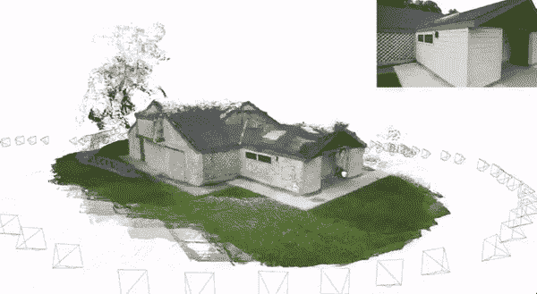
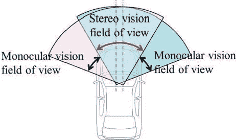
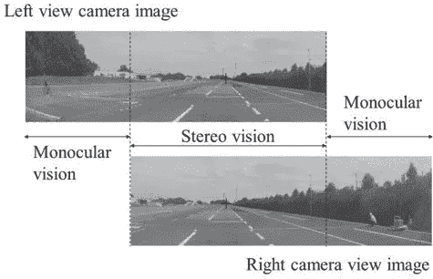
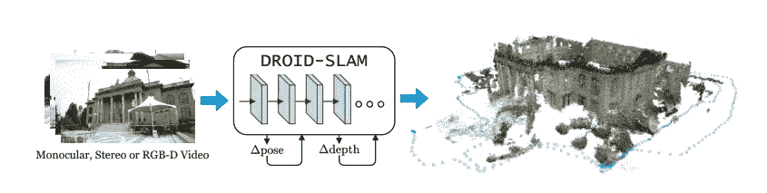
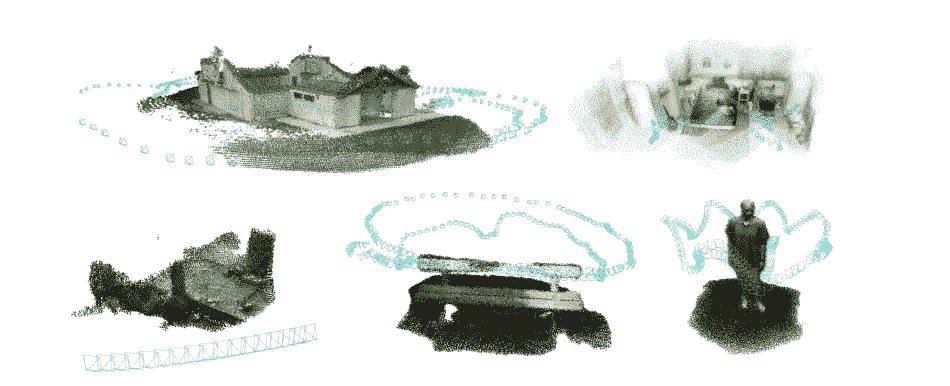
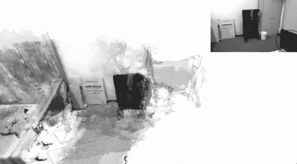

# 同步定位和绘图系统

> 原文：<https://medium.com/geekculture/simultaneous-localization-and-mapping-slam-systems-44d4369fcb46?source=collection_archive---------4----------------------->

## 超越 DROID-SLAM 系统简介

DROID SLAM Output [[Source](https://youtu.be/GG78CSlSHSA)]

短语“**同时定位和制图**”(SLAM)指的是利用全球参考位置估计进行长期同时地图创建和定位的算法集合。

机器人社区在过去十年中最显著的成就之一是 SLAM 问题的“解决方案”。作为一个公式和解决方案，理论问题提出了几种形式。SLAM 还用于各种不同领域的机器人，包括空中、水下和室内系统。SLAM 在理论上和概念上可以认为在这一点上已经解决。然而，在实施更广泛的 SLAM 方面存在重大的实际挑战。解决方案，特别是作为 SLAM 算法、富地图等的一个组成部分的感知的开发和使用。

> **定位**:捕捉或定位物体的位置。
> 
> **映射**:一个物体/机器人/智能体将执行的一组动作或映射
> 
> SLAM :实时或同时构建地图和本地化代理

SLAM 还有很多其他用途，比如在深空。大型场景中的导航、室内定位和探索、无人位置中的安全或监控，以及室内应用，如清洁机器人或自动吸尘器。深有最近。SLAM 技术的性能也通过使用神经网络(DNNs)得到了改善。SLAM 问题有多种潜在的解决方案，取决于应用和用于收集环境数据的数据收集传感器。视觉传感器([单眼](https://en.wikipedia.org/wiki/Monocular)、[立体](https://en.wikipedia.org/wiki/Stereo_camera)和多眼)、[激光雷达](https://en.wikipedia.org/wiki/Lidar)、[雷达](https://www.fierceelectronics.com/sensors/what-a-radar-sensor#:~:text=Radar%20sensors%20are%20conversion%20devices,motion%20characteristics%2C%20and%20motion%20trajectory.)、GPS 传感器、惯性传感器和其他传感器是最广泛使用的。

Difference between monocular and stereo vision [[Source](https://ieeexplore.ieee.org/document/9043079)]

在先前描述的技术中，视觉传感器的普及和低成本是具有足够高分辨率和频繁数据收集的相机的成本下降的结果。

被称为 **ORB-SLAM** 的基于特征的单目视觉 SLAM 系统被认为是值得信赖和全面的。它利用了旋转的**概要**(二进制鲁棒独立基本特征)和定向的**快速**(来自加速段测试的特征)特征检测器(ORB)，两者都是在。与其他基于立体视觉的技术相比，它只需要一个单镜头摄像机，这使它成为一个技术上更简单的解决方案，具有更简单的校准方法。

与照相机相比，使用这些测量工具有一些优点和缺点。精确地确定物体的距离是一个优点，而对干扰的敏感性是一个缺点。使用 SLAM 算法提供的距离测量(激光雷达)和相机解决方案可以解决这些缺点。这些解决方案的成果在作品中得以展示。论文提供了 SLAM 算法的进一步广泛生存。

# 机器人满贯

[**普林斯顿大学**](https://www.princeton.edu/research) 提出了一个全新的基于深度学习的 **SLAM** 系统。通过使用密集束调整层， **DROID-SLAM** 包括对相机姿态、相机角度和像素级深度的重复迭代调整。“**可微分递归优化启发设计**”(DROID)，一种端到端可微分设计，结合了传统方法和深度网络的优势，是 DROID-SLAM 实现稳健性能和通用性的原因。它包括重复的迭代更新，在光流的 [RAFT](https://link.springer.com/chapter/10.1007/978-3-030-58536-5_24) 的基础上进行扩展，同时提供两个显著的进步。

首先，它迭代地更新相机姿态和深度，而不是 RAFT 的[ [循环所有对场变换](https://link.springer.com/chapter/10.1007/978-3-030-58536-5_24) ]迭代更新光流。与仅使用两帧的 RAFT 相比，DROID-SLAM 的更新允许对所有相机姿势和深度图进行全局联合优化，这对于减少长轨迹和循环闭合的漂移是必要的。

第二，可微分的**密集束调整** (DBA)层计算对相机姿态和密集每像素深度的高斯-牛顿更新，以最大化它们与光流的最新估计的一致性。该层在 DROID-SLAM 中创建相机姿态和深度图的每次更新。由于 DBA 层使用了几何约束，单目系统可以接受立体或 RGB-D 输入，而无需重新训练，这也提高了准确性和鲁棒性。

DROID-SLAM builds a dense 3D map of the environment while simultaneously localizing the camera within the map. [[Source](https://arxiv.org/pdf/2108.10869.pdf)]

DROID-SLAM 是准确的，大大优于早期的研究，并且具有弹性，灾难性故障明显较少。尽管接受了单目视频训练，但它可以使用立体或 RGB-D 视频在测试中表现更好。

**系统概述:**

**初始化**:收集帧，直到计数达到 12，将其累加，然后在特定时间戳后通过在关键帧之间创建边来初始化帧图，以进行捆绑调整。

**前端**:维护一个关键帧集合和一个存储可见关键帧之间边缘的帧图。在通过平均光流测量的 3 个最近邻居的帮助下进行特征提取和图形创建，通过计算平均光流大小和去除冗余帧来计算帧对之间的距离。

A very simple graphical model [[source](https://en.wikipedia.org/wiki/Graphical_model)]

**后端**:后端的主要操作是全局捆绑调整。首先，在时间上相邻的关键帧之间添加边。然后按照流量增加的顺序从距离矩阵中采样新的边。

Conversion of a 2D image dataset into a 3D image [[Source](https://arxiv.org/pdf/2108.10869.pdf)]

迭代发生在密集束调整上。它使用 PyTorch 来利用自动区分引擎。在推理时，我们使用一个定制的 CUDA 内核，它利用了问题的块稀疏结构，然后在减少的摄像机块上执行稀疏[乔莱斯基分解](https://en.wikipedia.org/wiki/Cholesky_decomposition)。这些链接是针对 [**论文**](https://arxiv.org/pdf/2108.10869.pdf) 和 [**GitHub**](https://github.com/princeton-vl/DROID-SLAM) 资源库而提到的。最后的结果真的很牛逼！！！

right top is the incoming video stream which is constructing a live 3D model [[Source](https://youtu.be/GG78CSlSHSA)]

如果你对大满贯感兴趣，那么这里有一个关于 [**西里尔·斯塔希尼斯**](https://www.ipb.uni-bonn.de/people/cyrill-stachniss/) 的视频。 [**这里的**](https://youtu.be/uHbRKvD8TWg) 是视频链接。

**最后的话**

SLAM 系统是 3D 对象实时映射领域的游戏改变者。它在许多领域有许多应用，并将减少卫生和其他部门的大量风险。DROID-SLAM 是最新最有效的 SLAM 算法之一，运行良好。虽然 SLAMs 在计算上非常昂贵，但有许多类型的研究正在进行，肯定会降低成本。

# 如果你觉得这很有见地

如果你觉得这篇文章很有见地，请关注我的 [**Linkedin**](https://www.linkedin.com/in/chinmay-bhalerao-6b5284137/) 和 [**medium**](/@BH_Chinmay) 。你也可以 [**订阅**](/@BH_Chinmay) 在我发表文章的时候得到通知。让我们创建一个社区！感谢您的支持！

## 如果你想支持我:

因为你的跟随和鼓掌是最重要的事情，但是你也可以通过买咖啡来支持我。 [**咖啡**](https://www.buymeacoffee.com/chinmaybhalerao) **。**

**参考文献:**

> 1]伦纳德，J.J 一个自主移动机器人的同时地图建立和定位。1991 年 11 月 3-5 日在日本大阪召开的 IROS 91:IEEE/RSJ 智能机器人和系统国际研讨会论文集；第三卷，第 1442-1447 页。
> 
> 2]迪，k；万；赵；刘；王；视觉冲击的进展与应用。测绘学报。卡通人物。罪恶。2018, 47, 770–779.