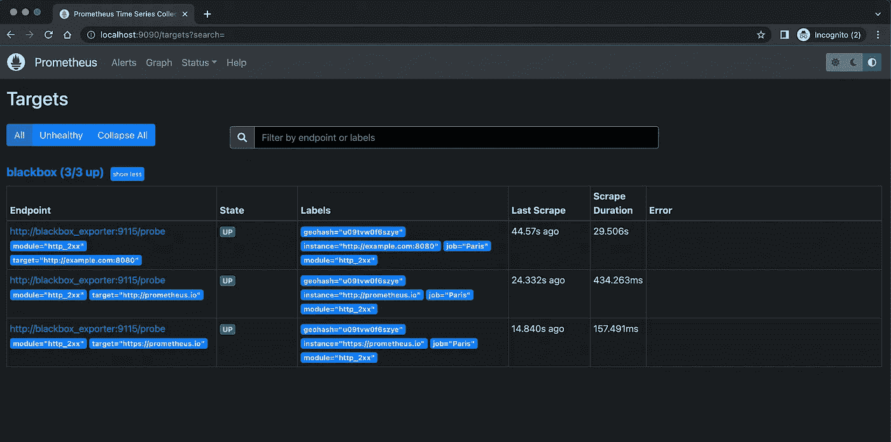

# 几十个黑盒出口商的单一普罗米修斯工作

> 原文：<https://medium.com/geekculture/single-prometheus-job-for-dozens-of-blackbox-exporters-2a7ba492d6c8?source=collection_archive---------1----------------------->

## 我们在视觉上很固执。我们在细节上很灵活——杰夫·贝索斯


Photo by [Alina Grubnyak](https://unsplash.com/@alinnnaaaa?utm_source=medium&utm_medium=referral) on [Unsplash](https://unsplash.com?utm_source=medium&utm_medium=referral)

## **什么是黑盒导出器？**

T 他普罗米修斯[黑盒导出器](https://github.com/prometheus/blackbox_exporter#blackbox-exporter-)允许通过 HTTP、HTTPS、DNS、TCP、ICMP 和 gRPC 对端点进行黑盒探测。该导出器提供有关端点状态、HTTP 延迟、重定向信息、DNS 查找延迟的指标，以及有关 SSL 证书过期的统计信息。它开箱即用，因为它只关注外部可见性细节。

## 这个故事是关于什么的？

> 这个故事不是关于黑盒输出器的安装，更多的是关于普罗米修斯方面的配置。目标是通过避免将普罗米修斯配置弄得一团糟来实现简单、最小但灵活的配置。

假设您在世界各地有 20 多个黑盒导出器，它们不属于任何集群或环境，只是作为独立的应用程序运行，用于从不同的地方监控端点。例如，您应该监控来自所有位置的 100 多个 URL，以确保您的网站可用性、延迟等。根据[文档](https://github.com/prometheus/blackbox_exporter#prometheus-configuration)，一个简单的 Prometheus 作业配置如下所示:

```
scrape_configs:
  - job_name: 'blackbox'
    metrics_path: /probe
    params:
      module: [http_2xx]  # Look for a HTTP 200 response.
    static_configs:
      - targets:
        - [http://prometheus.io](http://prometheus.io)    # Probe with http.
        - [https://prometheus.io](https://prometheus.io)   # Probe with https.
        - [http://example.com:8080](http://example.com:8080) # Probe with http on port 8080.
    relabel_configs:
      - source_labels: [__address__]
        target_label: __param_target
      - source_labels: [__param_target]
        target_label: instance
      - target_label: __address__
        replacement: 127.0.0.1:9115  # Blackbox exporter's address.
```

如果在导出器的配置中定义了许多黑盒导出器、URL 和多个模块，会怎么样呢？最基本的答案是:*“在 Prometheus 中为每个黑盒导出器定义所有目标(URL)的作业”*对吗？总的来说，这将是近 20+作业和 2000 多行配置。当然，你可以这样做，但是请记住，这不是一个专业的方式来实现它，因为我们谈论的是普罗米修斯。正如您在上面的作业示例中看到的那样，导出程序的模块名称、目标和地址都是静态的，所以任何时候当您想要更改某些内容时，您都需要更改整个配置。让我们看看如何使用 Prometheus 提供的[**file _ SD _ config**](https://prometheus.io/docs/prometheus/latest/configuration/configuration/#file_sd_config)和[**relabel _ config**](https://prometheus.io/docs/prometheus/latest/configuration/configuration/#relabel_config)**特性。**

## **配置单个 Prometheus 作业**

**乍一看，您可能会认为下面描述的工作示例既困难又复杂，但是不要担心，我们会详细介绍这一点。**

**Prometheus job: blackbox**

**第一个重要部分是`file_sd_configs`部分，这意味着普罗米修斯将从提供的文件中读取它的目标。它很酷，因为你可以动态地改变文件的内容，而不需要重新加载 Prometheus 服务器。让我们看看这个文件是什么样子的。**

**blackbox-targets.yml**

**你可以认为这个文件的内容与我们上面讨论的部分`static_configs.targets`相似，但是目标有点“奇怪”，对吗？这里，每个目标包含所有元数据，这些元数据将在抓取后在时间序列的最终标签集中提取。正如你所看到的，我们使用了下面的符号`:_:`作为所提供字段的分隔符。请确保分隔符可以是任何有效字符。如果您用提供的分隔符将这些行分开，您将得到每个目标五个字段。这些字段如下:**

**`<BLACKBOX_IP_PORT>:_:<<MODULE>:_:<LOCATION>:_:<GEOHASH>:_:<TARGET_URL>`**

1.  ***黑盒子出口商的地址(IP:PORT)，***
2.  ***黑盒导出器配置中定义的模块名称，***
3.  ***黑盒出口商所在城市名称，***
4.  ***对应城市的* [*geohash*](https://en.wikipedia.org/wiki/Geohash) 的值(在 Grafana 的 Geomap 面板中使用)**
5.  ***需要监控的目标 URL。***

**第二个重要部分是`relable_configs`部分。重新标记是一个强大的工具，可以在目标的标签集被删除之前动态地重写它。在此示例中，有七个重新标记的步骤。所有步骤的逻辑几乎相同。为了清楚起见，让我们涵盖所有的步骤。**

## **重新标注出口商地址**

**在这一步，我们应该告诉 Prometheus 目标字符串中的哪个字段负责`__address__`标签。它是一个特殊的标签，被设置到目标的`<host>:<port>`地址。**

```
33   *# the Blackbox exporter's real hostname:port*
34   **- source_labels: [__address__]**
35     **regex: '(.*):_:.*:_:.*:_:.*:_:.*'** 
36     **target_label: __address__**
```

**正如您注意到的，对应于地址标签的值是通过`regex`匹配器提取的。这里的`(.*)`是一个有效的 [RE2 正则表达式](https://github.com/google/re2/wiki/Syntax)，它的值在`${1}`变量下提取。**

> ***输入文本:* `*1.2.3.4:9115:_:http_2xx:_:Paris:_:u09tvw0f6szye:_:*[*http://prometheus.io*](http://prometheus.io)`**
> 
> ***Regex:* `*(.*):_:.*:_:.*:_:.*:_:.**`**
> 
> ***输出:* `*${1}*` *=* `*1.2.3.4:9115*`**

## **重新标记模块**

**像前一部分一样，这里提取的是模块名。重新标记的目的是在最终的时间序列中有一个名为`module`的标签。**

```
9   *# adds "module" label in the final labelset*
10  **- source_labels: [__address__]**
11    **regex: '.*:_:(.*):_:.*:_:.*:_:.*'**
12    **target_label: module**
```

> ***输入文字:* `*1.2.3.4:9115:_:http_2xx:_:Paris:_:u09tvw0f6szye:_:*[*http://prometheus.io*](http://prometheus.io)`**
> 
> ***Regex:* `*.*:_:(.*):_:.*:_:.*:_:.**`**
> 
> ***输出:* `*${1}*` *=* `*http_2xx*`**

**这里我们只是将`module`标签的值作为 HTTP 查询参数传递给 Blackbox exporter，我们已经在上一步中重新标记了这个参数。**

```
25   *# passes "module" parameter to Blackbox exporter*
26   **- source_labels: [module]**
27     **target_label: __param_module**
```

## **重新标记工作标签**

**`job`标签很特别，因为真正的`job`标签`blackbox`将被重命名为相应出口商所在的地点/城市名称。**

```
21   *# rewrites "job" label with corresponding location name*
22   **- source_labels: [__address__]**
23     **regex: '.*:_:.*:_:(.*):_:.*:_:.*'**
24     **target_label: job**
```

> ***输入文字:* `*1.2.3.4:9115:_:http_2xx:_:Paris:_:u09tvw0f6szye:_:*[*http://prometheus.io*](http://prometheus.io)`**
> 
> ***正则表达式:* `*.*:_:.*:_:(.*):_:.*:_:.**`**
> 
> ***输出:* `*${1}*` *=* `*Paris*`**

## **重新标注 geohash 标签**

**`geohash`是倒数第二个字段，因此将按以下方式提取。**

```
13   *# adds "geohash" label in the final labelset   * 
14   **- source_labels: [__address__]** 
15     **regex: '.*:_:.*:_:.*:_:(.*):_:.*'** 
16     **target_label: geohash**
```

> ***输入文本:* `*1.2.3.4:9115:_:http_2xx:_:Paris:_:u09tvw0f6szye:_:*[*http://prometheus.io*](http://prometheus.io)`**
> 
> ***Regex:* `*.*:_:.*:_:.*:_:(.*):_:.**`**
> 
> ***输出:* `*${1}*` *=* `*u09tvw0f6szye*`**

## **重新标记实例标签**

**在这一步中，最后一个字段(目标 URL)将在`instance`标签下提取。**

```
13   *# rewrites "instance" label with corresponding URL*
14   **- source_labels: [__address__]**
15     **regex: '.*:_:.*:_:.*:_:.*:_:(.*)'**
16     **target_label: instance**
```

> ***输入文字:* `*1.2.3.4:9115:_:http_2xx:_:Paris:_:u09tvw0f6szye:_:*[*http://prometheus.io*](http://prometheus.io)`**
> 
> ***Regex:* `*.*:_:.*:_:.*:_:.*:_:(.*)*`**
> 
> ***输出:* `*${1}*`*=***

**像这里的`module`标签一样，`instance`标签将其值(即[*http://Prometheus . io*](http://prometheus.io))作为名为`target`的 HTTP 查询参数传递给黑盒导出器。**

```
29   *# passes "target" parameter to Blackbox exporter*
30   **- source_labels: [instance]**
31     **target_label: __param_target**
```

**如下图所示，Prometheus 服务器知道如何根据所提供的配置从目标进行抓取。(这张截图是从我的本地电脑上截取的，仅来自巴黎端点)。**

****

**Prometheus targets**

# **结论**

**我猜看完这个故事后，你已经知道如何有效地为黑盒导出器配置 Prometheus 作业了。**

**感谢阅读。我希望这个故事是有帮助的。如果你有兴趣，可以看看[我的其他媒体文章](https://hayk96.medium.com/)。**