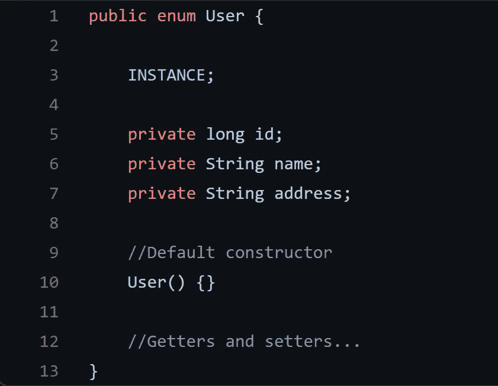

# 在 Java 中使用枚举的单例模式

> 原文：<https://medium.com/geekculture/singleton-pattern-using-enum-in-java-597067f24ad0?source=collection_archive---------4----------------------->

## 重新审视单例模式设计

## 什么是单例，如何实现它

**Singleton** 是一种**设计模式**，用于创建一个类的*唯一* **实例**:通过运行时，将只有一个。

这个**模式**的经典实现使用静态方法**的组合**来检查是否有…