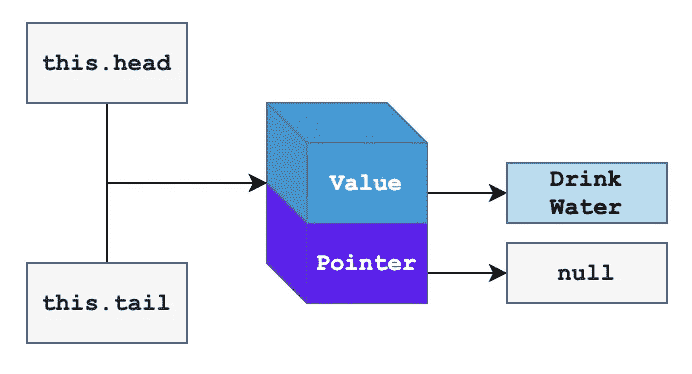
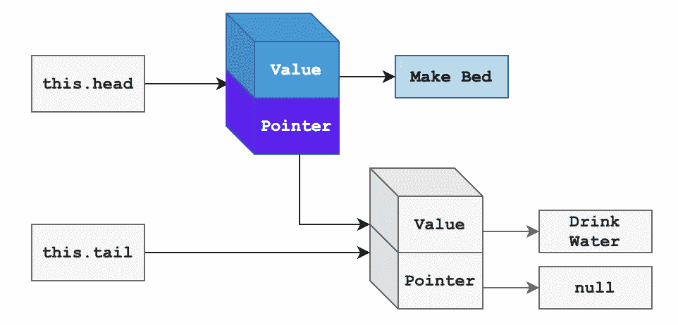
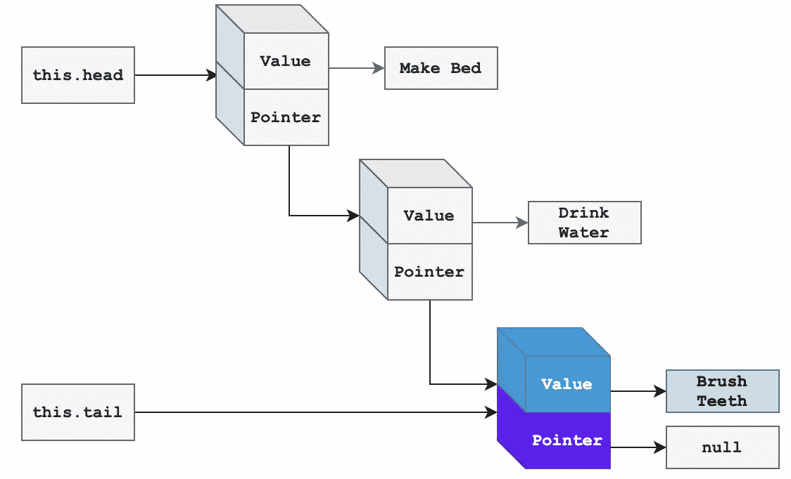
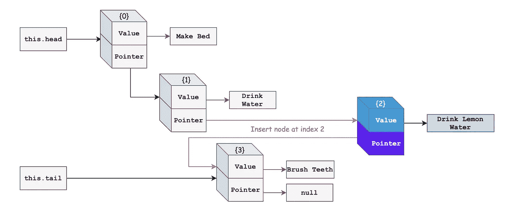
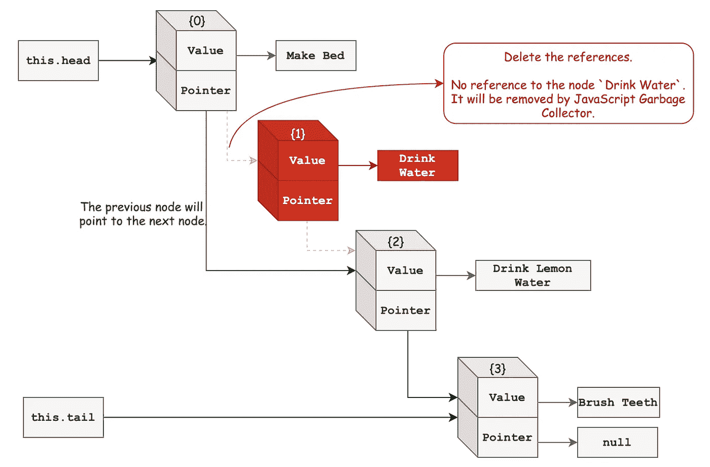

# 单链表— JavaScript

> 原文：<https://medium.com/geekculture/singly-linked-lists-javascript-d6d315b956f4?source=collection_archive---------23----------------------->

在这篇博客中，我们将讨论 JavaScript 中单链表的基本操作和实现。

*这是带有 JS 链表的博客 DS 的一部分。对于入门和链表的基础知识，请查看。*

[](https://darshnarekha09.medium.com/ds-with-js-linked-lists-1062e386ae26) [## 带有 JS 的 DS——链表

### 链表是一种低级的数据结构。深入了解 JavaScript 的基础知识及其实现。

darshnarekha09.medium.com](https://darshnarekha09.medium.com/ds-with-js-linked-lists-1062e386ae26) 

# 基本操作

这是对单链表执行的最常见操作的列表。我们将看到用法和它们的时间复杂度。

让我们从单链表的节点表示开始。我会考虑列出一些早晨习惯。



First Node in Singly Linked List | Morning Habits.

我们知道单链表中的一个节点由两个元素组成— *值和一个指向下一个节点或`null`的指针*。第一个节点称为`head`，最后一个节点称为`tail`。首先，让我们考虑在我们的单链表中只有一个节点。

节点定义如下。对于每个节点，使用`this.next`表示指针。

```
class Node {
    constructor(value) {
        this.value = value;  
        this.next = null; 
    }
}
```

我们的第一个节点的代码表示如下。目前`head`和`tail`都指向第一个节点。

```
const morningRoutine = {
    value: 'Drink Water',
    next: null
};
```

现在让我们从这个链表的不同操作开始。

# 预先考虑

Prepend 意味着在链表的开头添加一个节点。

让我们在`Drink Water`前增加一个晨练`Make Bed`。

`prepend('Make Bed');`

这些步骤将是

*   创建一个新节点`Make Bed`。
*   `this.head`将指向新的节点。
*   `this.tail`没有变化。它将指向当前节点`Drink Water`。
*   新节点的指针`next`将指向节点`Drink Water`。



Prepend Node `Make Bed`

这个操作很简单。时间复杂度是`**O(1)**`，因为我们将只改变新节点的引用`this.head`和指针`next`。

我们的链表将表示如下。

```
const morningRoutine = {
    **value: 'Make Bed',
    next:** {
        value: 'Drink Water',
        next: null
    }
};
```

# 附加

Append 意味着在链表的末尾添加一个节点。

让我们在早上喝了水之后再增加一个新的套路`Brush Teeth`。

`append('Brush Teeth');`

这些步骤将是

*   创建新节点`Brush Teeth`。
*   `Drink Water`节点的`next`将指向`Brush Teeth`节点。
*   `this.tail`将指向新的节点。



Append Node `Brush Teeth`

这是一个简单的操作，我们改变了`this.tail`的参考和节点`Drink Water`的`next`。这个操作的时间复杂度是`**O(1)**`。

现在早上的例行链表看起来如下。

```
const morningRoutine = {
    value: 'Make Bed',
    next: {
        value: 'Drink Water',
        next: **{
            value: 'Brush Teeth',
            next: null
        }**
    }
};
```

# 插入

在这个操作中，我们在给定的索引处插入一个节点。

让我们添加一个新的节点`Drink Lemon Water`后，我有一些水，这是节点`Drink Water`。

`insert('Drink Lemon Water', 2);`

这些步骤将是

*   创建一个新节点`Drink Lemon Water`。
*   **遍历**到节点`Drink Water`。
*   将`Drink Water`节点的`next`指向新节点。
*   将新节点的`next`指向节点`Brush Teeth`。



Insert `Drink Lemon Water` after `Drink Water`

在最坏的情况下，我们可能不得不遍历到单链表的末尾。因此，该操作的时间复杂度为`**O(N)**`，其中`N`为单链表中的节点数或单链表的长度。

现在早上的例行链表看起来如下。

```
const morningRoutine = {
    value: 'Make Bed',
    next: {
        value: 'Drink Water',
        next: **{
            value: 'Drink Lemon Water',
            next:** {
                value: 'Brush Teeth',
                next: null
            **}
        }**
    }
};
```

我们可以通过检查索引来优化插入—如果索引是`0`调用`prepend`，当索引等于单链表的长度时调用`append`。

# 去除

在这个操作中，我们删除给定索引处的一个节点。

让我们删除节点`Drink Water`。

`delete('Drink Water', 1);`

这些步骤将是

*   遍历到要删除的节点之前的节点— `previousNode`。
*   将节点`previousNode`的`next`指针指向待删除节点所指向的节点。



Deleting the node `Drink Water` from the Singly Linked List.

时间复杂度是`**O(N)**`因为我们需要通过链表来找到要删除的节点。

链表的最终版本如下。

```
const morningRoutine = {
    value: 'Make Bed',
    next: {
        value: 'Drink Lemon Water',
        next: {
            value: 'Brush Teeth',
            next: null
        }
    }
};
```

为了在索引为`0`的情况下进行优化，我们可以将`this.head`指向下一个节点。

# 履行

现在我们知道了运算`append`、`prepend`、`insert`和`delete`的算法，我们可以将逻辑写成如下。

除了这些操作，我们还将添加`printList`来记录单链表中每个节点的值。

Singly Linked List Implementation in JavaScript

理解实现的最好方法是**画出图**并理解指针引用的变化。

# 继续阅读

在这里继续阅读链表👇

[](https://darshnarekha09.medium.com/ds-with-js-linked-lists-1062e386ae26) [## 带有 JS 的 DS——链表

### 链表是一种低级的数据结构。深入了解 JavaScript 的基础知识及其实现。

darshnarekha09.medium.com](https://darshnarekha09.medium.com/ds-with-js-linked-lists-1062e386ae26) 

或者查看双向链表

[](https://darshnarekha09.medium.com/doubly-linked-lists-javascript-b13cc21ca59d) [## 双向链表— JavaScript

### 用 JavaScript 实现双向链表的基本操作和实现。

darshnarekha09.medium.com](https://darshnarekha09.medium.com/doubly-linked-lists-javascript-b13cc21ca59d)