# 奇异值分解:使用 Python 中的特征值和特征向量进行计算

> 原文：<https://medium.com/geekculture/singular-value-decomposition-calculation-using-eigenvalues-and-eigenvectors-in-python-dde785559174?source=collection_archive---------5----------------------->

嗯，我看过很多文章解释什么是 PCA，以及如何找到特征矩阵的主成分。几乎都是讲特征向量和特征值看主成分。然后我看了 python `SKlearn`库 [PCA 类](http://scikit-learn.org/stable/modules/generated/sklearn.decomposition.PCA.html)的文档，讲的是奇异值分解(SVD)寻找主成分。我真的很困惑 SVD 和特征值，以及特征向量是如何相互关联的。

本文将包含 SVD 的定义。以及如何将 SVD 问题转化为特征值问题，然后使用特征值和特征向量求解。这篇文章将更倾向于线性代数，但我们也会看到求特征值、特征向量和奇异值分解的 pythonic 方法。在下一篇文章中，我们将关注 PCA 以及如何使用协方差矩阵来获得 SVD 的分解矩阵。

## 奇异值分解

**定理** : SVD 定理陈述了每一个矩阵都可以分解成三个初等变换的序列:输入空间 U 中的旋转，缩放矩阵σ，输出空间 v 中的旋转矩阵

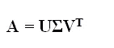

> 其中 A 的大小为 mxn，U 的大小为 mxm，σ的大小为 mxn，V 的大小为 nxn。
> 
> u 和 V 在线性代数术语中称为酉矩阵。

## 奇异值分解的几何推断；

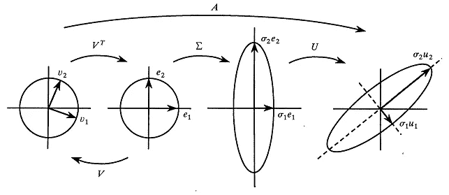

u 和 V_transpose 是酉矩阵或旋转矩阵，因此它们保持向量之间的角度。这里我们用 v1 和 v2 向量表示一个圆。因此，首先，V 的特征向量 v1 和 v2(它们是正交的)映射到两个正交基向量 e1 和 e2，然后通过σ缩放到正交σ1e1、σ2e2，再通过酉 U 映射到σ1u1、σ2u2。线性映射 A 完全由这些向量的变换来定义，因为每个向量都可以由 V 的基来分解，并且我们知道基向量的线性映射规则。

**U 和 V 的正交性质:**

> 从 SVD 获得的 u 和 V 矩阵总是正交的。它们保持长度，保持角度，并且不放大误差。当一个矩阵的转置等于它的逆矩阵时，称它是正交的。

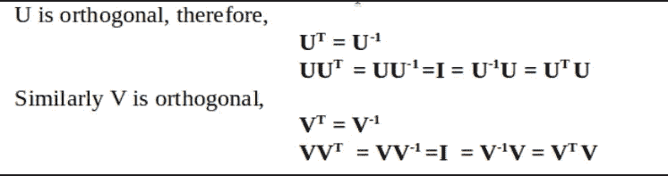

这个类有直接计算给定矩阵的奇异值和奇异值的方法，但是符号略有不同，这可能会让你感到困惑。

当您调用`svd()`函数时，它返回三个矩阵: **U、****σ_ array 和 V_transpose** ，其中 U 和 V_transpose 是 SVD 定理中定义的同一个矩阵，但σ是包含特征值的奇异值或平方的一维数组。因此，当你乘这些返回的矩阵时，你得不到原来的矩阵，大多数时候你会得到错误，因为这些返回的矩阵顺序不同，因此不能相乘。

考虑下面的 SVD 示例，我们取大小为 2x3 的矩阵 A，将使用 NumPy 库执行 SVD，并检查所获得的分解矩阵的形状:

```
import numpy as np
A = np.array([[1,4,1],[-4,-7,1]], dtype = float)
U, Σ_array, V_transpose = np.linalg.svd(A)

print("U shape:{}, Σ_array shape:{}, and V_transpose shape:{}".format(U.shape, Σ_array.shape, V_transpose.shape))
print("U is:\n{},\n Σ_array is:\n {},\n and V_transpose is:\n {}".format(U, Σ_array, V_transpose))
```

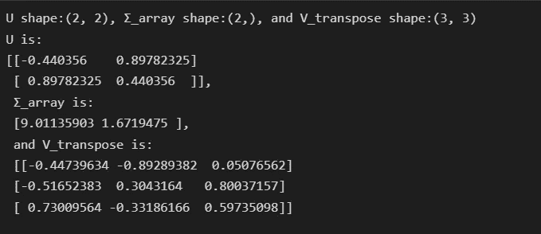

如上所述，U 和 V 是正方形和正交矩阵。

但是，当我们将这些返回的矩阵相乘以返回矩阵 A 时，我们会得到错误:

```
U@Σ_array@V_transpose # @ is used to perform dot product 
```

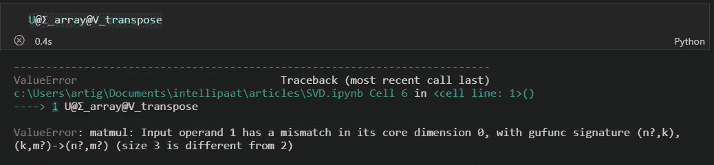

Error

NumPy 库的`svd()`函数并不像定理中所说的那样直接返回σ，但是我们可以从返回的σ_ array 中获得σ。现在，我们的任务是从σ_ array 中获取σ。我们知道σ是`mxn` 矩阵。σ_ array 的值是σ的对角元素。因此，我们将首先用全零初始化大小为`mxn`的σ，然后形成σ_ array 的对角矩阵，然后将其分配给σ的顶部方阵。

```
m = A.shape[0]
n = A.shape[1]
Σ = np.zeros((m,n))
Σ[0: len(Σ_array), 0: len(Σ_array)] =  np.diag(Σ_array)
print(Σ)
```

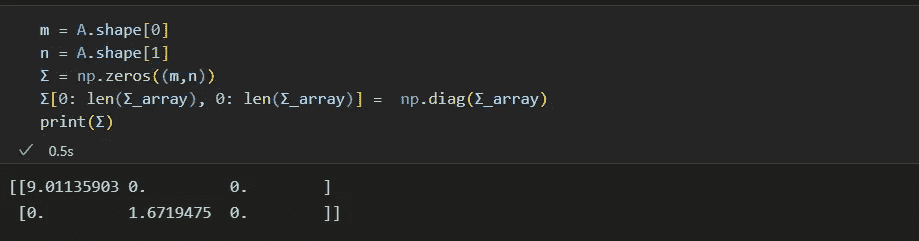

Σ

现在我们可以将 U、σ和 V_transpose 相乘，我们将得到原始矩阵 A:

```
print("Matrix constructed from original matrix:\n {}".format(U@Σ@V_transpose))
print("Original Matrix:\n{}".format(A))
```

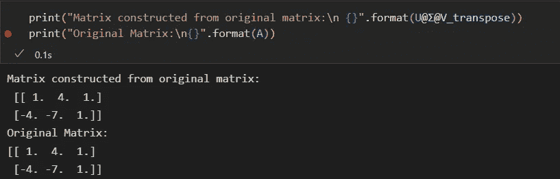

## 我们已经得到了这些分解矩阵，但是我们如何计算它们呢？

我们知道 U 和 V 是正交矩阵，因此利用它们的特性，SVD 分解问题被转化为特征值和特征向量问题。因此我们可以用特征值和特征向量找到 U 和 V 矩阵。

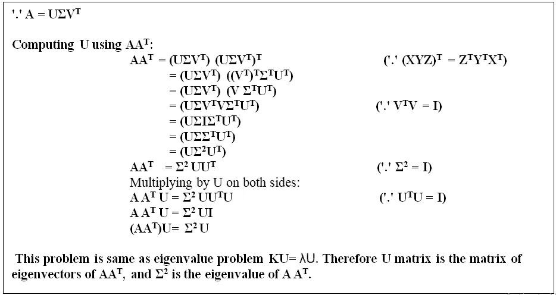

用类似的方法，我们可以计算 V:

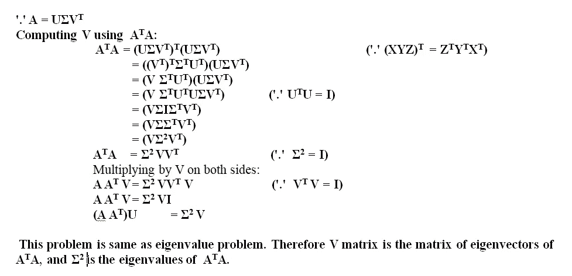

**计算 U:**

#注:从`**AA^T = (np.dot(A,A.T))**` 的特征向量接收的 U_ 按特征值降序重新排列，得到 SVD 方程中的 U。

```
eigen_values_U, eigen_vectors_U = np.linalg.eig(np.dot(A, A.T))  # gives U
# Sorting eigen_values_U and eigen_vectors_U in descending order of eigen_values_U
idx = eigen_values_U.argsort()[::-1]   
eigen_values_U = eigen_values_U[idx]
eigen_vectors_U = eigen_vectors_U[:,idx]
print("eigen_values_U received from AA^T:\n{}".format(eigen_values_U))
print("eigen_vectors_U received from AA^T:\n{} which is same as U obtained in SVD except in sign:\n{}".format(eigen_vectors_U, U))
```

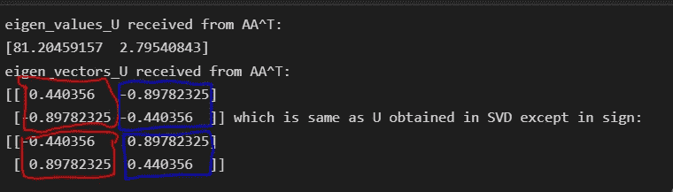

**计算 V:** 对从矩阵`A^TA`接收的特征值 V 进行转置，得到 SVD 方程中的 V 转置。

```
eigen_values_V, eigen_vectors_V = np.linalg.eig(np.dot(A.T, A)) # gives V
# Sorting eigen_values_V and eigen_vectors_V in descending order of eigen_values_U
idx = eigen_values_V.argsort()[::-1]   
eigen_values_V = eigen_values_V[idx]
eigen_vectors_V = eigen_vectors_V[:,idx]
print("eigen_values_V received from A^TA:\n{}".format(eigen_values_V))
print("eigen_vectors_V received from A^TA:\n{}".format(eigen_vectors_V))
print("SVD return V_transpose, therefore taking transpose of eigen_vectors_V:\n{} which is same as V_transpose obtained in SVD:\n{}".format(eigen_vectors_V.T, V_transpose))
```

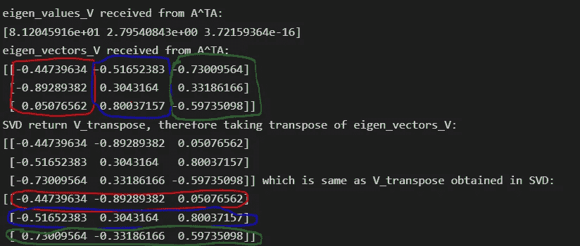

**计算σ:**

σ是对角矩阵，包含对角线上的奇异值，这是通过取出按降序排列的`AA^T`和`A^TA`的公共特征值的平方根来实现的，因为我们得到的特征值是**σ**的平方，因此我们必须取从`**AA^T and A^TA**`接收的特征值的平方根:

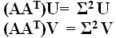

```
# eigen_values_U, eigen_values_V are the Σ^2
# taking the min(m,n) and truncate the eigen_values_V or eigne_values_U as both will return same result
Σ_array_cal = np.sqrt(eigen_values_V[:min(m,n)])
print("Σ_array_cal:{}\nis as same as Σ_array received from SVD() function of numpy:{}".format(Σ_array_cal, Σ_array))
```

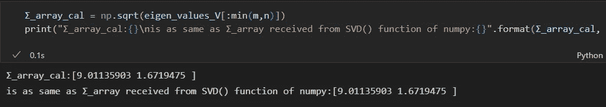

你可以在这里找到本文所用代码的 [GitHub 链接。](https://github.com/grgupta13/machine-learning/blob/main/Linear_algebra/SVD.ipynb)

在下一篇文章中，我们将看到如何在 PCA 中使用 SVD，以及如何使用协方差矩阵计算 SVD 的分解矩阵。如果你喜欢这篇文章，那么不要忘记鼓掌，评论，并关注我的媒体，关注未来的帖子。

**参考文献:**

[https://insightsanalytics . in/do-标准化和规范化-将数据转换为正态分布/](https://insightsanalytics.in/do-standardization-and-normalization-transform-the-data-into-normal-distribution/)

[](https://insightsanalytics.in/) [## 主页-洞察分析

### 在您的数据科学之旅中，我们是您的伴侣。我们提供关于 SQL 和 python 的博客，让您快速入门…

洞察分析](https://insightsanalytics.in/) [](https://gregorygundersen.com/blog/2018/12/10/svd/) [## 尽可能简单的奇异值分解

### 其中是酉矩阵是对角矩阵并且是酉矩阵。是的共轭转置。取决于…

gregorygundersen.com](https://gregorygundersen.com/blog/2018/12/10/svd/) [](https://math.stackexchange.com/questions/3309124/singular-value-decomposition-understanding-the-geometric-visualisation) [## 奇异值分解-理解几何可视化

### begingroup$矩阵 A 的奇异值分解满足$ \ mathbf A = \ mathbf U \ mathbf \适马\mathbf…

math.stackexchange.com](https://math.stackexchange.com/questions/3309124/singular-value-decomposition-understanding-the-geometric-visualisation)