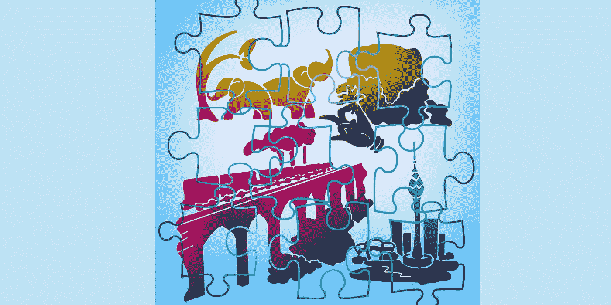

# 僧伽罗语是世界上最美丽的语言之一

> 原文：<https://medium.com/geekculture/sinhala-is-one-of-the-most-beautiful-languages-in-the-world-7e117f63b35a?source=collection_archive---------5----------------------->

## 僧伽罗语的演变…

E 每一种语言都有一组字母，它是那种语言所独有的。这组字母被称为“字母表”。斯里兰卡人的主要语言叫做**僧伽罗语**。僧伽罗文字母表不是一次诞生的。这是几千年来形成的结果。目前，它被确定为…