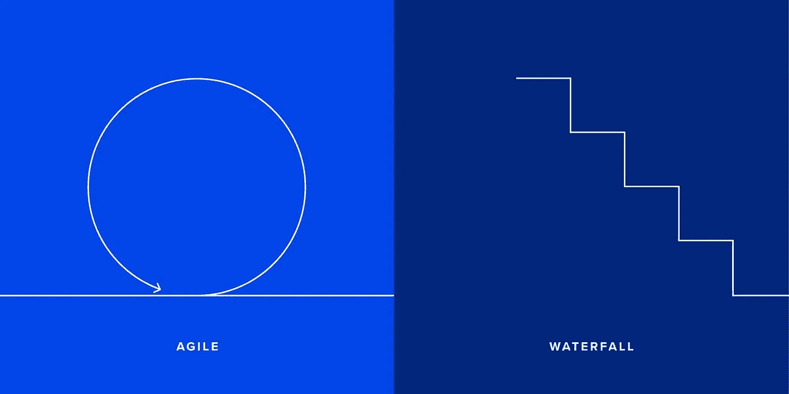

# 敏捷开发的六大好处

> 原文：<https://medium.com/geekculture/six-key-benefits-of-agile-development-7f56106493a5?source=collection_archive---------28----------------------->

从本质上讲，敏捷是一种交互式的、迭代的、增量式的项目管理方法。该方法基于帮助公司和团队在不断变化的环境中有效运营，同时尽可能快地交付商业价值。

敏捷项目管理中使用的所有方法(Scrum、XP、看板等)都遵循一个基于实现持续改进、灵活性、团队贡献和高质量结果的灵活宣言。在这篇文章中，我们将仔细看看敏捷对于[定制应用开发](https://eleks.com/services/custom-application-development/?utm_source=medium&utm_medium=refferal&utm_campaign=Republ-agile_benefits_blog)的好处，以及它可能的挑战和缺点。

# 敏捷与传统开发

在继续讨论敏捷实际上是什么之前，让我们首先考虑一下敏捷项目管理相对于传统开发和管理模型的区别和好处。

通常，当他们说“传统管理”时，有经验的公司高管和项目负责人会将其视为瀑布模型，或者简单地说，瀑布方法。与敏捷不同——主要是因为它没有那么灵活和迭代——瀑布是一个循序渐进的过程，在这个过程中，您可以看到不同阶段的进展。它是一个顺序模型，通常从需求分析、设计、实现、测试和维护开始。下图展示了这两种方法的价值差异。敏捷的独特优势之一是，它在过程开始时提供可见性、适应性和价值，并随着项目的进行显著降低风险。

与传统方法相比，灵活的方法更适合客户需求。例如，在整个敏捷生命周期中，通过提供可见性和透明度，展示项目的实际进展，鼓励用户参与。

敏捷方法预先假定了简短的迭代计划，使得随着任何需求的变化而调整策略变得非常容易。贯穿整个过程的这种持续的计划和反馈对于项目管理来说是非常宝贵的帮助。而且，当与[近岸软件开发](https://eleks.com/expertise/nearshore-software-development-company/?utm_source=medium&utm_medium=refferal&utm_campaign=Republ-agile_benefits_blog)合作模式相结合时，敏捷可以在成本效益方面给企业带来巨大的好处。

同样，这个想法是通过使减轻开发风险变得更容易，在过程的早期创造商业价值。所以，让我们仔细看看敏捷的好处，以及它可能的挑战和缺点。

# 敏捷项目管理的 6 个好处

## 1.它创造出最高质量的产品

敏捷开发的本质是，您可以在实现或开发周期的任何阶段绝对控制一切。这意味着，在任何一个周期的产品验证阶段，Agile 都允许您跟踪质量，进行任何必要的调整，并以最少的错误发布一个可投入使用的产品。就质量而言，您还可以从以下方面受益:

*   及时定义和开发需求，使产品特性尽可能准确和相关。
*   将持续集成和日常测试合并到开发过程中，允许开发团队在问题出现时立即解决问题。
*   自动化测试工具的使用。
*   进行冲刺回顾，允许 scrum 团队不断地改进过程和工作。
*   软件是在快速递增的周期中开发的。这导致了小的增量版本，每个版本都基于以前的功能。然后，每个版本都要经过彻底的测试，以确保软件的质量得以保持。

## 2.你有更高的顾客满意率

使用敏捷方法，产品负责人不断地参与到开发过程中，包括进行任何调整、错误修复和进一步的循环。因此，产品的开发过程和结果对客户和开发团队都是可见的。总之，您可以:

*   在每次 sprint 评审中向客户展示工作的进展和结果。
*   通过每次发布，更快、更频繁地将产品推向市场。客户可以在产品的整个生命周期中提前接触到产品。
*   确保客户对开发项目的必要参与。

## 3.您关注最相关的指标

使用传统方法的公司通常比使用灵活系统的公司生产出质量较差的产品。此外，他们通常花费更多的资源和时间。使用敏捷，你可以通过考虑你的开发团队的技能和能力来决定项目的时间和预算。您的开发团队将根据项目要求提供劳动力估算。然后，使用这些相对的估计，而不是小时或天，您可以将大概的劳动力需求与开发团队的知识和能力联系起来。此外，您还可以:

*   随着开发团队对项目了解的增加，定期更新对工作量、时间和成本的估计。
*   获取 sprint 倦怠图表的每日更新，以提供开发团队在每个 Sprint 中表现的准确度量。
*   将未来开发的成本与该开发的价值进行比较，这有助于项目团队确定何时完成项目并将资本重新分配给新的计划。

## 4.风险接近于零

灵活性是敏捷的主要优势之一，使您几乎消除了项目全面失败的可能性。这是因为从第一个 sprint 开始，您总是有一个工作产品，所以您的项目总是有一个有形的结果，您可以在其上开发和构建。

同样关键的是，你可以发展你的 sprints，以确保在最初的项目投资和任何潜在的失败之间，或者同样地，在你证明产品/方法有效的时刻，有一个短的时间间隔。这里还有一些更值得一提的风险相关特性:

*   敏捷允许您通过自筹资金的项目提前获得收入，使组织能够以很少的前期成本支付项目费用。
*   由于新的增量发布的频率，敏捷给你以很低的成本实现新的变更的自由。
*   在开发过程中，您可以快速适应客户的需求和偏好。敏捷通常考虑用户故事和以业务为中心的接受标准来定义产品特性。通过关注真实客户和最终用户的需求，每个产品特性逐渐为项目增加商业价值，而不仅仅是另一个 IT 组件。
*   您还可以在每次迭代后对软件进行 beta 测试，在项目早期获得有价值的反馈，并提供在需要时进行更改的能力。

## 5.更快的投资回报

交付周期长通常是企业面临的一个问题，尤其是在快速增长的市场。因为敏捷开发是迭代的，特性是增量交付的，所以当产品仍在开发中时，好处就在早期实现了。

当开发很早就开始时，您可以在几次迭代中实现功能齐全的市场就绪产品，这就给了您所谓的“先发优势”。此外，有了敏捷，您可以受益于更快的产品发布和评估客户反应并做出相应改变的能力——在竞争中领先一步。正如我们已经提到的，敏捷方法允许您关注业务价值。通过使客户能够优先考虑功能，团队了解对客户的业务最重要的是什么，并能够以最有价值和最相关的顺序提供功能。

## 6.监督项目风险和可能失败的能力

敏捷项目管理包括几个实践、人工制品和工具来增加可预测性。在整个项目中保持相同的 sprint 持续时间和开发团队的分布允许项目团队知道每个 sprint 的确切成本。

此外，考虑开发的速度允许项目团队预测发布的时间表和预算，以及理解未完成的产品积压和需求组。更重要的是，使用来自日常 scrum 会议的信息，sprint 倦怠图表和问题板允许项目团队预测单个 sprint 的表现。

# 使用灵活敏捷系统的挑战

当然，敏捷不是一个完美的系统。和其他事情一样，你需要考虑风险和挑战。其中包括:

*   **可能需要额外的培训和技能**。敏捷本身需要大量的训练和熟练的使用才能成功。大多数公司不理解这一点，因此试图快速地做每件事，避免投入任何额外的努力。不幸的是，由此产生的项目经常失败。
*   **组织变革**。为了取得成功，敏捷方法可能还需要某种程度的组织变革。业务涉众需要本着信任和伙伴关系的精神与开发团队合作。这可能意味着打破某些组织障碍，使这变得困难或不可能。
*   **扩展性**。在大型项目中实施敏捷方法通常是一项复杂且耗时的工作。这有几种模型(Scrum-of-Scrum，LeSS and SAFe)，但没有一个是易于实现的通用解决方案。
*   **与项目或计划管理的整合**。敏捷并不总是适合于需要计划方法来实现一定程度的可预测性的项目。但是有很多方法可以创建敏捷和更传统的基于计划的方法的混合，并衡量敏捷/Scrum 在这种情况下的正确比例。

# 那么，您应该如何以及何时使用敏捷模型呢？

当你需要不断更新你的产品，实现新的特性和功能时，敏捷的好处，包括自由和灵活性，是非常重要的。由于创建新增量的频率很高，所以可以以非常低的成本实现新的变更。

与瀑布模型不同，敏捷只需要非常有限的计划就可以开始一个项目。敏捷模型假设最终用户的需求在业务和 IT 的动态世界中不断变化。可以根据可用的反馈来讨论更改和添加或删除功能。这有效地为客户提供了完全符合其要求和需求的成品。

# 摘要

尽管敏捷有这么多好处，但是这种方法并不能解决你所有的项目管理挑战。但它是一个通用的工具，可以帮助你改善你的业务和你的服务和产品的质量。

您也可以使用敏捷作为创建定制管理方法的基础，将传统风格与新的灵活风格相结合。这给了你一个更灵活的项目管理系统，你可以根据情况调整你的方法。

你对如何运用敏捷实践来帮助你实现你的产品理念有疑问吗？我们将很乐意回答这些问题。[联系](https://eleks.com/contact-us/?utm_source=medium&utm_medium=refferal&utm_campaign=Republ-agile_benefits_blog)我们。

*原载于 2021 年 7 月 22 日*[*【https://eleks.com】*](https://eleks.com/blog/benefits-of-agile-development/?utm_source=medium&utm_medium=refferal&utm_campaign=Republ-agile_benefits_blog)*。*