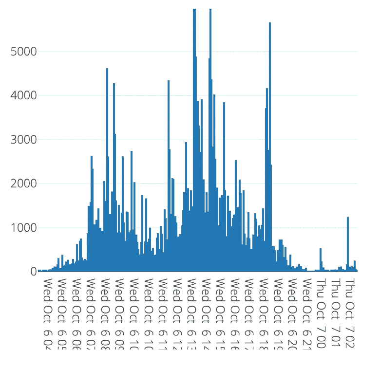

# M6 金融预测竞赛的六种训练方法

> 原文：<https://medium.com/geekculture/six-ways-to-train-for-the-m6-financial-forecasting-competition-cacaf3af58b5?source=collection_archive---------1----------------------->

Image by John Arano

M6 预测比赛的细节已经公布。这一次是最难的测试，正如在[预测竞赛的未来](https://www.microprediction.com/blog/future)中所讨论的，很高兴看到我们正在实时进行。但你会问，既然股市已经是一场预测竞争，我们为什么还需要一场预测竞争？我会让组织者讨论这个问题，你可以在这里阅读详细内容[。](https://mofc.unic.ac.cy/the-m6-competition/)

> 有效市场假说(EMH)假定股票价格反映了所有相关信息，这意味着市场的持续优于市场是不可行的。EMH 得到了经验证据的支持，包括晨星公司的年度“主动/被动晴雨表”研究，该研究经常发现，主动、专业的投资经理平均来说不会击败随机选择的股票。另一方面，像沃伦·巴菲特、彼得·林奇和乔治·索罗斯等传奇投资者，以及包括黑石、Bridgewater Associates、Renaissance Technologies、DE Shaw 和许多其他公司在内的知名公司在很长一段时间内取得了惊人的成绩，积累了不可能仅凭运气来证明的回报，并对 EMH 的有效性提出了质疑。**M6 竞赛的明确目的就是实证研究这一悖论**。

如果你打算参加这个比赛，我提供六个想法。

# 1.练习进行分布和等级概率预测

如果你来自 Kaggle 或其他你已经做过点估计的地方，我会鼓励你继续前进。在我看来，阿尔法一代不太可能成为决定性因素。

仔细看看规则。你被要求提供该类别中每种资产回报率的*等级*的概率预测(1 到 5 之间的数字)。基准是均匀分布。该度量是排名的概率分数。你需要预测所有资产的收益分布。这是一场赛马。

也许这是太多的希望，但 M6 竞赛可能会刺激更好的顺序统计估计，分布和分位数方法开源包的开发。我将尝试在这里添加更多的 Python 包[，让我们看看我们是否能拿出一个像样的新的子部分。](https://www.microprediction.com/blog/popular-timeseries-packages)

如果你在 Julia 并且使用 Flux，看一看 Rusty Conover 用 Flux 构建的分布式 NYISO 电力模型(并通过 Tensorflow.js 公开——见[这个报告](https://github.com/rustyconover/nyiso-electricity-models)和他的一些其他报告)。

我希望，预测分布和分位数也会让你对分位数和期望分位数的评分规则的微妙之处感兴趣。

为了好玩，我设置了一个竞赛，你可以试着预测实际五场赛马的等级概率。这显然不是同样的挑战，但它至少可以让你适应事物的变化。你可以在这里了解这场比赛[。](https://microprediction.medium.com/crowd-order-statistics-9940acae85fa)

# 2.预测波动性、协方差或其他辅助量，而不是平均值

不言而喻，如果你想做出好的分布预测，你仍然可以从相关量的点估计中获益。现场微观预测竞赛中的竞争者已经发现了这种情况，因此尽管分布估计是目标，但是整理任何可以找到的点估计当然是值得的。

由于波动性可能与交易量以及市场中观察到的其他事物有关，所以直接练习预测交易量可能会有好处。这是原油交易量(布伦特，如果你在乎的话)。

你可以在这里看到现场版。您也可以在[流列表](https://www.microprediction.org/browse_streams.html)中搜索“音量”。您还可以创建一个只跟踪流量(或波动性)流的爬虫。此处提供了告诉你的爬虫去哪里的说明[。](https://www.microprediction.com/python-6)

# 3.练习使用收缩和剩余预测

缩水几乎总是值得一看。就股票市场而言，这无疑是正确的。事实上，沃伦·巴菲特赢得 M6 的唯一机会是，除了他的一两个关键观点之外，他把所有东西都缩小到零。

如果你看看在 Elo 最快算法评级中表现最好的时间序列算法([这里是](https://microprediction.github.io/timeseries-elo-ratings/html_leaderboards/fastest.html))，你会看到有一堆集合在上面——稍后会有更多——但是接下来是名为 *thinking_slow_and_fast* 的算法。然后，如果你深入研究那个算法的代码([这里](https://github.com/microprediction/timemachines/blob/main/timemachines/skaters/simple/thinking.py))，你会注意到两件事。首先，它只是用一条移动平均线来预测另一条移动平均线的误差(但正在缩小)。

其次，您可以用一行代码对您自己的模型做同样的事情。这一行代码是对像*快速移动伪君子剩余工厂*这样的函数的调用，我承认这不是最吸引人的名字。但这很容易。请记住，当您预测市场时，您预测的是现有预测的残差。我希望 M6 竞赛能为鞅假设检验带来新的、好的开源代码，如果没有其他的话。

这里[还有一点讨论](https://www.microprediction.com/blog/timemachines)。

# 4.练习在线堆叠

[堆叠](https://en.wikipedia.org/wiki/Ensemble_learning#Stacking)可以很简单，也可以更精细。在姚、Pirs、Vehtari 和 Gelman 最近的一篇论文中可以找到一些参考和想法。一种简单的方法跟踪最近的经验误差，并相应地对模型进行加权。

有簿记的问题来跟踪准确性，必须小心避免数据泄漏。通常最简单的方法是在网上进行，完全避免这种危险。正如我在这篇[帖子](https://www.microprediction.com/blog/forever)中提到的，我已经提供了一些实用程序来使这变得方便。

在这方面, [**巡游**](https://github.com/microprediction/timemachines/blob/main/timemachines/skatertools/components/parade.py) 简单而方便(它跟踪 k 步预测及其对输入数据的准确性)。此外，我们需要一些小的便利来跟踪偏差、平方误差的运行估计，如果必要的话，还需要更高的矩( [**动量函数**](https://github.com/microprediction/momentum/blob/main/momentum/functions.py) 就足够了)。更多工具可在 [**滑板工具/组装**](https://github.com/microprediction/timemachines/tree/main/timemachines/skatertools/ensembling) 模块中找到。

# 5.协作并为开源做出贡献

我怀疑这次比赛会比大多数比赛更有竞争力。如果你想和一群对时间序列预测和开源开发感兴趣的人聊天，我想你可以在各种场所找到他们，比如 Kaggle。另一个是微预测[松弛](https://join.slack.com/t/microprediction/shared_invite/zt-xauc5r03-XmIMdy~iL4a3Hw3G1Agv6w)。

也许到比赛结束时，我们会收到很多对开源包的请求。一些模型搜索工具，如 [tslearn](https://github.com/tslearn-team/tslearn) 、 [autots](https://pypi.org/project/AutoTS/) 、 [pycaret](https://github.com/pycaret/pycaret) 可能会让你朝着正确的方向前进，但也有望从你的贡献中受益。我不是想玩最喜欢的游戏。这里有一个很长的名单。

但是在特征生成、异常检测或模体发现库中可能有一些想法，如 [liminol](https://pepy.tech/project/luminol) 、 [tsfresh](https://tsfresh.readthedocs.io/en/latest/text/forecasting.html) ，或者不太知名的 [saxpy](https://pypi.org/project/saxpy/) 、 [stationarizer](https://github.com/shaypal5/stationarizer) ，或者 [luinaire](https://zillow.github.io/luminaire/) (来自 Zillow)，它们是对更知名的库的补充。也许你可以通过案例来分割任务，使用像 [rocket](https://github.com/angus924/rocket) 这样的分类包。

我认为这可能归结于你如何组合工具。例如，我写过一篇关于使用 pycaret 和 [timemachines](https://microprediction.medium.com/combining-pycaret-and-timemachines-for-time-series-prediction-a4d456e47cd9) 的短文。但是你会用 [deepecho](https://pypi.org/project/time-series-generator/) 或者 [timesynth](https://pypi.org/project/timesynth/) 做什么呢？首先，你可以训练你的模型不要过度使用合成数据。

一些像 [magi](https://github.com/DavisTownsend/magi) 这样的工具可能会帮助你并行地做到这一点。并且 [tigramite](http://tigramite) 、 [causalnex](https://github.com/quantumblacklabs/causalnex) 或 [lingam](https://github.com/cdt15/lingam) 可能会帮助你发现时间序列之间的联系——比如一个波动性对另一个波动性。

欢迎您合作开发专门帮助人们进入 M6 的 Python 包。你可以在 pypi/m6 上找到它。也许当您读到这里时，已经有一些基准条目需要修改了。如果你有想法，提出一个[问题](https://github.com/microprediction/m6/issues)或拉动请求。

# 6.组建一个算法团队

当你使用像 [autogluon](https://github.com/awslabs/autogluon) 、autokeras[TimeSeriesForecaster](https://autokeras.com/tutorial/timeseries_forecaster/)、 [autots](https://pepy.tech/project/autots) 或 autosklean [(这里有效使用)](https://towardsdatascience.com/automl-for-time-series-forecasting-6caaf194d268)这样的模型搜索工具时，在某种意义上，你是在组建一个算法团队。

然而，也有可能形成一个由*实时*自主算法组成的团队。这种方法有点像用竞赛来参加竞赛。您可以使用免费的 [API](https://www.microprediction.com/public-api) 来实时发布数据点。当你这样做的时候，你会得到预测，因为一些算法会围绕你的数据并试图预测它。

这和使用开源软件包的区别在于，你可能永远不知道，也可能不关心，另一边的算法在做什么。虽然排行榜经常充满了带有代码徽章的条目，您可以点击它们(参见[示例](https://www.microprediction.org/leaderboard.html))。

我肯定会使用 microprediction API 参加 M6 竞赛，但这完全取决于你如何去做。microprediction API 旨在进行短期预测(最长一个小时)，但如果你够聪明，这并不会阻止你改善一个月前的预测——或者至少创造出可行的方法。

# 为了科学而做

我希望你们喜欢 M6 竞赛，并感谢 Spyros Makridakis 和助手们为此所做的不懈努力。竞赛是推进研究的催化剂，也是时尚和炒作的解毒剂。自从 1982 年第一次出现以来，情况一直如此。

此外，当你参加 M6 和类似的比赛时，你可能甚至不会意识到你可能做出的贡献。时间会证明算法的自动评估是否刚刚开始，以及它是否有一天会带来非凡的东西。更多推测[此处](https://www.microprediction.com/blog/reward)。

# 更新

我很高兴地宣布，我的公司将成为 M6 竞赛的赞助商。我们觉得这与我们的开源时序努力非常一致，我们很自豪能与 M6 合作。我们将尽我们所能确保 M6 促进新的开源工作。期待在 [m6](https://github.com/microprediction/m6) 和[时间机器](https://github.com/microprediction/timemachines)看到更多的连接器代码，这使得在 m6 使用开源包更加容易，反之亦然。