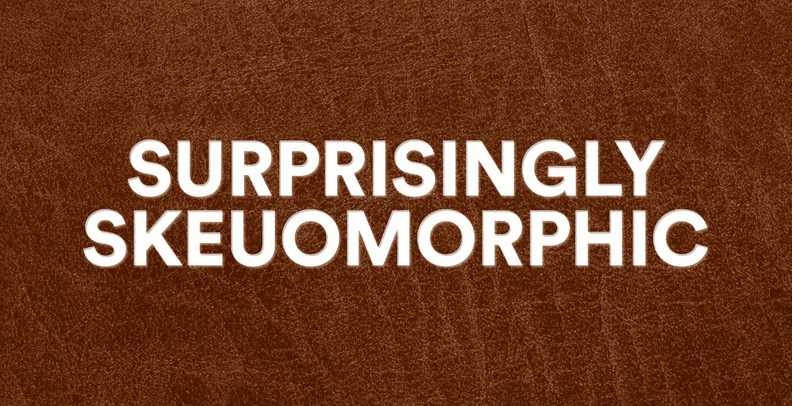

# Skeuomorphism 反击

> 原文：<https://medium.com/geekculture/skeuomorphism-strikes-back-c2312f622379?source=collection_archive---------16----------------------->

## 从 EVs 到 VR，感觉很像 2007 年

回过头来看，iOS 6 是**野**。在 2007 年至 2013 年期间，我们如此集体地迷恋高分辨率触摸屏的光泽，以至于我们完全疯了。

notes 应用程序是一个黄色的皮面合法记事本。

游戏中心有一个绿色毛毡背景和木材装饰。

我发现我的朋友们有驼色皮革装饰——*和可见的缝线！*

iBooks 是**的字面意思**一个书架。

指南针直接指向了《鲁滨逊漂流记》。

阴影无处不在。每个表面都有纹理。每种工具都有现实生活中对应的插图。回想起来，这太疯狂了(但有其独特的美)。

这就是所谓的 skeuomorphism，一旦你知道要寻找什么，它就无处不在。下面是来自维基百科的定义:

> 一个 **skeuomorph** 是一个衍生对象，它保留了原始结构中必要的装饰设计线索(属性)。Skeuomorphs 通常用于使新事物感觉熟悉，以加速理解和适应。他们使用的元素，虽然对最初的目标是必不可少的，但在新的系统中却毫无用处。

基本上，skeuomorphism 是将旧的、不必要的模型带入新的设计和技术。上面的例子是教科书上的用户界面案例，但是你也可以在普通的物品中看到它，比如客厅天花板上的装饰梁或者电脑老虎机上无用的“手臂”。

Skeuomorphism 有时会受到很多人的讨厌，但这些无用的功能通常有一个有用的目的——帮助新用户理解新技术是如何工作的，以及他们可以用它做什么。

今天，我们看到 skeuomorphism 回来了，在某些方面比以往任何时候都大。看看我们当前话语中的新兴技术:

*   沃尔玛[刚刚因为一个“元宇宙”虚拟购物体验](https://www.theverge.com/tldr/2022/1/5/22868323/walmart-metaverse-shopping-video-viral-old)而被嘲笑，这个体验看起来很像一个低成本的大型电子游戏。(虽然其实是老片段)。
*   像特斯拉和其他电动汽车制造商有不必要的气帽，格栅和模拟噪音，使他们更熟悉司机和其他道路使用者。
*   除了肉类和不可能的食物，加上一些追随者，已经掀起了植物性肉类的浪潮，这些肉类看起来和尝起来非常像动物性汉堡、香肠和鸡块。
*   加密货币既有“硬币”也有“钱包”，而非金融货币是“铸造”的，并在“画廊”中展示。

随着 2013 年 iOS 7 的发布，正如苹果喜欢说的，“一切都变了”，他们有史以来最大的界面重新设计。纹理和阴影消失了，取而代之的是简单、多彩的“平面”图标。在 iPhone 问世六年后，我们能够脱下辅助轮，拥抱这些在屏幕上与数据互动的新方式。

这让我想起了开发人员 Laurie Voss 最近关于他对 crypto 的研究的一篇非常棒的文章:

> H 阿文经历了 web 1.0 和 web 2.0 的繁荣，我非常清楚的一件事是**新事物不会重建旧事物**。旧的东西还在；新事物是不同的。但是一开始，人们试图重建旧的东西。人们在弄清楚网络原生出版是什么样子之前，试图建立“在线杂志”。他们试图用你推来推去的过道和手推车建立“网上购物”。我们建立了“公告板”而不是论坛。

有了上面这些新兴的技术项目，我们仍然处于 skeuomorphic 重建阶段，但这将会改变。电动汽车仍然是五个座位和一个方向盘——尽管[自动驾驶的未来](https://guttmann.medium.com/22-ways-to-see-the-city-4fac69bb9fa7)看起来可能会有很大不同(可能更像是 [Zoox](https://zoox.com/) 正在建造的东西)。植物性肉类仍然在复制汉堡和热狗，而不是探索新的形式。

当我们度过这个难关时，我们就会得到真正有趣的东西。(虽然我可以在我的 iPhone 上使用更多的皮革装饰。)

让我知道你在下面的想法，很想听听你的想法。然后在 [Twitter](https://twitter.com/guttmann) 上与我保持联系，了解更多信息！

**顺便说一句:**我一周发两次电子邮件，内容是一些有趣的事情。[在 Substack](https://somethinginterestingemail.substack.com/) 上免费报名。