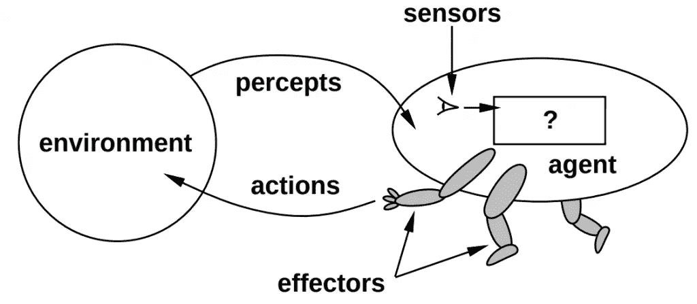
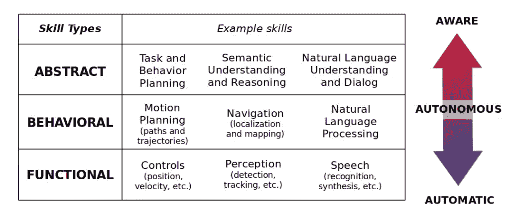
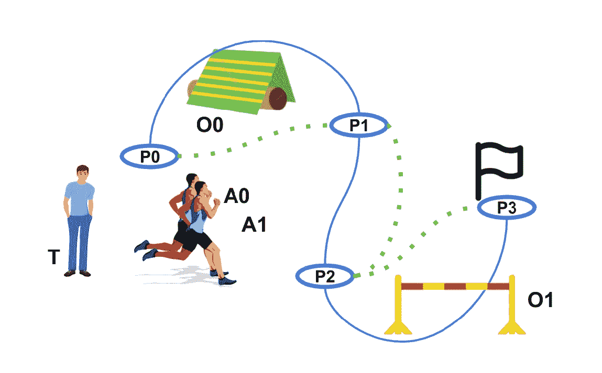
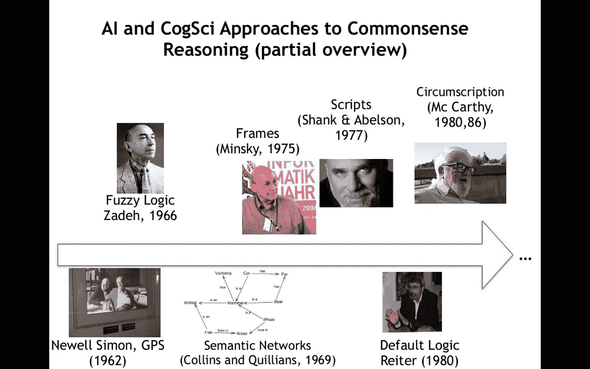
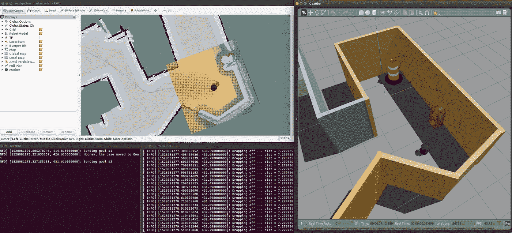

# 熟练的机器人导航

> 原文：<https://medium.com/geekculture/skilful-robotic-mobile-navigation-cb0c91706ab3?source=collection_archive---------62----------------------->

在我们为减轻日常负担和确保更美好的未来而共同努力的过程中，我们面临着生产能够在我们的层面上有效和智能地行动的系统的必要性。有鉴于此，很明显，要让这些系统为我们提供帮助，最重要的是让它们能够在我们居住的环境中进行熟练的移动导航。从避障到场景理解和导航规划，有几个过程在起作用。需要有效的编组和协调的过程。

但话说回来，在这种情况下，固有的复杂性比比皆是，并继续阻碍这一理想的实现。从不合适的全球传感器到缺乏通用性和昂贵的计算，机器人部署继续面临各方面的障碍。既然如此，为了解决这一困境，机器人专家和计算机科学家开始与人类如何操作进行比较，以开发类似的系统，希望获得简化论者无法获得的资源。他们坚持不懈的尝试仍然是对解决方案空间的必要探索，他们在解决方案空间中努力实现若干功能，如定位、导航、操纵、规划和人机交互。

现在，为了更好地规划和导航技能，将被动技能(如几何和语义场景理解)与主动技能(如学习、推理和长期记忆)结合起来使用可能是一条有前途的研究途径。在这里，目标是鼓励将视觉导航技能概括为新指令的能力，并在任务之间转移获得的语义知识，以便该单元可以随着时间的推移而改进，并随着新环境的增加而获得经验。在这一点上，探索政策的发展和一个单元的语义推理能力是有区别的。

关于推理问题，这个想法是，一个有效的机器人应该具备某种形式的语义导航技术。记录遇到的对象、区域和相互关系以推断理解的过程，即。有利的是，它可以捕捉室内环境中的典型布置模式，以便更好地做出决策。以这种方式，在导航目标的执行中，哪里更有可能找到某些物体成为一条有用的信息。从长远来看，这种类型的推理被追求，希望它将修剪计算，并使更好地理解一个单位的环境。

在探索策略方面，目标是在给定长期目标的情况下，从代理的当前姿态估计来规划路径。有意地，这种训练应该发生在该单位完全不熟悉的环境中，以便它没有接收到预先的经验并且避免过度拟合它的训练数据。在这样做的时候，一个单元将别无选择，只能基于它在飞行中接收到的观察和它所具备的任何语义推理来做出许多决定。例如，当部队穿越一个区域时，可以战略性地使用探索过的和没有探索过的。类似地，为了优化长期导航，可以寻找短期检查点等等。

考虑到所有的事情，从类似的事业中出现的好处将在实现具体化代理的改进和通用的视觉导航中发挥重要的作用。这是一项具有挑战性的任务，也是成功的移动家庭助手的首要关注点。