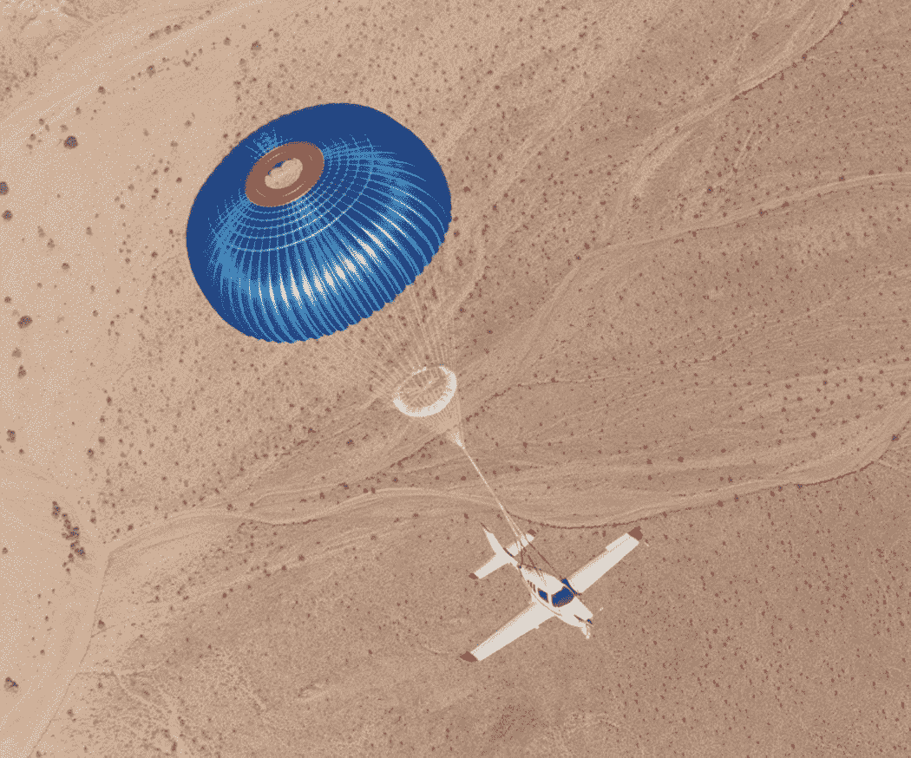

# 技巧和技术避免了樱桃溪上空的悲剧

> 原文：<https://medium.com/geekculture/skill-and-technology-avert-tragedy-in-skies-over-cherry-creek-67368f34b99?source=collection_archive---------72----------------------->

涉及“半空中撞机”这几个字的故事，很少有圆满的结局。飞机在离地面数千英尺的高空高速坠毁通常会导致头条新闻宣布悲惨的死亡人数。

但是最近一次发生在樱桃溪水库上空的空中碰撞像任何空难一样愉快地结束了，所有的机组人员和乘客都离开了他们严重受损的飞机。对于那些在空中和地面上的人来说，这场事故很容易以悲剧告终，这是由于熟练的驾驶和一项令人惊讶的未得到充分重视的航空安全技术。

5 月 12 日星期三上午 10 点 25 分左右，一架 Swearingen Metroliner 双涡轮螺旋桨飞机和一架 Cirrus SR22 飞机最后一次降落在 Centennial 机场。这架载有货物和一名飞行员的 Metroliner 获准降落在机场的 17L 跑道上。载有一名飞行员和一名乘客的卷云号获准在平行跑道 17R 着陆。

在撰写本文时，不知什么原因，两架飞机在跑道以北大约 3 海里处相撞。值得注意的是，尽管他的飞机机身的一大块丢失了，Metroliner 的飞行员仍然能够继续飞行并安全降落在机场。

尽管飞机严重受损，地铁驾驶员还是将飞机引导至安全地带。

南方地铁消防救援队的公共信息官员 Eric Hurst 告诉 AOPA 新闻，地铁客机碰撞后的路径将它带到了人口稠密的地区，包括南方地铁消防救援站。如果飞机坠毁了，可能会造成地面人员伤亡。

虽然 Metroliner 在碰撞后可以继续着陆，但 Cirrus 的情况要糟糕得多。根据美国联邦航空管理局(FAA)今天发布的初步报告，Cirrus 的飞行员向空中交通管制发出无线电通知，他的飞机无法控制，他已经部署了 Cirrus 机身降落伞系统(CAPS)。

樱桃溪公园(Cherry Creek Park)震惊的旁观者看着飞机缓缓下降，系在一个颜色鲜艳的降落伞上，在贝尔维尤大道(Belleview Avenue)和皮奥里亚街(Peoria Street)的交叉口附近相对柔和地着陆。飞行员和乘客都离开了飞机，路人纷纷上前提供帮助。

CAPS 是 BRS Aerospace 开发的安全系统的 Cirrus 版本。BRS 代表弹道回收系统，这是鲍里斯·波波夫在 1980 年发明的一种降落伞系统，当时他驾驶着一架发生故障的悬挂式滑翔机从 400 英尺的高空坠落，幸免于难。波波夫的系统使用一个小型固体燃料火箭将降落伞从机身的外壳中拉出，并展开一个伞盖，该伞盖旨在将整个飞机轻轻地降至地面。

波波夫的第一次有记录的救生发生在 1983 年科罗拉多州，当时飞行员杰伊·蒂普顿的超轻型飞机发生故障。蒂普顿展开他的 BRS，在他妻子和三岁女儿的注视下安全着陆。

1993 年，西锐公司与 BRS 航空航天公司合作，专门为他们的飞机开发了一套系统。结果是 CAPS 成为第一个由 FAA 认证的 BRS 系统。

迄今为止，西锐公司是唯一一家将降落伞回收系统作为飞机标准配置的制造商。根据卷云拥有者和驾驶员协会的数据，自 2002 年以来，截至 5 月 12 日樱桃溪上空的空中碰撞，CAPS 已经在 104 次激活中拯救了 212 条生命。

Cirrus 报告说，自从他们在飞机上采用 CAPS 标准以来，已经挽救了 200 多人的生命。

莱特州立大学(Wright State University)2018 年发表在《航空航天医学与人类表现杂志》(Journal of Aerospace Medicine and Human Performance)上的一项研究对 268 起事故进行了研究，发现在 CAPS 被激活的事故中，死亡、重伤或坠机后火灾的几率明显下降。

尽管它被证明是有效的，制造商和飞行员们还是迟迟没有采用弹道降落伞回收系统。莱特州立大学研究的主要作者迪恩·奥尔森告诉《航空与航天》杂志，他认为飞行员不愿意放弃对飞机的控制，并认为他们的驾驶技能可以拯救他们。奥尔森说:“当你打开降落伞时，你就成了一名乘客，我不知道某些人在这种情况下是否真的想放弃控制。”

5 月 12 日，我们见证了驾驶技术和航空安全技术在樱桃溪上空的应用。他们一起拯救了空中和地面的生命。也许随着越来越多的人从可能以悲剧收场的事故中走出来，更多的飞行员和制造商将会接受 CAPS 等技术的潜力。