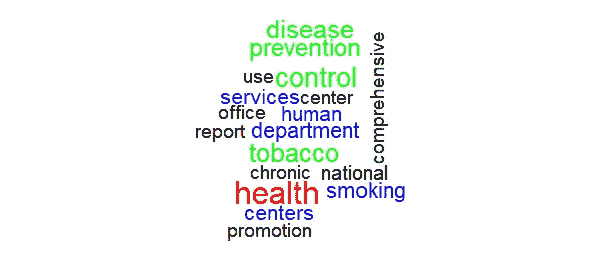

# 浏览经济学论文:R 教程

> 原文：<https://medium.com/geekculture/skimming-through-econ-papers-an-r-tutorial-290c67997594?source=collection_archive---------53----------------------->

在这篇简短的博客文章中，我分享了一个快速浏览 PDF 的快速算法，这个算法很可能并不新颖。只是为了好玩，我先分享一下它的动力。如果你很急，请跳到“单词云算法”这一节。否则，拿起你的饮料，继续阅读。

## 暑假

5 月 21 日，我完成了经济学硕士(一个 2 年的项目)的第一年，真的对一切都感到恶心(基本上，除了足球)。但是时间能治愈一切，对吗？在两个月的假期后，还有两周的时间，我决定写硕士论文，2022 年 5 月到期。事实上，我最喜欢的话题是工人汇款(显然)永无止境的增长——在过去的 4-5 年里，墨西哥收到了大量美元——这引起了我很长一段时间的注意。

然而，这个夏天我改变了主意。事实上，一个吸引我更长时间的话题是一般均衡分析。特别是，我对开发一个动态随机一般均衡(DSGE)模型感兴趣。此外，我要进行的分析围绕着劳动力市场。我在 Macro II(即 Romer (2018)的第 11 章)中学到了几个劳动力市场模型，并希望在开发一般均衡模型时深入研究它们。我认为这是一个很好的工具，因为 DSGEs 是评估货币政策的好工具；此外，如果应用于墨西哥经济，人们希望考虑无处不在的劳动力市场非正式现象。

因此，我很快发现自己沉浸在疑惑、信息、那到底是什么、这到底是什么等等的海洋中。所以我决定从假设的最终结果开始:在这个特定的知识领域，在同一所学校从事相同项目的其他人以前写过什么？我找了 7 篇之前写的硕士论文，都是符合我兴趣的。当然，我不会在不知道这 7 部作品与我的研究相关的情况下阅读这 7 部作品。

因此，我决定用 R 语言创建一个算法，它可以向我简要介绍这 7 篇文章的主题。当然，阅读摘要是最直接的方法，但还有更多的方法。所以这个算法会计算字数，然后创建一个单词云来补充对摘要的简单阅读。

## 单词云算法

对于本教程，您需要做好准备。首先，让我们安装所需的软件包:

*访问 PDF 文件:包****【PDF tools】***

函数 pdf_text 是 pdftools 附带的 pdf 实用程序的一部分，这是一个功能强大的包，使 R 能够读取 PDF 文件。

*文本挖掘:包****【TM】***

这个软件包将承担分析 PDF 文件的繁重工作。我们将把这个文件转换成一个“语料库”对象——一个用自然语言表示的文本。这个对象将被 tm_map 函数操作，该函数将修剪空白，将所有字母转换为小写，清除所有标点符号，并删除所有“停用词”。后者是一组最常用的词(如“这个”、“一个”、“这个”等)，不计算在内。最后，这个包包含“DocumentTermMatrix”函数，它将为文本中的每个术语创建一个频率向量。

*一堆单词:package* ***【单词云】***

这需要一堆单词和它们的频率，并返回一个漂亮的云。这只是为了演示的目的，但有它也很好。

```
install.packages(“tm”) 
install.packages(“pdftools”)
install.packages(“wordcloud”)
```

我们有工具，让我们继续前进。

```
#setwd(“C:/Don’t/Forget/To/Set/The/Correct/Working/Directory”)
library(tm)
library(pdftools)
library(wordcloud)
```

第一步是选择你想要的 PDF 文件。请允许我假装我们对这个文件([https://www . cdc . gov/tobacco/data _ statistics/evidence/pdf/comprehensive-TCP-508 . pdf](https://www.cdc.gov/tobacco/data_statistics/evidence/pdfs/comprehensive-TCP-508.pdf))很感兴趣，这是一个关于烟草控制项目的 CDC 总结。你可以去看看，链接是安全的。将其保存到您的工作目录中，并随意命名。我将它命名为:CDC_file.pdf

```
myfile <- “CDC_file.pdf” mytext <- pdf_text(myfile) ## Load the documentthebody <- Corpus(VectorSource(mytext)) ## convert the text (NLP) to corpora, the data type that ‘tm’ works with
```

接下来的步骤将清理文本，使其易于阅读、处理和分析。尽管我们喜欢 R 的卓越性能，但它仍然是一台机器，不理解自然语言。

```
thebody <- tm_map(thebody, tolower) ## all letters are lower capthebody <- tm_map(thebody, removePunctuation) ## no punctuationsthebody <- tm_map(thebody, stripWhitespace) ## this trims all whitespacesthebody <- tm_map(thebody, removeWords, stopwords(“en”)) ##remove stop words
```

现在，我们有了一个更清晰的文本。让我们从中提取单词及其计数:

```
thebody$content  ## extract the words from the body of our text
thematrix <- DocumentTermMatrix(thebody)  ## this creates a vector of words with their frequenciesthematrix <- t(as.matrix(thematrix))frequencies <- sort(rowSums(thematrix), decreasing = T)  ## and this sorts the words by frequency, from higher to lower.
```

## 最后的结果

最后，我们开始画我们的云:

```
wordcloud(head(names(frequencies), 18), head(frequencies, 18), scale = c(2,1), colors = c(“black”, “blue”, “green”, “red”))
```



We better not account for words such as “department”, “disease” and “control”. Those would obviously appear.

这就是这篇教程的全部内容，希望对以后的人有所帮助。如果您不喜欢云的外观，请使用。你可以随心所欲地发挥创造力。就我而言，我只想在阅读之前尽可能快地浏览一下文章。

记得戴口罩，打疫苗。

*感谢阅读我。在你离开之前，请记住:这篇文章中的练习只是为了说明我分析一篇文章的一种方法。这既不是详尽的分析，也不是认真的分析。本文所表达的观点纯属本人观点，* ***仅代表本人观点*** *。*