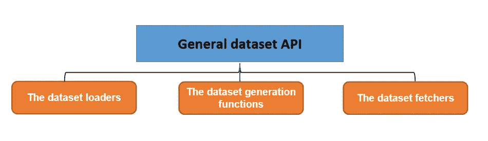
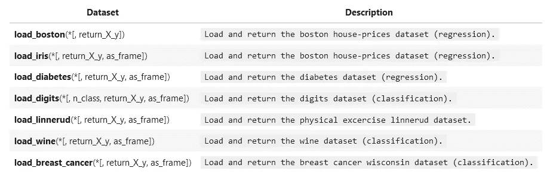
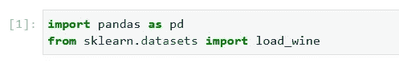
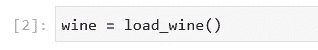
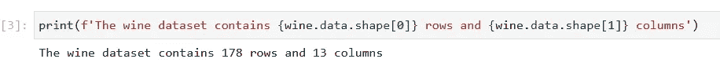
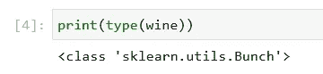
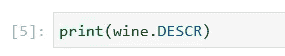
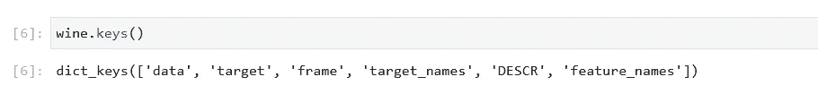
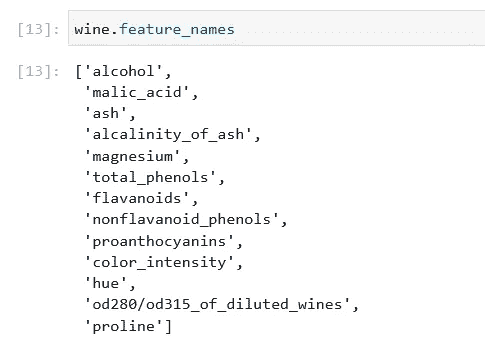
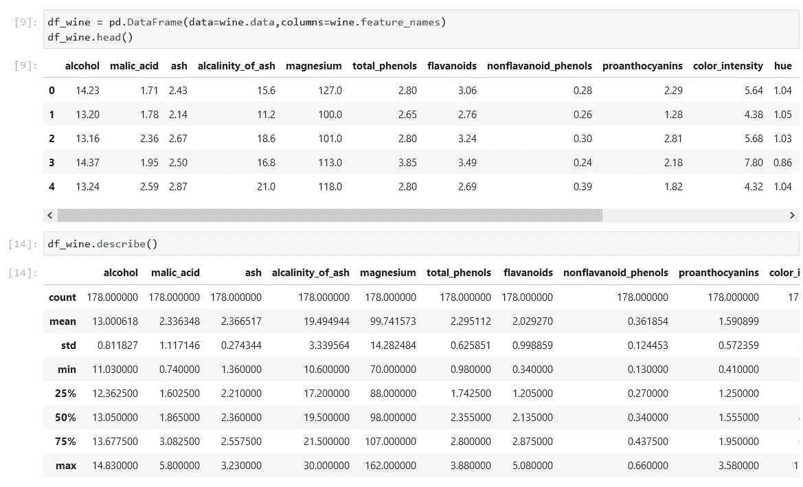

# Sklearn 数据集加载实用程序

> 原文：<https://medium.com/geekculture/sklearn-dataset-loading-utilities-78ee309de56b?source=collection_archive---------63----------------------->


Image from [Unsplash](https://unsplash.com/s/photos/toys)


Image from Sklearn website

scikit-learn Python 库附带了一些不需要从外部网站下载任何文件的小型标准数据集，因为它们可以通过执行`sklearn.datasets`包在 sci-kit learn 安装中获得。

# 通用数据集 API

根据所需的数据集类型，有三种主要的数据集接口可用于获取数据集。



Image by Author

*   **数据集加载器**

可用于加载小型标准数据集，它们也被称为*玩具数据集*，我将在本文档的下一节中详细讨论。

*   **数据集提取器**

它们可用于下载和加载更大的数据集。欲了解更多信息，请参考 [sklearn 网站](https://scikit-learn.org/stable/datasets/real_world.html)上的*真实世界数据集*部分。

*   **数据集生成功能**

它们可用于生成受控的合成数据集。在 [scikit 学习网站](https://scikit-learn.org/stable/datasets/sample_generators.html)的*生成的数据集*部分找到更多信息。

数据集还在其`DESCR`属性中包含完整的描述，有些数据集包含`feature_names`和`target_names`。有关详细信息，请参见下面的数据集描述。

## 玩具数据集

scikit-learn 附带一些小型标准数据集，不需要从外部网站下载任何文件。

可以使用以下函数加载它们:



Image by Author

请记住，这些数据集有助于快速说明 scikit-learn 中实现的各种算法的行为，尽管它们被认为太小，无法代表真实世界的机器学习任务。



Image by Author

现在我们已经通过应用函数`load_wine()`从 sklearn API 加载了一个玩具数据集，我们将它存储在变量 *wine* 中



Image by Author

接下来，让我们利用*形状*来检查它有多少列和多少行。



Image by Author

查看数据集的数据*类型*，我们注意到 *sklearn.utils.Bunch* 被返回，有关这个 Bunch 对象的更多信息，请转到这个[链接](https://scikit-learn.org/stable/modules/generated/sklearn.utils.Bunch.html#sklearn.utils.Bunch)



Image by Author

到目前为止，我们知道我们的 wine toy 数据集由 178 行和 13 列组成，但我们还没有第一次看到它，因此让我们使用前面谈到的 *DESCR* 属性，这与 pandas *describe()* 函数的工作方式类似，但它提供了关于数据集的更详细的信息。



Image by Author

```
.. _wine_dataset:

Wine recognition dataset
------------------------

**Data Set Characteristics:**

    :Number of Instances: 178 (50 in each of three classes)
    :Number of Attributes: 13 numeric, predictive attributes and the class
    :Attribute Information:
 		- Alcohol
 		- Malic acid
 		- Ash
		- Alcalinity of ash  
 		- Magnesium
		- Total phenols
 		- Flavanoids
 		- Nonflavanoid phenols
 		- Proanthocyanins
		- Color intensity
 		- Hue
 		- OD280/OD315 of diluted wines
 		- Proline

    - class:
            - class_0
            - class_1
            - class_2

    :Summary Statistics:

    ============================= ==== ===== ======= =====
                                   Min   Max   Mean     SD
    ============================= ==== ===== ======= =====
    Alcohol:                      11.0  14.8    13.0   0.8
    Malic Acid:                   0.74  5.80    2.34  1.12
    Ash:                          1.36  3.23    2.36  0.27
    Alcalinity of Ash:            10.6  30.0    19.5   3.3
    Magnesium:                    70.0 162.0    99.7  14.3
    Total Phenols:                0.98  3.88    2.29  0.63
    Flavanoids:                   0.34  5.08    2.03  1.00
    Nonflavanoid Phenols:         0.13  0.66    0.36  0.12
    Proanthocyanins:              0.41  3.58    1.59  0.57
    Colour Intensity:              1.3  13.0     5.1   2.3
    Hue:                          0.48  1.71    0.96  0.23
    OD280/OD315 of diluted wines: 1.27  4.00    2.61  0.71
    Proline:                       278  1680     746   315
    ============================= ==== ===== ======= =====

    :Missing Attribute Values: None
    :Class Distribution: class_0 (59), class_1 (71), class_2 (48)
    :Creator: R.A. Fisher
    :Donor: Michael Marshall (MARSHALL%PLU@io.arc.nasa.gov)
    :Date: July, 1988

This is a copy of UCI ML Wine recognition datasets.
[https://archive.ics.uci.edu/ml/machine-learning-databases/wine/wine.data](https://archive.ics.uci.edu/ml/machine-learning-databases/wine/wine.data)

The data is the results of a chemical analysis of wines grown in the same
region in Italy by three different cultivators. There are thirteen different
measurements taken for different constituents found in the three types of
wine.

Original Owners: 

Forina, M. et al, PARVUS - 
An Extendible Package for Data Exploration, Classification and Correlation. 
Institute of Pharmaceutical and Food Analysis and Technologies,
Via Brigata Salerno, 16147 Genoa, Italy.

Citation:

Lichman, M. (2013). UCI Machine Learning Repository
[[https://archive.ics.uci.edu/ml](https://archive.ics.uci.edu/ml)]. Irvine, CA: University of California,
School of Information and Computer Science. 

.. topic:: References

  (1) S. Aeberhard, D. Coomans and O. de Vel, 
  Comparison of Classifiers in High Dimensional Settings, 
  Tech. Rep. no. 92-02, (1992), Dept. of Computer Science and Dept. of  
  Mathematics and Statistics, James Cook University of North Queensland. 
  (Also submitted to Technometrics). 

  The data was used with many others for comparing various 
  classifiers. The classes are separable, though only RDA 
  has achieved 100% correct classification. 
  (RDA : 100%, QDA 99.4%, LDA 98.9%, 1NN 96.1% (z-transformed data)) 
  (All results using the leave-one-out technique) 

  (2) S. Aeberhard, D. Coomans and O. de Vel, 
  "THE CLASSIFICATION PERFORMANCE OF RDA" 
  Tech. Rep. no. 92-01, (1992), Dept. of Computer Science and Dept. of 
  Mathematics and Statistics, James Cook University of North Queensland. 
  (Also submitted to Journal of Chemometrics).
```

通过应用 *key()* 函数，我们将可以访问可应用于该数据集的属性列表。



Image by Author

第一个函数返回数据集中包含的数据本身的数组。


Image by Author

第四个给了我们酒类的名称，意思是目标特征。


Image by Author

最后一个是数据集中所有要素的名称。



Image by Author

# 在 pandas 数据框架中转换 Sklearn 数据集

虽然从 sklearn API 加载的数据集已准备好用于机器学习算法，但为了其他目的将其转换为 pasdas 数据帧也是有用的。



Image by Author

这样或那样的方式将是我们的 EDA 或机器学习的数据预处理的起点。在本教程中，我们学习了如何使用 sklearn API 中可用的预加载数据集，如果您对克隆该笔记本感兴趣，请在 my [GitHub repo](https://github.com/fvgm-spec/ML/blob/main/notebooks/Sklearn%20toy%20datasets.ipynb) 中找到它，或者如果您需要更多文档，请在 [sklearn 站点](https://scikit-learn.org/stable/datasets.html)中找到它。

# 未完待续…