# 松弛集成能力:迷你指南

> 原文：<https://medium.com/geekculture/slack-integration-capabilities-the-mini-guide-a2c1622109b2?source=collection_archive---------6----------------------->

在[之前的帖子](/geekculture/salesforce-apis-and-integration-capabilities-the-pocket-guide-2a1a8e97603d?source=friends_link&sk=8bc83d17960cd031782b0ea2e3011f8c)中，我们讨论了构成 Salesforce 平台的互连部分，并总结了其 API 和功能。

在这篇文章中，我们将关注 Slack，并更深入地了解它的**集成能力**。

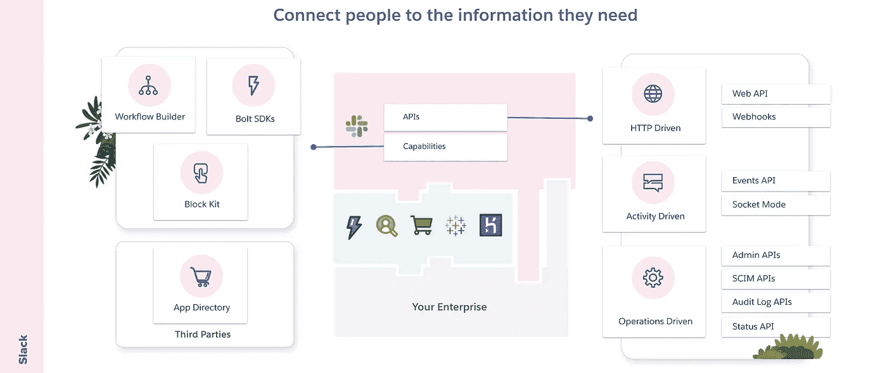

Slack summary: APIs and key integration capabilities

我们将查看上图的左侧，并双击 Slack 的每个关键集成功能。

# 工作流生成器

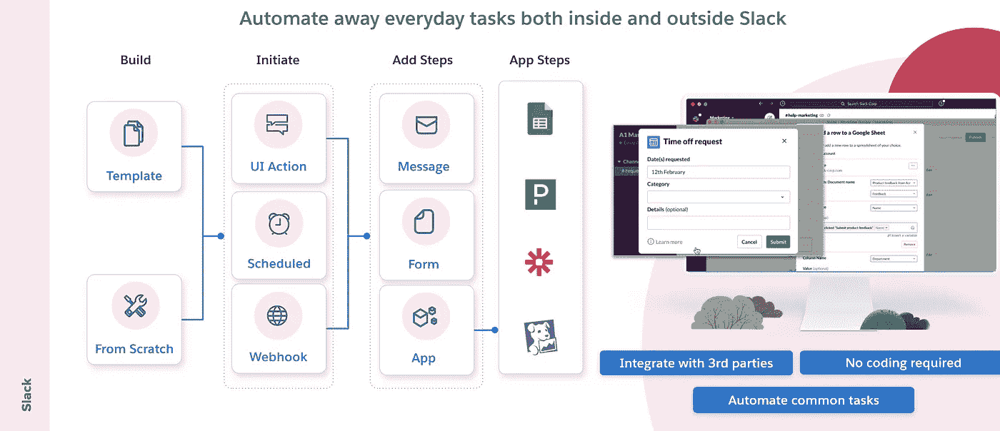

[Workflow Builder](https://api.slack.com/workflows) 提供了一套工具，帮助您在宽松的工作空间中将日常流程自动化为工作流。Slack 中的工作流可以简单或复杂，并且可以连接到其他应用程序。我喜欢把用例看作是一种突出工作流如何为 Slack 用户提供强大集成能力的好方法。

*   用*自动化*入职消息欢迎队友。
*   使用*定制表格快速填写请求。*
*   简化*重复性*进度更新，如状态报告等。
*   添加一个请求休假的流程(见截图)。
*   在*page duty*提出一个事件或者在*吉拉提出一张罚单。*

Slack 提供常用的**模板**——或者你可以从头开始**。您只需选择如何启动您的工作流程**——要么:****

*   ****通过 UI 交互(当添加新的频道成员或表情符号反应时，通过快捷菜单)。****
*   ****在预定的日期和时间。****
*   ****通过 webhook 请求。****

****然后，您只需在声明性向导中添加步骤，引导用户完成一系列操作来完成工作流。在这里，您可以:****

*   ****发送**消息**(在闲暇时与人交流)。****
*   ****添加一个**表格**来组织和收集信息。****
*   ****使用第三方**应用**提供的步骤，这样您就可以将收集的信息发送到另一个服务，或者从该服务中提取信息(比如触发 PagerDuty 中的事件)。****

****这里有一个简单的例子来提醒你的团队在每个工作日的上午 10 点左右张贴他们的单口相声。****

****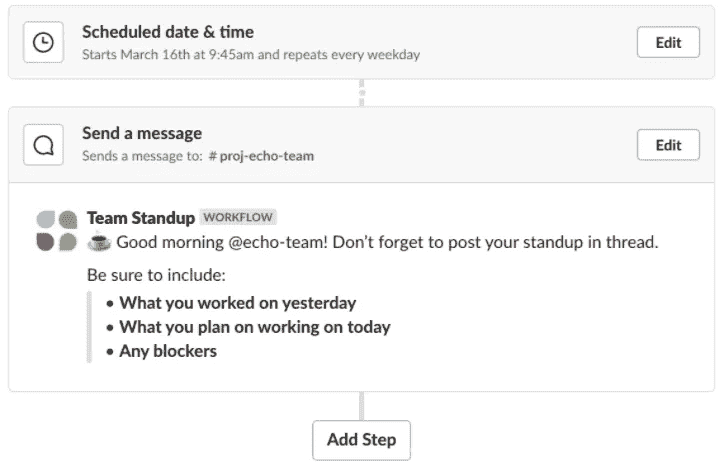****

****Sample workflow — Edit steps to remind your team to post a daily standup.****

> ****可以把 workflow builder 看作是在空闲时间自动化重复任务的无代码方法。****

# ****Bolt SDKs****

****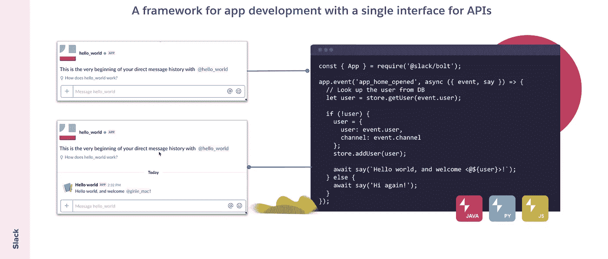****

****没有一个开发人员希望浏览 API 文档来管理认证、创建、管理和向他们的用户发送消息所需的 boiler plate 代码。[由**博尔特**](https://api.slack.com/tools/bolt) 提供的 SDK 旨在让开发者能够更直观地创建应用，并为现代编程语言提供了一个抽象层次。****

****您使用 OAuth 2.0 安装应用程序。然后，用 Java、Python 和 JavaScript 编写的应用程序可以对传入的事件做出反应，这些事件对应于事件 API、动作快捷方式和斜杠命令。该框架有一个方法来为每种类型的请求构建一个监听器并采取行动，比如能够发布消息。****

****Bolt 框架还有一个顶级客户端，可以用来调用 Web API 中的方法。****

****对于 JavaScript，您可以使用包管理器安装 SDK。****

```
**npm install @slack/bolt**
```

****然后如下初始化你的应用程序:****

```
**const { App } = require('@slack/bolt');

const app = new App({
  signingSecret: process.env.SLACK_SIGNING_SECRET,
  token: process.env.SLACK_BOT_TOKEN,
});

/* Add functionality here */

(async () => {
  // Start the app
  await app.start(process.env.PORT || 3000);

  console.log('⚡️ Bolt app is running!');
})();**
```

****要监听 Slack 中的任何事件 API 活动，请使用 Bolt `event()`方法。这允许你的应用程序在 Slack 中发生事情时采取行动。在这种情况下，当 a 选择名为 tip_rating 的快捷方式时，它会打开一个对话框来捕获用户输入。****

```
**//Reacting to a shortcut event called tip_rating
app.shortcut('tip_rating', async ({ shortcut, ack, client }) => {

  try {
      await ack();
      // Call the views.open method using the built-in WebClients
      const result = await client.views.open({
        trigger_id: shortcut.trigger_id,

        view: tipModal.getModalBlockUI()
      }); console.log(result);
  }
  catch (error) {
    console.error(error);
  }});**
```

****这允许您使用上面的代码创建丰富的用户体验，允许我创建一个简单的评级应用程序来捕获用户的反馈，并将反馈放在一个通道中供团队审阅。****

****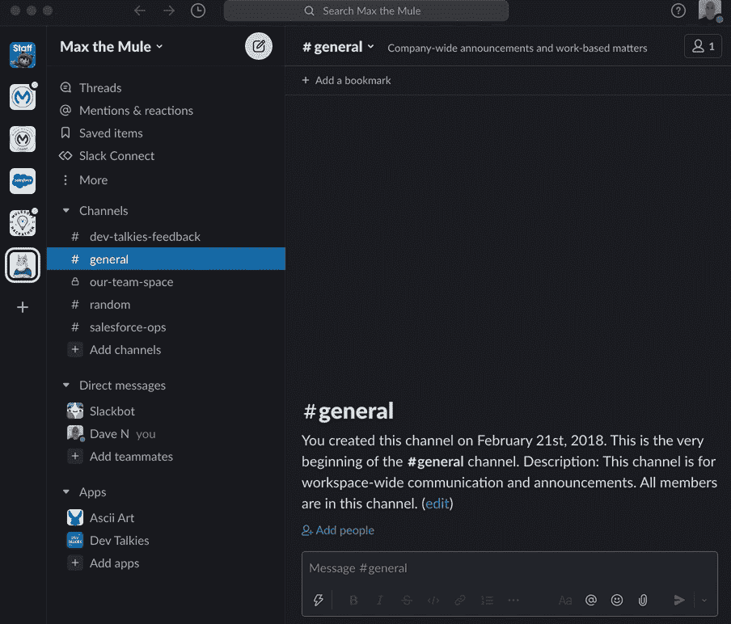****

****点击这里查看完整代码****

****Sample Glitch to create an interactive Slack experience with the Bolt SDK****

## ****松弛连接器— MuleSoft****

****虽然在 Java、Python 或 JavaScript 中使用 Bolt SDK 可能会满足您的需求，但生产中代码的维护、部署和管理可能不太令人满意——MuleSoft 有一个 Slack 连接器，您应该检查一下。这意味着没有用于认证的模板代码，您只需要创建能够创造商业价值的集成流。****

****考虑将松弛负载发送到多个目的地的需求，或者您可能需要调用第三方服务——您将如何为所需的编排和转换编码？MuleSoft 通过声明性的路由、过滤和转换功能简化了事情。****

****为了突出这一点，让我们向 Slack 应用程序添加一个 slash 命令，它应该接受 Slack 有效负载，不仅从值中创建 Ascii Art，还将有效负载发送到 Postgres 数据库——这可能需要大量 JavaScript 代码。****

****下面是它在 [Anypoint Studio](https://www.mulesoft.com/platform/studio) 中的样子。****

****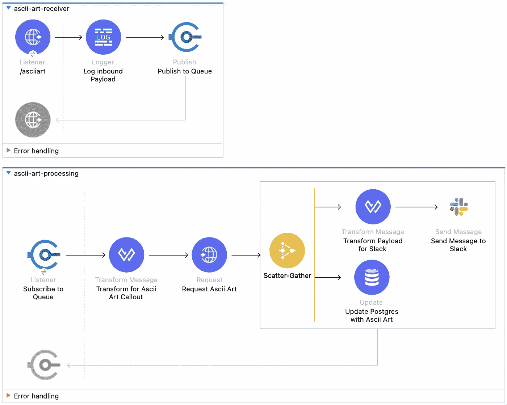****

****Slack Connector in MuleSoft: Simplified responding to interactive Slack events at scale****

****这是用户体验的样子…****

****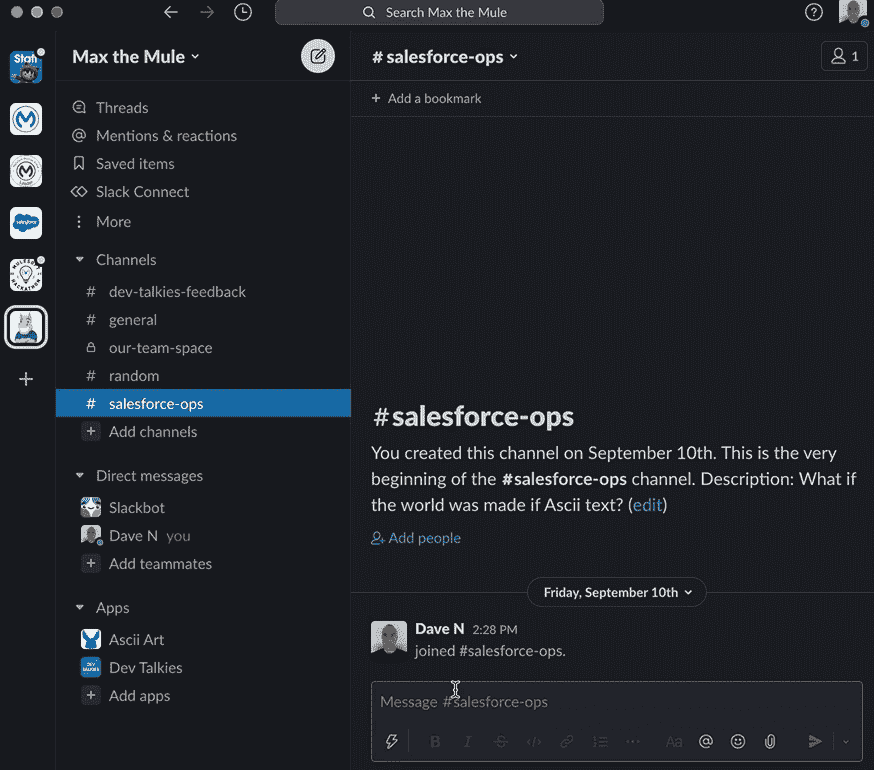****

****Using MuleSoft’s Slack Connector to orchestrate callouts with no code. In this case converting text to Ascii Art.****

> ****可以将 Bolt SDKs 视为 Slack 事件和 Web API 的生产力包装器，允许您创建定制的用户体验。尝试 MuleSoft 连接器，进一步提高重复利用率和生产率。****

# ****积木套件****

****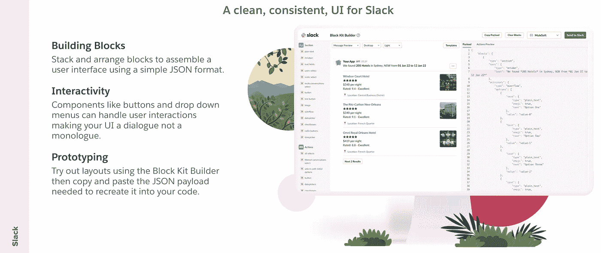****

****设计集成到 Slack 用户界面中的应用程序的一个关键组件是与它所使用的 UI 框架保持一致。**块**是可视组件，可以堆叠和排列以创建应用布局。块可以是文本、降价、按钮、复选框、单选按钮等。****

******交互组件**是增加交互性的模块的子集。交互可能是用户批准旅行请求或重新安排约会的建议日期。****

****为了重新排列并决定最适合您应用的布局，您可以使用[积木套件生成器](https://app.slack.com/block-kit-builder)。这提供了一个平台，让您在将页面布局提交到代码之前，可以看到它们的外观。你甚至可以将你的样片发送到 Slack，在你选择的频道中观看。****

****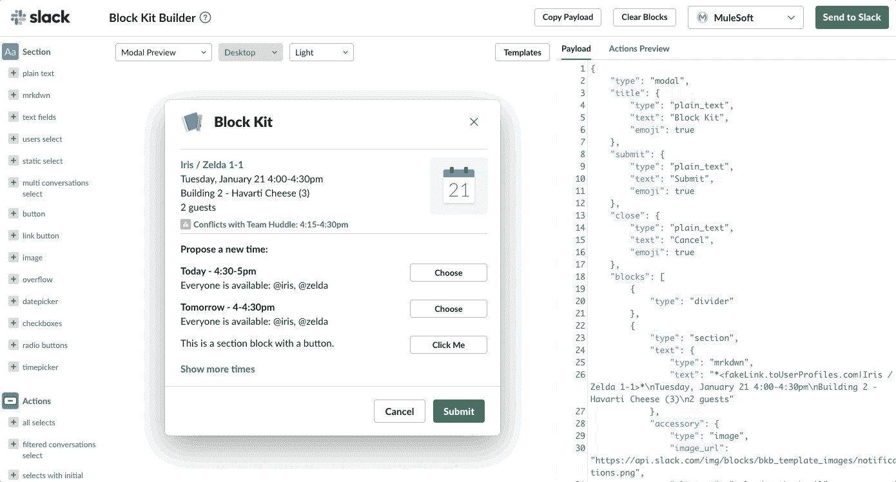****

****Bolt SDK 和 Block Kit 也是试点项目 [< Foyer >](https://developer.salesforce.com/blogs/2021/09/introducing-foyer-native-slack-integration-for-the-salesforce-platform) 的关键组件，该项目使 Salesforce 开发人员能够创建连接到其 lightning 平台数据和元数据的交互式应用程序。****

> ****可以把 block kit 看作是一种创建可视化组件的简单方法，这些组件被设计成与 Slack UI 的其余部分具有一致的外观和感觉。****

# ****应用程序目录****

****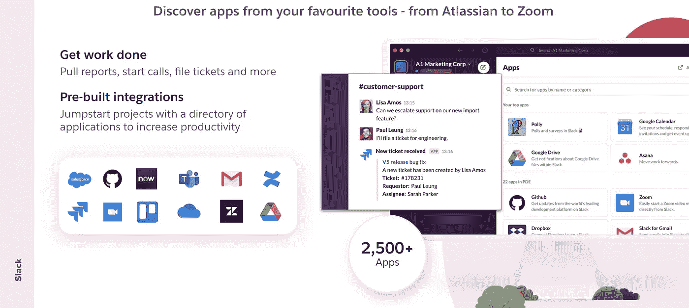****

****App Directory 是 Slack 为合作伙伴提供自动化工具以加速数字化转型的市场。****

****对于集成用例，Slack 的合作伙伴已经开发了可以集成到调查工具、文档管理解决方案、营销工具、DevOps 等等的应用程序。例如，如果你将一个谷歌幻灯片放入一个空闲频道，你可以让谷歌提示你与频道中的每个人分享该文档。****

> ****把这些看作是你最喜欢的应用程序的预集成省时器。****

# ****摘要****

****Slack 中的集成功能从声明式工作流构建器到与您喜爱的编程语言兼容的 SDK。MuleSoft 为 SDK 提供了一个包装器，以简化端到端集成流的创建。****

****这些功能允许开发人员以最小的摩擦创建定制的用户体验。****

****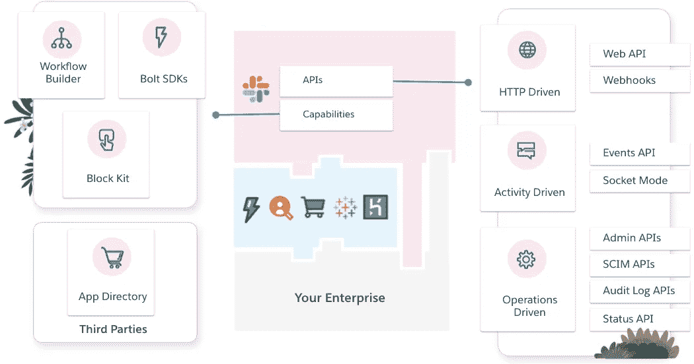****