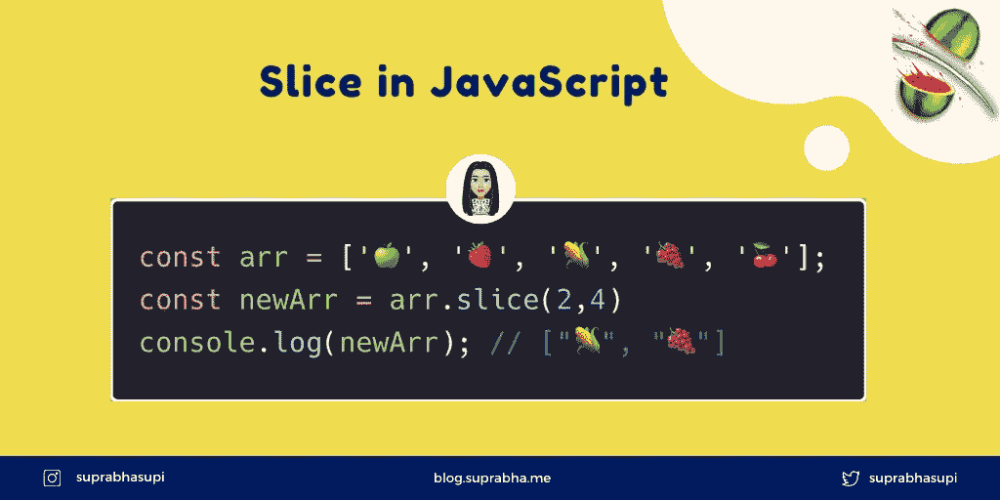

# JavaScript 中的切片

> 原文：<https://medium.com/geekculture/slice-in-javascript-2a42b32e23e7?source=collection_archive---------0----------------------->



slice in javascript

slice 方法返回一个新数组，其中包含从原始数组复制的切片。

语法:

```
arr.slice([start[, end]])
```

`start`表示从零开始的索引。如果`start`未定义，`slice`从索引 0 开始。

在`end`中，切片提取到但不包括结尾。

这在理论上太正确了😜，让我们通过几个例子来理解。

## ✅:使用了两个论点

```
const arr = ['🍏', '🍓', '🌽', '🍇', '🍒'];
const newArr = arr.slice(2,4);
console.log(newArr); // ["🌽", "🍇"]
```

## 如果没有参数，您将获得完整数组✅的副本

```
const arr = ['🍏', '🍓', '🌽', '🍇', '🍒'];
const newArr = arr.slice();
console.log(newArr); // ["🍏", "🍓", "🌽", "🍇", "🍒"]
```

## 使用一个参数，从指定的索引到数组✅的末尾得到一个副本

```
const arr = ['🍏', '🍓', '🌽', '🍇', '🍒'];
const newArr = arr.slice(3);
console.log(newArr); // ["🍇", "🍒"]
```

## Index 也可以是负数，在这种情况下，从结束✅开始计算起始索引

```
const arr = ['🍏', '🍓', '🌽', '🍇', '🍒'];
const newArr = arr.slice(2,-2);
console.log(newArr); // ["🌽"]
```

## 如果`start`大于序列的索引范围，则✅返回一个空数组

```
const arr = ['🍏', '🍓', '🌽', '🍇', '🍒'];
const newArr = arr.slice(6);
console.log(newArr); // []
```

## 如果`end`大于序列的长度，切片提取到序列✅的末尾

```
const arr = ['🍏', '🍓', '🌽', '🍇', '🍒'];
const newArr = arr.slice(1,9);
console.log(newArr); // ["🍓", "🌽", "🍇", "🍒"]
```

## slice()方法也可以用于字符串✅

```
const arr = 'suprabha';
const newArr = arr.slice(0,3);
console.log(newArr); // "sup"
```

**注:🧨**

Slice 是不可变的，Splice 使数组发生变异。

# 参考🧐

[切片 MDN](https://developer.mozilla.org/en-US/docs/Web/JavaScript/Reference/Global_Objects/Array/slice)

🌟[推特](https://twitter.com/suprabhasupi) |👩🏻‍💻 [Suprabha.me](https://www.suprabha.me/) |🌟 [Instagram](https://www.instagram.com/suprabhasupi/)