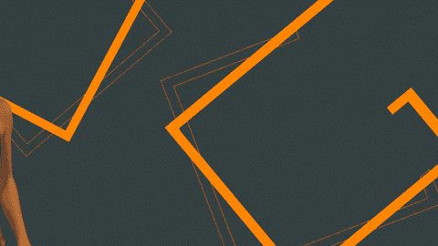

# Go 语言中的切片和数组

> 原文：<https://medium.com/geekculture/slices-and-arrays-in-go-language-1615a50a491b?source=collection_archive---------15----------------------->


我们将仔细研究 Go 中的数组和切片，并尝试理解它们的内部结构和基本原理。我们还将看看向函数传递数组和向函数传递切片时的不同行为。我们走吧！


# Go 中的数组:

数组是一种数据结构，它的内存是按顺序分配的。顺序形式的内存允许正在使用的内存在更长的时间内保持加载到 CPU 缓存中。使用索引算法，我们可以遍历所有的条目。因为数组的长度由其类型决定，所以不能调整数组的大小。

## 声明和初始化切片

在 *Go* 中，我们可以通过提供数组的数据类型和长度来声明数组。

```
var array[5] int
```

数组也可以在同一行声明和初始化。

```
array := [5] int {1,2,3,4,5}
```

我们还可以为特定的索引赋值

```
/*Here index 1 and index 2 are assigned values 10 and 20 respectively while other indexes are set to default value 0*/array:= [5]int {1:10,2:20}
```

# **围棋中的切片:**


切片是抽象和操作底层数组的微小对象。它们可以适应增长，并包括一个名为 append 的内置功能，允许我们有效地增加存储片。也可以通过切掉底层内存的一部分来减小片的大小。切片在实践中比数组更普遍。

## 声明和初始化切片

内置函数 *make* 允许我们声明一个具有数据类型、长度和容量的切片。我们也可以使用切片文字来声明它。

```
//Creates slice of string with length and capacity of 5
slice := make([]string,5)//Creates slice of string with length of 3 and capacity of 5
slice2 := make([]string,3,5)//Slice literal declaration of length and capacity of 3
slice3 := []string{"a","b","c"}
```

我们可以对现有切片进行切片以创建新切片。

```
slice := []string{"a","b","c"}//slice2 will be [b,c]
slice2 := slice[1:3]
```

请注意，现在这两个切片具有相同的底层数组。一个存储片对底层阵列的共享部分所做的更改也会反映到另一个存储片。

还有一个三索引片，它允许我们限制容量。

```
//Creates slice with length 1 and capacity of 2 
slice := array[2:3:4]
```

这里，计算一个片[i:j:k]的路长度和容量是
长度= j-1
容量= k-i

切片 s 的长度和容量可以使用表达式 len(s)和 cap(s)来获得。

## 追加到切片

Append 接受一个源切片和一个要添加的值，并返回一个包含修改的新切片。append 函数总是会根据需要增加切片的大小。容量可能会也可能不会受到影响，具体取决于源存储片的可用容量。

```
s :=[]int{1,2,3,4,5}
s2:= s[1:3]
s2:= append(s2,6)
```

在这种情况下，因为 s2 的底层数组中有可用的容量，所以 append 操作将可用的元素合并到 s2 长度中，并赋值。因为原始切片共享底层数组，所以索引 3 中的更改对 s 也是可见的。

但是如果没有足够的容量呢？

```
//Creates a slice of int with length and capacity of 4
slice := []int{1,2,3,4,5}
//Appends 6 to slice and assigns the new slice to slice2
slice2 := append(slice,6)
```

在这个追加操作之后，slice2 接收它自己的底层数组，并且该数组的容量比它的初始大小增加了一倍。

# 在函数之间传递数组:



在函数之间传递数组可能是一个消耗内存和性能的过程。当我们向一个函数提供一个数组时，不管它的大小如何，它都会被复制并发送给该函数，这就是所谓的按值传递。
阵列越大，成本就越高。

## 一种方法

我们可以通过指针传递数组来避免在函数间传递数组。

```
var array[5] int//Function foo accepts a pointer to array of 5 integers
foo(&array)//Function foo accepts a pointer to array of 5 integers
func foo(array *[5]int){
//Function body
}
```

此操作在内存和性能方面效率更高。注意，因为我们使用了指针，改变指针指向的值将会改变程序中其他地方的值，因为内存是共享的。

## 更好的解决方案:


有一个比通过指针传递数组更好的解决方案。它通过使用和传递切片！

# 在函数之间传递切片:

```
slice := make([]int,10000)
foo(slice)//Function expects a slice of integer 
func foo(slice []int){
//Function body
}
```

在这种情况下，只有片被复制并通过值传递，而不是底层数组，这比传递数组要高效得多。这就是切片如此方便的原因。您不必处理复杂的语法或传递指针。你只需复制你的切片并做必要的修改。

# 遍历切片和数组

像大多数其他语言一样，我们可以使用可靠的 for 循环迭代切片和数组

```
slice:= []int{1,2,3,4,5}
for index:=2 ;l index < len(array); index++{
    fmt.Printf("Value %d at Index %d",slice[index],index)
}
```

函数的作用是:返回数组或切片的长度。同样的循环的*也适用于数组。但是，有一条*走*的路可以做到。*

```
slice := []int{1,2,3,4,5}array := [5]int{1,2,3,4,5}//iterating over slice
for index,value := range slice{
    fmt.Println(“Value: %d\n with its Index : %d”,value,index)
}//iterating over array
for index, element := range array{
    fmt.Println(index, "=>", element)
}//ignoring index by using black identifier
for _, element := range array{
    fmt.Println(element)
}
```

*range* 关键字返回两个值*。*第一个是索引，第二个是该索引位置值的副本。

对于数组和切片来说，这就是全部了。感谢您花时间阅读本文。如果你喜欢这篇文章，和朋友分享吧！直到下次🌸

参考资料:

*   [开始行动](https://www.manning.com/books/go-in-action)
*   [Go 文档[第 6–18 页]](https://tour.golang.org/moretypes/6)