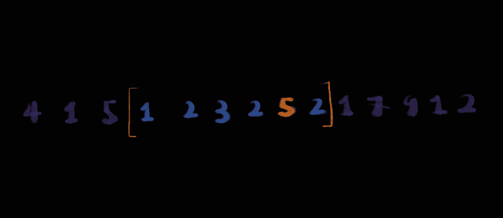

# 滑动窗口最大值

> 原文：<https://medium.com/geekculture/sliding-window-maximum-98eba530e47d?source=collection_archive---------21----------------------->

## 算法和复杂性分析

(Image by Author)

在这个故事中，我们将讨论一个有趣的问题:在一个列表中寻找最大整数。这个问题是欺骗性的，因为简单的解决方案实际上很简单，但是有几个不太明显的技巧可以应用于它，从而大大提高性能。

## 问题陈述