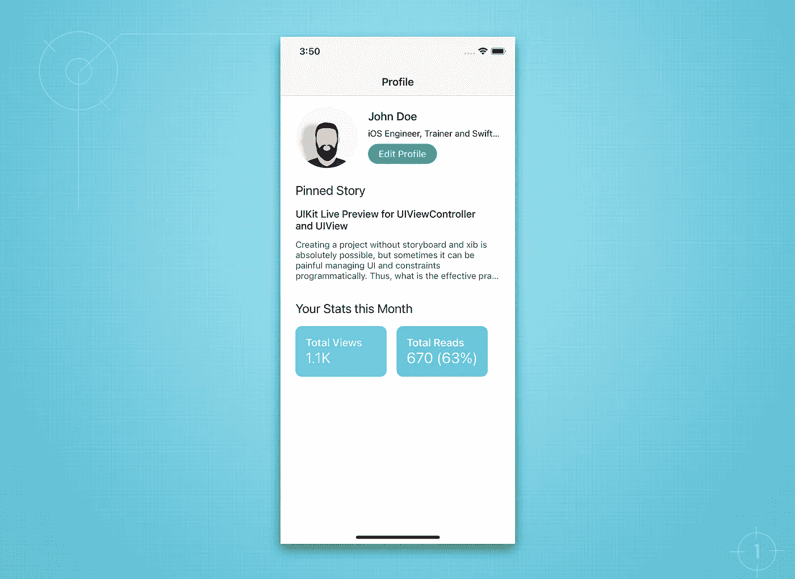
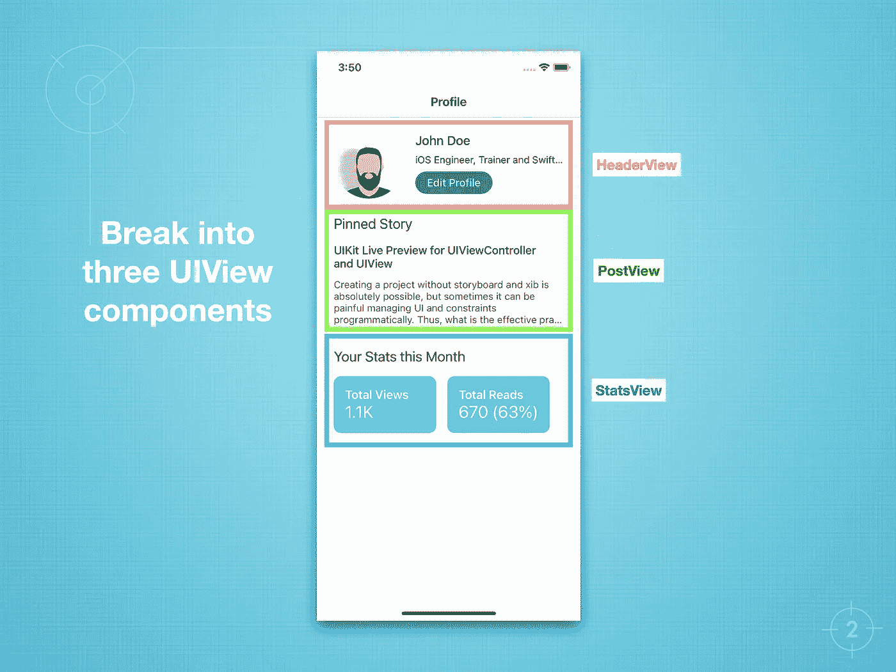
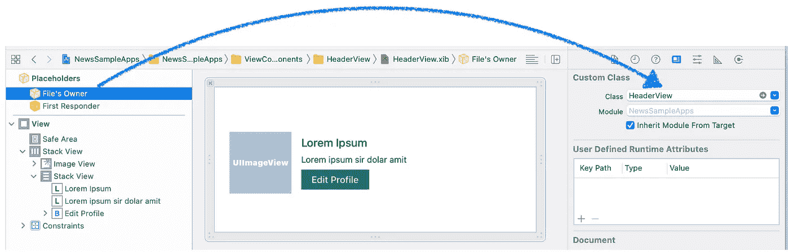
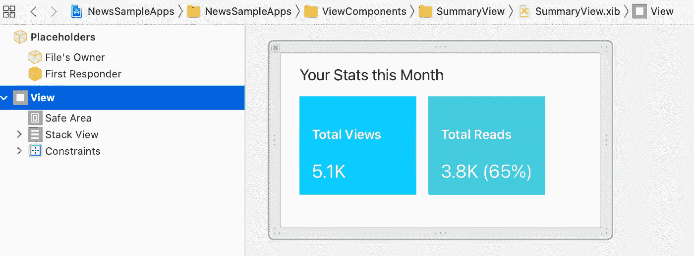
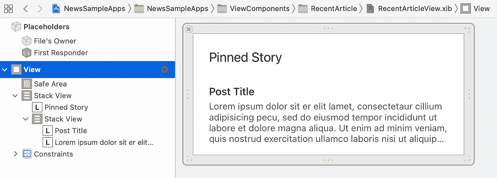
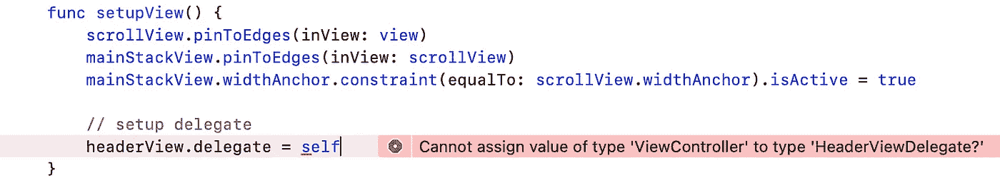

# 如何修复你的胖视图控制器

> 原文：<https://medium.com/geekculture/slim-uiviewcontroller-break-into-multiple-uiview-components-78d7a67d7468?source=collection_archive---------7----------------------->

## 分解成多个视图组件

Image by [M W](https://pixabay.com/users/efraimstochter-12351/?utm_source=link-attribution&utm_medium=referral&utm_campaign=image&utm_content=708088) from [Pixabay](https://pixabay.com/?utm_source=link-attribution&utm_medium=referral&utm_campaign=image&utm_content=708088)

在 iOS 开发中，UIViewController 变得非常混乱和难以管理是很常见的，因为它充满了每一个元素，包括视图、出口、动作、装饰、布局和业务逻辑。

其实 *UIViewController* 应该很简单。它只需要管理视图并观察动作的发生。在本教程中，我想分享一个我一直应用于项目的最佳实践。

# 解决办法

我们将**把屏幕分解成多个 UIView 组件**，每个 UIView 组件将自己管理所有的布局和样式。它还将负责**通知 ViewController 任何动作或变化**。此外，UIView 组件最终会在整个项目中变得可重用。厉害！

假设我们要开发这个简单的个人资料页面(如上图)。所以，在我们看来，我们肯定会把所有这些东西放在一个 ViewController 中。我们可以简单地打开故事板，开始添加出口(标签，图像)和一些约束。没错，不幸的是，这是我们一贯的做法😅

是啊，也许读完这篇文章后我们就不会再犯这样的错误了。

当开始对用户界面做更多的改变或者增加更多的功能时，问题就会出现。因此，ViewController 很容易变胖。

# 现在打破它

现在，我们希望 UIViewController 始终保持苗条，并开始分解成单独的 UIViews。以下是步骤。

1.  首先，在 ViewController 中添加 UIScrollView 和 UIStackView，以支持动态添加组件。
2.  分成三个界面(`HeaderView`、`StatsView`和`PostView`)
3.  为每个组件创建 xib 和 UIView 文件(您可以根据需要以编程方式创建这些文件)
4.  管理每个 UIView 中的所有样式。
5.  在 UIView 中创建用数据更新 UI 的函数。
6.  在每个 UIView 中添加协议(委托),以便在任何 UI 更新或操作上启用 ViewController get 事件

# 编码时间！

好的。让我们把手弄脏吧！创建新的 iOS 项目。在开始执行每个步骤之前，请注意，您可以在此处查阅已上传的完整项目[。](https://github.com/xmhafiz/SlimViewControllerDemo)

## **1。在 ViewController 中添加 StackView 以启用动态添加组件。**

转到 *ViewController.swift* ，然后编程添加`UIStackView()`和`UIScrollView()`变量(暂时不需要接触故事板)。首先，添加一个 UIScrollView 并将其固定到 superView 的边缘。然后，我们在 scrollView 中添加 UIStackView，并固定边缘。还要确保将 stackView 的`width`约束设置为 scrollView。

很好！如果我们运行这个项目，目前没有任何变化。

## **2。分解成 3 个 ui 视图(头视图、统计视图和后视图)**

在这一步中，我们将创建 3 个 UIView Swift 文件和 3 个 xib 文件，然后将它们链接在一起。

a.HeaderView.swift 和 HeaderView.xib

确保将“文件的所有者”与“类”名称联系起来。也链接所有在 HeaderView.swift 中创建的`IBOutlets`。

link the “FIle’s Owner” with the `HeaderView.swift`

b.StatsView.swift 和 StatsView.xib(同前，链接“文件的所有者”和 Outlets)。

c.最后创建的`UIView`文件是 PostView.swift 和 PostView.xib

## **3。所有样式都在每个 UIView 中管理**

## **4。在 UIView 中创建用数据更新 UI 的函数。**

确保传递要使用的正确对象。在这个项目中，我们将使用`DemoProfile`和所有需要的属性。

## **5。在每个 UIView 中添加协议(委托),以便控制器可以获得任何 UI 更新或动作的事件**

也许你熟悉 Swift 协议，因为我们在这个步骤中使用它来确保 UIView 组件能够通知 ViewController 任何动作或变化。

我们的 UIView 组件是一个独立的类，因此，ViewController 不知道它内部发生的任何事情。

在我们的例子中，我们只需要在`HeaderView`中添加一个协议(delegate)来通知控制器是否点击了“Edit Profile”按钮。

a.首先，在 HeaderView.swift 中添加一个协议，即`HeaderViewDelegate`

b.然后如上图，添加一个名为`didTapEditButton()`的方法。然后，确保按钮目标动作将调用委托方法(在第 19 行的代码上面)。

c.在`ViewController`类中，实现`HeaderViewDelegate`并将 HeaderView 对象`.delegate`设置为`self`以获取实现方法中的调用(如下所示)。

在 ViewController.swift 文件中添加`HeaderViewDelegate`实现(在底部)以使其工作并避免错误。

最后，让我们更新`ViewController`以在 stackView 中包含这 3 个组件。更新后的`ViewController`如下。

# 任务完成！

恭喜你！现在，我们已经完成了所有的步骤，项目已经准备好运行了。看到我们的 ViewController.swift 只有 52 行。真的吗？是的，你做到了🎉。

完整的源代码可以在[这里](https://github.com/xmhafiz/SlimViewControllerDemo)下载。试着在你现有的项目中实现，这样它会变得更干净，更具可扩展性(通过未来的模块或特性)。

感谢您的阅读，不要忘记与您的朋友分享。非常欢迎反馈。

“学习，这是我们增长技能的方式”

# 参考

[https://docs . swift . org/swift-book/language guide/protocols . html](https://docs.swift.org/swift-book/LanguageGuide/Protocols.html)

[https://github.com/xmhafiz/SlimViewControllerDemo](https://github.com/xmhafiz/SlimViewControllerDemo)