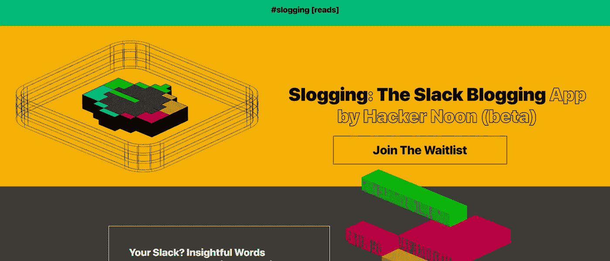

# 苦干、区块链和众包内容的创新:HackerNoon 创始人访谈

> 原文：<https://medium.com/geekculture/slogging-blockchain-and-innovations-in-crowdsourced-content-interview-with-founder-of-hackernoon-1dfccfeef279?source=collection_archive---------20----------------------->

对 HackerNoon 创始人 David Smooke 的采访，以及将远程团队的聊天内容转化为可发布内容的新方法。

HackerNoon 成立于 2016 年，是一个独立的科技媒体发布平台，由 David Smooke 和 Linh Dao Smooke 创办并运营。该网站有超过 7，000 个…