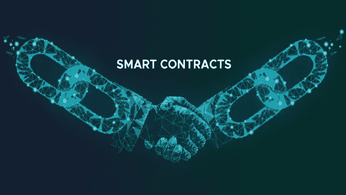

# 区块链智能合约:终极备忘单

> 原文：<https://medium.com/geekculture/smart-contracts-on-blockchain-the-ultimate-cheat-sheet-e038f63c3fce?source=collection_archive---------12----------------------->

Image by: Author

智能合同是一种计算机技术，用于以数字方式促进、验证或执行合同谈判。“智能合同支持在没有第三方参与的情况下执行值得信赖的交易。这些都是可追踪的、不可撤销的交易。”维基百科是这么说的。

但是，老实说，阅读上面的定义比了解智能合同更让一些人困惑。

那么，什么是智能合约呢？因为该系统的工作方式本质上类似于智能合约，所以我认为智能合约类似于投币柜。

# 清晰简单的定义和示例

智能合约在区块链上尤为重要，因为它们有助于使交易安全可靠，并且更加结构化。不仅如此，它还使其他组件，如在这些平台上运行的应用程序，更容易访问。但是什么是智能合同呢？

智能契约是对某些事情的保证，由一个逻辑(编码)承诺组成，该承诺指定如果 Y 发生，X 就会发生，等等。

因此，在我们的硬币寄存柜的情况下，要么硬币将被取走，您将获得一个存放行李的地方，要么它将不被接受(如果没有达到要求的数量或使用了假币)，硬币将被交给您。

那么，智能合约和前面的例子有什么区别呢？这完全取决于信任和开放的程度。

如果投币柜接受 Rs。1000 万作为寄存行李的押金，不会让人吃惊吗？所有智能合约都在一个可公开访问的共享账本上进行加密，并且由于使用了区块链网络而具有防篡改性，这使得它们不可更改，这意味着它们一旦生成就无法修改或删除。

现在，这不一定是一个好处，但也可能是一个缺点。想象一下，智能合同中的一个小故障会让你损失很多钱。

所以智能合约实际上并不智能，我喜欢假设它们被称为智能合约的唯一原因是它们在智能机器上运行和存储。

智能合约是计算机可读的逻辑代码(如果是基于条件的话)。它是一个自我执行的程序，在满足某个条件时启动。它们被保存在区块链上，以确保它们是自主的、可信的、安全的、透明的、可追踪的、准确的和快速的。它还消除了中间人的必要性。

# 使用智能合同的好处

## 准确性、速度和效率

1.当条件满足时，合同立即执行。

2.因为智能合同是数字化和自动化的，所以不需要处理文档。

3.没有浪费时间去纠正手工填写文件时经常出现的错误。

## 透明度和信任

1.没有必要担心个人信息被篡改，因为不涉及第三方。

2.参与者交换加密的事务日志。

## 安全性

1.区块链交易记录非常难以破解，因为它们是加密的。

2.因为分布式分类账中的每一项都与其前后的条目相关联，所以黑客必须改变整个链条才能改变一条记录。

## 储蓄

智能合约不再需要中间人来完成交易，也不再需要相关的时间延迟和费用。

# 用例

> 随着智能合约的推出，我们正在进入一个没有中介的未来，它可能会更快、更有效地发挥作用，并有无限多的应用:
> 
> 政府(投票系统、身份)
> 
> 2.金融服务
> 
> 3.卫生部门(健康记录、保险)
> 
> 4.房地产
> 
> 5.管理
> 
> 6.法律
> 
> 除了这些用例之外，智能合约还可以用来进行最安全、最可靠的现金、资产、股票以及一切可以想象的有价值的交易。

# 逐步指导其工作

智能合同是一种业务逻辑编码软件，运行在集成到区块链或其他分布式分类帐中的专用虚拟机上。

**步骤 1** :业务团队与开发人员合作，指定智能合约对某些事件或条件的预期响应方式。

**步骤 2** :简单事件包括支付授权、包裹收据和公用事业仪表读数阈值。

**第三步**:更复杂的动作，比如确定衍生金融工具的价值或者自动发放保险赔付，可以用更高级的逻辑来编码。

**步骤 4** :然后使用智能合同开发工具创建并测试逻辑。完成应用程序后，它将被转发给另一个团队进行测试。

**步骤 5** :可以利用专门评估智能合同安全性的企业或内部专家。

**步骤 6** :一旦合同被授权，它就被部署在现有的区块链或等效的分布式分类帐基础设施上。

**步骤 7** :部署后，智能契约将被设置为侦听来自“oracle”的事件更新，Oracle 本质上是一个加密的流数据源。

**步骤 8** :智能合约在从一个或多个 oracles 获得所需的事件组合后运行。