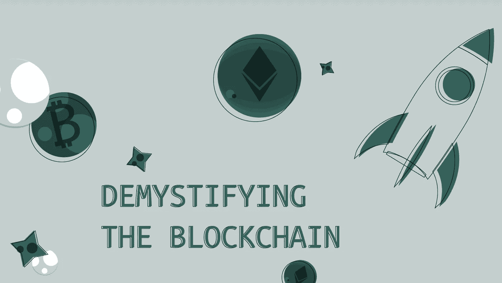
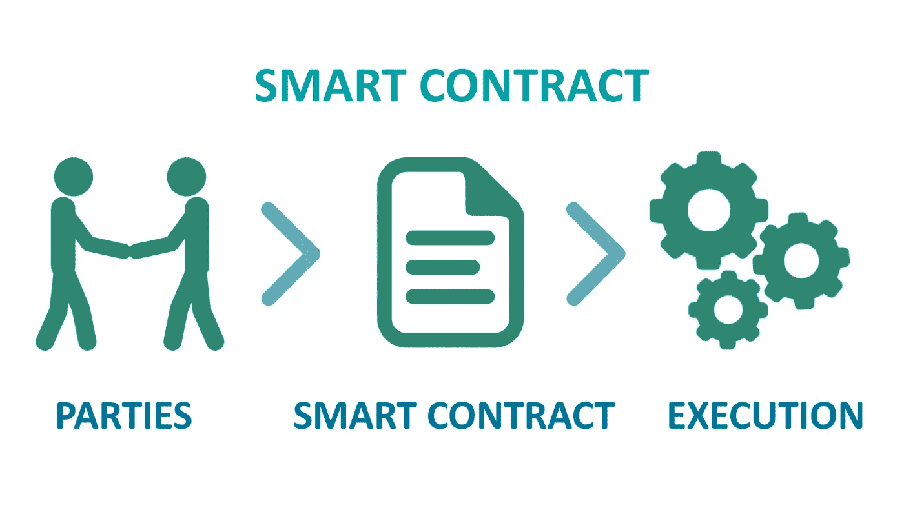
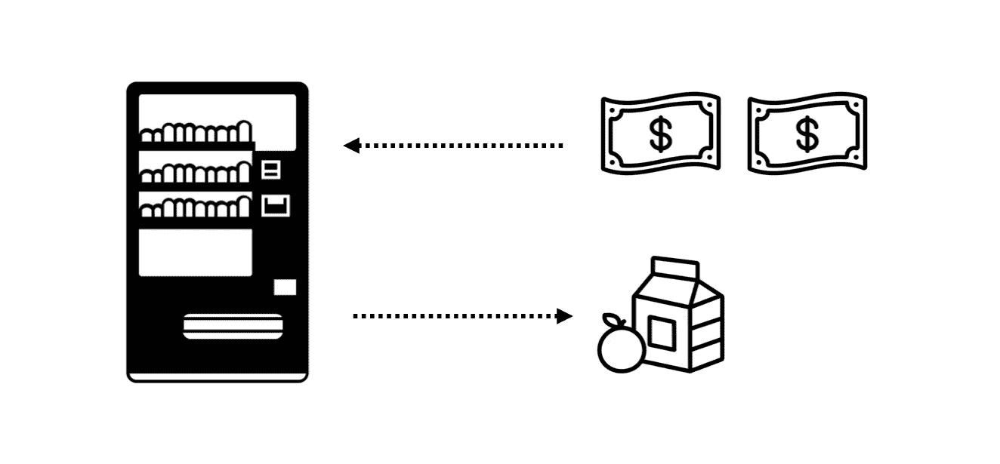
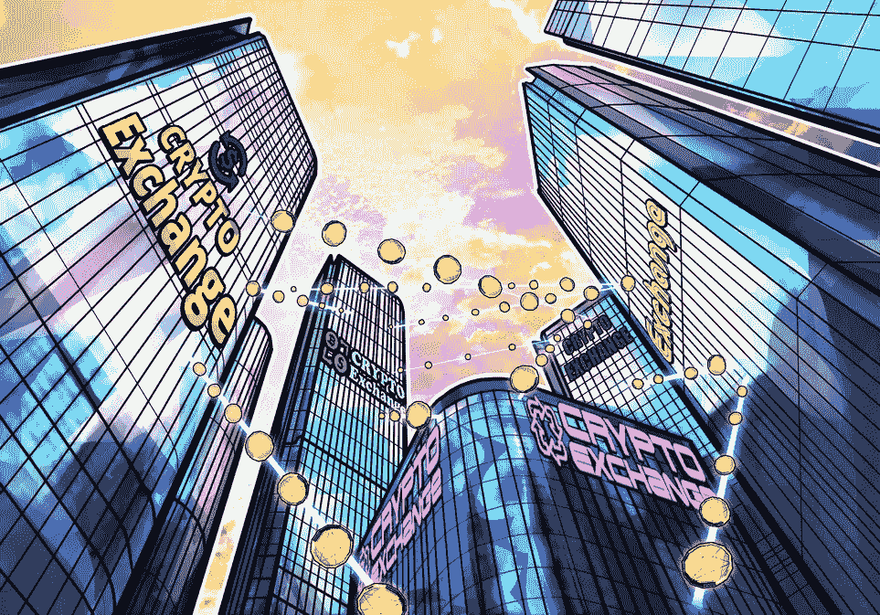

# 智能合同—什么是智能合同，它们是如何工作的？

> 原文：<https://medium.com/geekculture/smart-contracts-what-are-they-and-how-do-they-work-2a5de5ec4cab?source=collection_archive---------10----------------------->

## 揭秘区块链

## 更智能的交易方式

*欢迎来到我的系列，“揭开区块链的神秘面纱”在每篇文章中，我用不到 5 分钟的时间(可能不是真的)分解并解释一个与区块链相关的基本概念/主题。本文的讨论集中在智能合约上——未来已经到来，现在你可以不用离开你的床就可以控制你的商业交易，最好解雇那些追随者，嗯？*

# 一开始，有智能合同

让我们从头开始。在 20 世纪后期，当加密货币、在线交易和数字资产所有权等概念似乎仍然是一个梦幻般的未来时，华盛顿大学(University of Washington)最近的毕业生尼克·萨伯(Nick Szabo)敢于相信不同的观点。

# 起源故事

事实上，Nick Szabo 认为去中心化的在线交易的未来不仅是一个可以实现的可能性，而且是一个在短时间内可以实现的未来。1998 年，Nick 起草并发表了一篇文章，详细介绍了一项提案，该提案将当时完全通过一个由昂贵的中间人/女性组成的低效系统准备、构建和分发的许多业务相关的合同条款和操作嵌入到一个硬件/软件解决方案中，从理论上讲，该解决方案几乎不可能违反合同。在这样做的过程中，他不知不觉地向世界介绍了一个概念，这个概念引领着区块链技术以 web3.0 的形式全面融入万维网——他诞生了智能合同的概念。

# 智能合同:基本定义

简而言之，智能合约是微小的代码串，通常以 if/then/else 语句的形式存在，可以自动执行并存在于区块链中。用伟大的尼克·萨伯自己的话说，智能合约可以比作原始而实用的——中间人消除了自动售货机的功能。自动售货机的使用过程分为三个不同的步骤。

1.  *你在屏幕上选择订单，并同意支付一定的款项。*
2.  *你把辛苦赚来的钱放进机器里。*
3.  机器识别付款，确认其有效性，然后将你的一袋奶酪和微妙的辣味美食放入底部的槽中，供你拿起并享用。

> “一个典型的现实生活中的例子，我们可能会认为是智能合约的原始祖先，是不起眼的自动售货机。”—尼克·萨伯

# 你不能踢的自动售货机

智能合同实际上就是重新定位的在线自动售货机。每份合同都旨在监督特定类型的数字交易。如果参与交易的各方提供了满足智能合同参数所需的必要价值，交易就会完成，双方都会得到他们想要的东西。没有中间人。没有传统的交易成本。没有风险。

# 改变定义

智能合约的独特属性造就了 Defi 的一些引人入胜的应用程序，这些应用程序不断向世界展示新的、令人兴奋的业务处理方式。最近的一个这样的应用程序是在 2018 年以闪贷的形式出现的。

# 快速贷款

闪贷是区块链支持的借贷的一种体现，它借入在线货币资产，对这些资产进行某些预定的操作，然后在同一笔交易中全部归还。没有债务、信用损失或支付高额利息的风险。

尽管传统形式的投资，如借款和持有股票、房地产和其他资产，在闪贷中是不可能的(由于其一体化交易政策)，但你仍然可以进行一些相对有利可图和有趣的货币操作，如加密套利。

# 无管制的混乱

由于社会对加密货币交易的突然和压倒性的兴趣，以及区块链的本质和分散性，任何监管各种在线加密交易所价格的尝试都无法实现大规模市场采用，因此交易所之间的差异普遍存在。

加密套利的行为利用快速贷款借入大量的一种加密，在一个交易所将其转换为另一种加密，然后在另一个交易所以更高的价格出售借来的加密。

> 例如，您使用智能合约从 Aave 借入 100 以太，在 Uniswap 上将其转换为 DAI，然后在 Pancake swap 上将输出的 DAI 转换为 100.1 以太。希望运气站在你这边，从 Aave 收取的 0.09%的利息，加上以太坊的汽油费，少于你的交易收入。如果是这样的话，已经满足了必要的参数，交易就会通过，让你稍微富裕一点。

# 是时候变聪明并总结一下了

*   在它们最基本的定义中，智能契约只是 if/then/else 语句形式的小代码片段。
*   这些语句包含某些特定于交易类型的参数，如果满足这些参数，则允许交易发生，如果不满足这些参数，则取消交易，对任何人都没有损失。
*   智能合约有一系列的用例，其中之一是闪贷，这只是一种在一次操作中借款、进行交易和归还借款的功能。

智能合同将彻底改变我们在网上开展业务的方式，我非常期待看到它们的发展方向！

## 更多资源:

> [https://nakamotoinstitute.org/the-idea-of-smart-contracts/](https://nakamotoinstitute.org/the-idea-of-smart-contracts/)—中本研究所
> 
> 【Decrypt.co】https://decrypt . co/resources/what-is-flash-loans-the-defi-lending-phenomenon-explained
> 
> [https://www . coin desk . com/learn/Crypto-arbitrage-trading-how-to-make-low-risk-gains/#:~:text = Crypto % 20 arbitrage % 20 is % 20a % 20 type，跨越% 20 多个% 20 市场% 20 或% 20 交易所。text = The % 20 other % 20 great % 20 things % 20 about，order % 20 to % 20 begin % 20 arbitrage % 20 trading](https://www.coindesk.com/learn/crypto-arbitrage-trading-how-to-make-low-risk-gains/#:~:text=Crypto%20arbitrage%20is%20a%20type,across%20multiple%20markets%20or%20exchanges.&text=The%20other%20great%20thing%20about,order%20to%20begin%20arbitrage%20trading)。—Coindesk.com