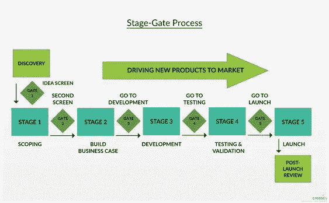

# 数字化转型(DX)之旅的智能袖珍指南:IIoT 视角

> 原文：<https://medium.com/geekculture/smart-pocket-guide-for-the-digital-transformation-dx-journey-the-iiot-perspective-8f5811fcb8cb?source=collection_archive---------17----------------------->

## 工业 4.0 和 IIoT

## 数字化不仅仅是一个目标，而是一种生活方式

Photo by [Joshua Sortino](https://unsplash.com/@sortino?utm_source=medium&utm_medium=referral) on [Unsplash](https://unsplash.com?utm_source=medium&utm_medium=referral)

使用机器学习或深度学习(ML/DL)的工业分析是工业 4.0 皇冠上的宝石。为了追求同样的体验，企业正在寻找正确的途径。数字化转型(DX)之旅的**的好处是无限的。IIoT 的成功实施只有在定制解决方案&的帮助下才有可能，该解决方案使用来自工厂车间或装配的实际数据。但是通常情况下，很难说服所有的利益相关者在整个企业内大规模实施 IIoT。因此，在计划阶段，必须安排一个解释最清楚、最合理的步骤。它还包括一个小规模原型或 [**概念验证(PoC)**](https://en.wikipedia.org/wiki/Proof_of_concept) 以证明其可行性。对于该示范项目，希望仅投资总项目成本的 5-10%。根据演示的结果，组织应该能够做出全面投资的决策。在本文中，作者试图详细说明如何规划 DX 之旅并进行 PoC 以找到最合适的解决方案。**

**根据思科 最近的一项研究，许多物联网和隐式物联网计划在概念验证阶段 [**失败。这并不奇怪，因为 IIoT 计划是影响公司商业模式、技术、架构、流程和人员的复杂转变。虽然这个数字看起来很高，但它类似于其他新计划的历史记录，比如云计算、敏捷计划等等。工业 4.0 的承诺和延长正常运行时间带来的潜在收入引发了人们对 IIoT 技术的浓厚兴趣。因此，许多分析师预测在物联网相关技术上的支出将会激增。根据麦肯锡的预测，到 2025 年，连接现实世界和数字世界每年可以产生高达 11.1 万亿美元的经济价值。**](https://newsroom.cisco.com/press-release-content?type=webcontent&articleId=1847422)**

****

**Photo by [fabio](https://unsplash.com/@fabioha?utm_source=medium&utm_medium=referral) on [Unsplash](https://unsplash.com?utm_source=medium&utm_medium=referral)**

**尽管几乎普遍认为 [**IIoT 可以通过我们面前充满希望的人工智能(AI)未来在工业领域释放出大量价值**](https://www.strategyand.pwc.com/gx/en/insights/industry4-0.html) ，但选择购买哪种解决方案往往很复杂。要想成功，我们必须首先学会拒绝顾问们描绘的虚假愿景，这些顾问们渴望超越彼此。大多数工程师对人工智能的理解不如他们对机械、电学或化学的理解。数据科学没有第一原理或科学定律。它非常模糊。因此，很难判断围绕分析提出的主张是否现实。或者你可能最终使用一种过于复杂的人工智能来完成一项简单的分析任务。肯定像早期的热力学和电磁学。在这个数字化转型(DX)、数字化、数字化、工业 4.0 的时代，围绕人工智能(AI)的信号褒贬不一。一方面，咨询公司对人工智能的夸大承诺被媒体广泛报道，经常引起最终用户不切实际的期望。另一方面，我们听说人工智能项目没有达到预期。一个彻底的以数据为中心的方法可以防止夸张，缓和预期，增加成功。这样， [**资源将会以正确的方式**](https://pathakc.medium.com/internal-roadblocks-in-the-way-of-digital-transformation-dx-journey-f7374d1fe28b) 被引导，在一个数据科学和人工智能的新时代，我们将会从人工智能中受益更多。让生活变得更好的可能性令人兴奋。在分析过程中，通常会观察到以下挑战:**

> ****错过启动 DX 之旅的适当规划:我们如何达到数据科学和工程的新成熟水平？****
> 
> ****解决方案的范围和时间表是基于“炒作”而不是“地面真相”来定义的:我们如何知道顾问描绘的人工智能愿景是现实的还是蛇油？****
> 
> ****如何为 IIoT 选择基础设施平台存在不确定性。****
> 
> ****我们是否因为不确定人工智能能力而错过了改进机会:组织没有创建定义良好的角色和职责？因此，选择解决方案提供商的过程可能会失败。****
> 
> ****企业正在努力跟上所有新的市场进入者，并了解解决方案之间的差异:我们如何知道哪种形式的人工智能是解决特定问题的最佳选择？****
> 
> ****仍然存在访问传感器数据的实际问题，涉及数据卫生，并且工业部门缺乏合格的数据科学家和不充分的商业智能工具会减缓基于 IIoT 的分析的采用。****

# ****通过阶段门流程遵循连续的反馈机制****

**许多公司使用 Cooper Stage-Gate 流程或衍生流程来批准和管理创新和解决方案开发。这个过程有 5 个关口(屏幕)和 5 个阶段(阶段)，之前是构思(阶段 0)。额外的第六阶段审查是一个很好的做法。该流程也用于批准和开发工业 4.0 项目。在头脑风暴用例之后，你必须首先证明它是可行的并且会有回报。然后在批准全面部署之前，开发和验证任何新的未经测试的解决方案。在每个阶段之前，或者如果你愿意的话，在两个阶段之间，每个用例解决方案的细节都被审查，要么进入下一个阶段，要么基于前一个阶段的结果而终止。在每一个关口，用例开发的领导者必须向把关者提供相关的输入。决定进行、终止、暂停或回收每个解决方案开发项目。**

****

**image courtesy: creately.com**

****第 0 阶段——构思:**建议进行一次发现会议，以发现工厂各运营部门面临的挑战。**

****阶段 1——范围:**对于在发现阶段确定的每个挑战，决定用例是应该继续进行进一步的评估还是被删除。回顾当前执行任务的方式，以便更好地定义问题和新概念。研究执行任务的其他方法，备选方案。看看现有自动化供应商的现成解决方案。**

****第 2 阶段——业务案例构建**:提供成熟现成解决方案的使用案例，或者使用现成组件的新解决方案可能会成功。需要定制编程的用例可能不会。因此，通常会选择成本较低且能够提供良好回报的用例作为下一个入口。使用专门构建的现成软件，部署工作、总安装成本和时间保持较低，因为没有定制编程，也没有长时间的数据清理和算法培训。计划采用无线传感器，理想情况下是非侵入式传感器，因为它们可以在工厂运行时安装，从而减少成本和延迟。这样，良好的投资回报率是可以实现的。**

****第 3 阶段——开发:**管理层和负责改造任务的部门审查上一阶段研究的每个用例的可行性，需要部署耗时且成本高昂的全厂基础设施的解决方案，或者节约可能需要更长时间才能实现的用例的解决方案，将被取消或搁置。首先，开发使用基础设施的解决方案，这些基础设施可以部署在工厂的一个部分，或者开发可以立即看到节约的解决方案。一些独特用例的解决方案可能需要一个现成的软件。它可以是一个应用程序或另一个软件的专有接口/驱动程序。如果是，那肯定是 4 号门之前定制开发的。然而，考虑到大量现成的可用软件和大量扩散的 OPC-UA 和 OPC 经典之前，这是极不可能的自定义是必需的。如果解决方案的系统集成商需要定制软件作为解决方案的一部分，这个阶段还包括编码和测试 alpha 原型。**

****第 4 阶段——测试和验证:**正在研究解决方案及其详细设计，并仔细检查任何定制软件 alpha 测试的结果。部署解决方案的成本估计现在应该没有什么不确定性了。对于在开发阶段详细设计的每个用例解决方案，决定该解决方案是应该继续进行进一步的测试和验证，还是被终止。定制编程软件尚未在任何其他工厂进行测试，因此开发的包含定制软件的解决方案需要进行 PoC 现场测试。对于定制软件，建议长时间运行该测试，使其暴露于各种过程条件下。这是在现场用真实输入数据完成的，而不是模拟的。必须纠正发现的错误和问题。这可能需要测试修复和重新测试的多次迭代。对于现成的软件，beta 测试已经完成，概念已经在其他工厂(通常在公司内部)得到验证，因此不需要这一步。经验证的解决方案最大限度地减少试点/概念验证。大多数项目需要集成来自两个或更多供应商的软件。这可能是项目中需要的新软件和工厂中已经运行的现有软件之间的冲突。如果这种集成是通过 OPC-UA 或一个旧的 OPC 经典接口完成的，这应该工作得很好。但是，如果有非标准的 API / web 服务接口，应该尽早测试。**

****第 5 阶段—发布:**已经在其他站点或成功的 PoC 中测试过的解决方案可以获得批准并发布。首先在一个工厂单元中部署开发的解决方案，然后扩展到整个工厂区域，最后是整个工厂。**

****第 6 阶段——回顾:**您需要报告在工厂中部署的用例解决方案的成功，以展示数字化转型的价值，帮助确保下一个项目的资金。建议收集“改造后”的数据，将其与“改造前”的数据进行比较，并计算节省的成本或增加的收入。**

**第四次工业革命(4IR)中的数字化转型是深思熟虑的。时间和金钱不是盲目投入的。只转换需要的东西。从几个低挂(水果)用例和支持数字操作基础设施(DOI)开始。然后随着您发现未来更多的运营挑战而扩展。下面介绍了实现有意义的概念验证的最佳实践。**

# ****范围&基于“真实”而非“炒作”的规划****

**通常，业务需求应该是技术变革的驱动力。商业应该推动技术，而不是相反。然而，很多时候，由于技术炒作周期，领导者会变得兴奋，并希望被视为领先的变革推动者。基本规划必须包括:**

> **创建一个由运营技术(OT:领域专家)和信息技术(IT:数据治理、网络和安全)成员组成的内部团队**
> 
> **根据工厂现代化审计准备目标清单，确定需要监控的设备/系统。审核确定了那些可带来显著节约潜力的主题，如减少停机时间、维护、运营费用、能源浪费和产品损失、HS&E 风险和非生产性程序。**
> 
> **得出以数据为中心的成功标准:结果的准确性，即有意义与无意义结果的推论，以及原型制作完成的时间表。**
> 
> **产品或服务的优势和劣势分析，即用户界面、集成的便利性和功能性。**
> 
> **基于市场的定价和产品或服务的未来特征。**

# ****基于现实基础设施的实施****

**成功规划后，下一阶段将是实施，包括以下步骤:**

****确定数据收集点**定义数据摄取过程，并据此选择最佳数据收集点。这将涉及评估传感器节点、物联网协议、最佳数据传输速率等等。**

****开发安全的物联网网关设备**，该设备负责关键任务，如设备配置管理和设备认证，以实现安全的网络访问。**

****设备和数据管理**:传感器节点的开发面临着一系列独特的挑战，从设计数据传输的最佳频率，到电源配置，再到传感器出现故障时强大的数据备份计划。这通过以下方式实现，**

> ****优化数据传输和电源管理流程:**内部电池是物联网传感器的主要电源。**
> 
> ****高效的数据可靠备份计划**，以防传感器节点故障或网络故障时数据丢失，同时数据包通过网络通道发送。**
> 
> ****远程设备管理**——FOTA(固件空中下载)模块，确保安全性。**

****开发安全且可扩展的云/本地应用**，以存储和高级分析从传感器收集的数据；然而，云连接有助于兑换完全连接的服务(IaaS、PaaS 和 SaaS)。最佳实践包括，**

> ****安全性**必须首先选择安全的基于互联网的协议**
> 
> ****选择优化的数据库**根据数据收集要求，云中的数据库需要进行配置，以管理来自传感器的大量数据。**
> 
> ****确保未来的可扩展性**必须审查使用 AWS-EC2 等服务进行自动容量调整同时优化服务器性能的自动扩展选项。**

****web/mobile 上的 UI 仪表盘**在物联网计划的整体成功和最终用户接受度方面发挥着非常重要的作用。在专业 UI 开发团队的帮助下，还可以重复使用在物联网概念验证阶段设计的大部分 HMI/UI 组件，用于最终推广。**

# ****彻底发展数据驱动文化****

**俗话说得好，人、流程和技术。前几个阶段主要是关于技术解决方案。包括人员和工作流程在内的变更管理也必须作为新解决方案部署的一部分。管理层必须传达数字化转型的重要性以及各种用例及其解决方案。工厂人员学习和发展(L&D)掌握新的数字技能/能力对于缩小技能差距非常重要。建议是让人们在部署使用新工具之前体验和学习它们。修改与每个角色和转换的职责相关的标准操作程序(sop ),以便在 sop 中反映新的数字工具和新的数据驱动的工作方式。**

# ****外卖****

**工业 4.0 和数字化转型都与数据有关。为了实现数据驱动或以数据为中心的工作，我们需要感知工厂的每个部分，将数据整理到需要的地方，将数据转化为智能，并根据智能采取行动。我们的工厂数据策略必须包括从数据收集和摄取、聚合和上下文化、存储、清理、数据分析到可视化的每一步。并且还具有管理、治理和保护方面。通过正确的方法，我们将获得高度完整的数据，随后我们将通过数据驱动的工作方式制定工厂数据和卓越运营的战略。**

***如果你觉得这篇文章有用，请点赞和分享，也欢迎评论。也可以在* [*LinkedIn*](http://www.linkedin.com/in/pathakchiranjit) *上找我。有兴趣了解工程领域的数据分析、数据科学和机器学习应用的更多信息吗？通过访问我的* [*中简介*](/@pathakc) *来探索我以前的文章。感谢阅读。***

***- Chiranjit***