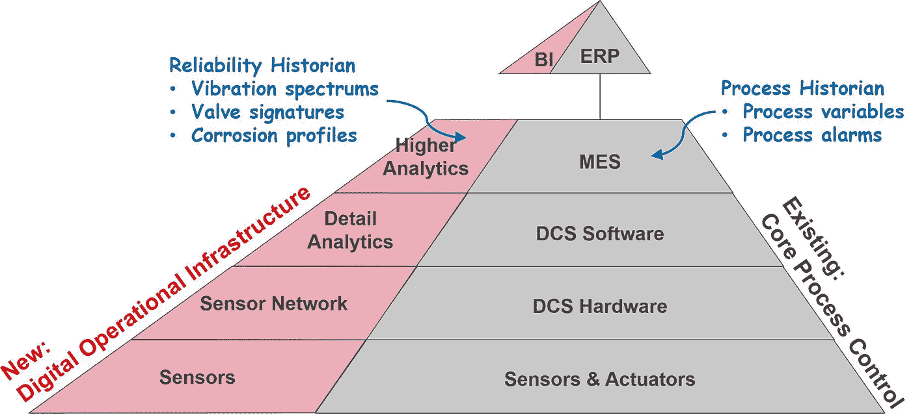
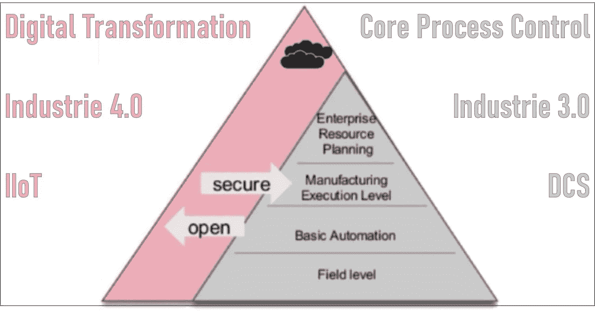

# 面向中小企业的智能流程工业属于工业 4.0 的范畴

> 原文：<https://medium.com/geekculture/smart-process-industry-for-smes-purview-of-industry-4-0-6888a2467cde?source=collection_archive---------24----------------------->

## 工业自动化和信息技术

## 为过程自动化带来开放性

Photo by [Stephen Dawson](https://unsplash.com/@dawson2406?utm_source=medium&utm_medium=referral) on [Unsplash](https://unsplash.com?utm_source=medium&utm_medium=referral)

与制造业类似，流程工业正面临着市场需求的飞速变化(更短的交付时间、更小的批量、创新产品更快的上市时间)和日益激烈的全球竞争。市场参与者必须考虑他们可以在数字化领域使用哪些技术可能性来提高效率。 [**数字化当然不是万能的，但却是重要的杠杆**](https://pathakc.medium.com/smart-pocket-guide-for-the-digital-transformation-dx-journey-the-iiot-perspective-8f5811fcb8cb?source=friends_link&sk=8d82fd4fb4df08c298aa6d254e9d0d55) 。为了使技术过程更加灵活，它还必须包括组织和后勤过程。

已经理解的企业，[已经根据他们的优先顺序](https://pathakc.medium.com/internal-roadblocks-in-the-way-of-digital-transformation-dx-journey-f7374d1fe28b)部署了他们的资源。有些人仍然一无所知假定高投资和一些尚未实现的需要。威名有曲解 [*【数字化】同*](https://www.truqcapp.com/digitization-vs-digitalization-differences-definitions-and-examples/) *【数字化】。***中小企业大多属于后两类。本文的目的是讨论其基础，流程的自动化和改进，以及将中小企业转变为工业 4.0 的方法。这个话题很广泛；然而，作者的目的是提供一个基于可用框架的基本路线图。**

**在讨论他们的数字化之旅时，几乎所有的企业都有如下的基本问题:**

> *****他们应该从哪里开始，是否具有可扩展性？*****
> 
> *****有没有可能在现有的基础设施和协议上实现？新要求的组件是否与现有设置兼容？*****
> 
> *****数据安全性和流程完整性呢？*****
> 
> *****如何从哪里提取信息值？*****

# **开始旅程及其可扩展性？**

**世界经济论坛[与麦肯锡合作的白皮书](http://www3.weforum.org/docs/WEF_4IR_Beacons_of_Technology_and_Innovation_in_Manufacturing_report_2019.pdf)建议工厂应该从多个小项目开始。T2 波士顿咨询公司(BCG)T3 也建议在这方面采取分阶段的方法。现有的历史记录系统(核心过程控制系统)可以根据需要使用额外的标签进行扩展。这样就可以快速实施，而且风险很低。一些企业投资*【错误】*项目，开启数字化转型(DX)之旅；新旧工作方式差别可能不大的地方。例如，爬虫、无人机以及平板电脑和智能手机可能并不总是数字化转型的最佳例子——因为它们仍然需要人类来操作、控制它们并将数据输入设备。把无人机和机器人放在 DX 旅程的后期可能会更好。仪表板和增强现实(AR)是人类的显示器，是数据-信息-知识-智慧链的最后一步。在创建有用的仪表板/ AR 覆盖图之前，您需要正确的分析来提供要在仪表板/AR 设备中显示的信息。在获得可靠的分析之前，你需要有用的数据。在 historian 系统上部署一个额外的“单一软件平台”可能需要数年才能看到投资回报。因此，工厂必须从数字联网传感器开始，并根据需要插入软件应用程序，一次解决一个问题。**

****

**image courtesy NAMUR**

# **技术和架构选择如何发挥作用？**

**如果支持 DX 的数字操作基础设施(DOI)是基于某种专有技术构建的，则系统功能将非常有限，并且长期维护成本很高。DX 的真正成功完全取决于传感器和 doi 如何无摩擦地相互作用。在现有数据中心内实施 DX 解决方案可能会遇到各种障碍。例如，在核心 DCS 服务器和工作站中安装第三方软件(专有技术),担心危及现有 DCS 的安全性和完整性。在现有工厂中，通过 DCS 连接所有传感器具有挑战性。因此，为了降低维护成本，标准网络协议&软件 API 和文件格式总是比专有技术更受青睐。doi 作为第二层自动化添加到 DCS 侧，适用于新的和现有的系统。现有系统保持不变，但根据所需的 DX 级别进行了调整。**

**使用基于诸如 [WirelessHART](https://en.wikipedia.org/wiki/WirelessHART) 、[基金会现场总线](https://en.wikipedia.org/wiki/Foundation_Fieldbus)和 [OPC-UA](https://opcfoundation.org/about/opc-technologies/opc-ua/) 等标准的通用基础设施，以适应具有通用 DOI 的广泛应用。OPC-UA(一个标准的开放 API)允许所有类型的预测分析应用程序访问混合基础数据源的数据，如现有的历史记录、控制系统、机械保护系统、电气系统和包装单元 PLCs 等。仿照 [NAMUR 开放架构(NOA)](https://www.namur.net/en/) 建造的系统架构允许工厂快速扩展，最大限度地利用现有基础设施，扩大而不是复制它。因此，标准化的开放式控制架构更容易从实时数据中创造信息价值。**

****

**image courtesy NAMUR**

# *****数据安全性和流程完整性呢？*****

**主要目标是通过额外的 doi 对可靠性、维护、能效和人员安全等进行监控和优化(M+O ),扩展工厂自动化(不涉及 DCS)。NOA 的设计不会对现有 DCS 的工厂可用性和安全性造成任何影响。NOA 的核心关键技术是 OPC-UA，用于从新的 DOIs 读取 DCS 和现场仪表中的数据，以实现新的 M+O 工业 4.0 解决方案。NOA 基于现有标准，如已建立的现场总线协议和软件接口，如 OPC-UA，以实现从现场级到企业级的数字组件的简单集成。这种方法适用于新的和现有的生产工厂。自动化安全性是体系结构的一个整体设计方面(通过设计实现的安全性)。**

****

**image courtesy NAMUR**

# **如何以及在哪里提取信息价值？**

**DX 的程度需要与工厂运营团队一起进行评估，并相应地计划逐步节约潜力的方法。DX 可以按照其价值创造能力的升序概括如下:**

*   **添加传感器，以便**自动收集数据**。**
*   ****参数管理系统**(在现有的历史记录或任何第三方 app 平台内)**
*   ****装置或设备健康管理系统**(在现有的历史记录或任何第三方应用程序平台内)**
*   ****高级分析:**更高级别的工程模型(基于第一原理)或数据科学驱动(基于机器学习)分析平台，用于设备或装置健康状况(维护)和/或分析运行数据(优化)并随后分别预测可靠性和产品质量。**
*   ****中央 HMI:** 包含实时运营指标的运营仪表盘；影响 KPI 的实时信息，具体到平板电脑上显示的个人职责。**
*   ****流程模拟:**用于操作员培训模拟器(OTS)软件和优化。实际物理过程的虚拟模型([数字孪生](https://en.wikipedia.org/wiki/Digital_twin))连接到离线控制系统(非生产系统)，该系统具有与生产系统相同的操作员图形和控制策略，以训练操作员在各种情况下采取适当的行动，如过程混乱或批量切换等。，所有这些都不会干扰实际的工厂。过程模型也用于试验新的控制策略和逻辑改进、调整和设定点等。用于过程优化，特别是用于在虚拟现实(VR)中实现过程的批量配方优化。**

# **采取方式:**

**未来是数字化的，这是不可避免的。因此，中小型企业应该在开始其 DX 之旅之前进行评估，以发现业务挑战。管理层和直线领导必须传达 DX 的重要性。基本路线图可以总结如下，**

*   **分阶段方法:发展中国家保持现状**
*   **以 NAMUR 开放架构为模型的架构:在 DCS 旁边添加 DOI 作为第二层**
*   **现成的应用:开放的 OPC-UA 应用平台**
*   **东方易用软件:基于标准化的 I&C 标准**
*   **数字生态系统:数字化网络附加传感器和数据的可读性(通过 OPC-UA 验证数据)**

> **数字化转型不是一个项目，而是一种生活方式**

# **令人担忧的副作用:**

**要维持的这些变化必须在各方面都有利于最终用户。它不应该为行政大楼中的某人获得仪表板而增加在车间将数据输入系统的负担。数据必须自动收集，所以没有手动输入；它必须不仅惠及行政大楼里的人，也惠及车间里的人。如果方法对他们没有帮助，员工将回到他们的旧系统。软件如果不能提供所有需要的功能和用户友好的界面，将会给用户带来挫败感。提供不可预测结果的分析(由于使用机器学习创建的模型未经验证)和没有正确的传感器将导致解决方案不成功，导致人们回到他们的旧工作方式。如果工具没有用或者太难用，就不会被使用。**

**企业必须确保上述问题不会对 DX 路径造成太大阻碍。NOA 独立于现有的 DCS，因此无论工厂的 DCS 如何，都可以迁移到工业 4.0。**

***如果你觉得这篇文章有用，请点赞和分享，也欢迎评论。也可以在* [*LinkedIn*](http://www.linkedin.com/in/pathakchiranjit) *上找我。有兴趣了解工程领域的数据分析、数据科学和机器学习应用的更多信息吗？通过访问我的* [*中简介*](/@pathakc) *来探索我以前的文章。感谢阅读。***

***- Chiranjit***