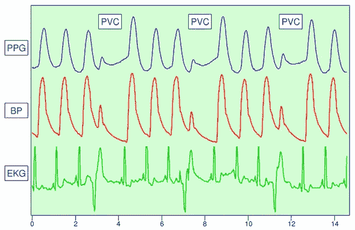

# 智能马桶初创公司 Casana 完成 1400 万美元的 A 轮融资

> 原文：<https://medium.com/geekculture/smart-toilet-startup-casana-closes-14m-series-a-round-fbb432851ea1?source=collection_archive---------27----------------------->

Photo by [Marc Schaefer](https://unsplash.com/@marcschaefer?utm_source=unsplash&utm_medium=referral&utm_content=creditCopyText) on [Unsplash](https://unsplash.com/s/photos/toilet?utm_source=unsplash&utm_medium=referral&utm_content=creditCopyText)

Casana 的愿景是提供一个监测你健康的厕所，这可能很快就会成为现实。这家智能马桶初创公司最近在由 General Catalyst 和 Outsiders Fund 牵头的 A 轮融资中获得了 1400 万美元。

Casana 希望使用其心脏座椅被动收集关键健康指标的数据。这些指标包括心率、血压、血氧水平和心输出量。该设备监控这些指标的趋势和洞察力。该公司希望为人们提供一种新的轻松的家用技术，用于监控重要的健康信息。

“我们的目标是能够在家更自然地监测患者的健康，而不中断他们的日常生活，”Casana 首席执行官奥斯汀·麦科德说。“马桶座圈不是什么科技产品。不像可穿戴设备，你不能摘下来，忘记使用或弄乱它。如果我们做好自己的工作，除非他们的健康状况需要关注，否则我们是隐形的。”

## **卡萨纳心形座椅的工作原理**

马桶座圈包含一个心电图(EKG)来监测你的心脏的电活动。EKG 活动异常可能是心脏病或心脏受损的迹象。它还包含一个[心冲击图](https://www.definitions.net/definition/ballistocardiography) (BCG)，可以跟踪心脏的机械活动，并可以检测出充血性心力衰竭等问题。卡萨纳马桶座圈的另一个功能是[光电脉搏图](https://www.news-medical.net/health/Photoplethysmography-(PPG).aspx)，它可以测量血氧水平。它通过检测光吸收的变化来做到这一点。

Photophethysmogram — Image credit Kirk Shelley & Stephen Linder via [Wikipedia Commons](https://commons.wikimedia.org/wiki/File:PVC_detectionUsing_PGG.png)

内置在马桶座圈里的电池应该可以使用几年而不用充电。不需要插电。使用马桶座的内置 WiFi 和 LTE 功能，可以将来自 Casana 马桶的健康信息无缝发送到其他设备。云连接设备有助于用户友好的客户体验。

“我们相信，提高家庭心脏健康监测设备的依从性将有助于促进家庭健康的加速采用，”McChord 说。"许多设备需要患者和/或护理人员的干预，并且经常受到用户错误的困扰."

这家初创公司正在寻求 FDA 的批准。多项同行评审研究报告了显示该技术准确性的测试。Casana 将心脏座椅作为心脏病管理的临床级技术。

## Casana 的创始人对成功的创业公司并不陌生

奥斯汀·麦科德在纽约罗切斯特创办了卡萨纳。这家公司以前的名字叫心脏健康智能。罗切斯特理工学院的一名研究人员开发了该公司智能马桶盖背后的技术。Casana 在 2020 年筹集了一轮种子资金。

奥斯汀·麦科德是一位经验丰富的企业家。20 岁出头时，他创办了自己的第一家公司，名为 Datto。网络安全和数据备份解决方案公司 Datto 最近进行了 45 亿美元的 IPO。麦科德从 2007 年 Datto 成立开始担任首席执行官，直到 2018 年卸任。

## **卡萨纳面临高科技马桶的竞争市场**

Casana 在智能马桶市场的一些竞争对手正在超越高科技马桶座圈。Toto 是一家总部位于日本的公司，也是世界上最大的马桶制造商。它正在制造一种可以测量粪便和尿液样本的厕所。通过分析人们的排泄物，Toto 马桶可以提供饮食建议，以改善营养，并标记潜在的健康问题。

斯坦福大学医学院的研究人员创造了一种厕所，可以分析尿液的流量，颜色和体积，以检测健康状况。这个厕所还配备了摄像头和机器学习算法，可以分析粪便中潜在的慢性疾病或更高的疾病风险。斯坦福大学的研究人员正在与韩国马桶制造商 Izen 合作建造这种马桶。

杜克大学的一组研究人员同样创造了一个原型厕所，内置摄像头来分析粪便。该技术观察粪便中血液的浓度、蛋白质含量和存在情况，以做出健康诊断。厕所也可以提取少量粪便样本，然后送到实验室做进一步分析。

谷歌有限责任公司在 2015 年获得了一项智能马桶专利。马桶可以监测心血管活动。目前还不清楚谷歌健康是否在智能马桶项目上取得了进一步进展。

## **智能马桶适应的机遇和可能的障碍**

Casana 会努力确保您的健康参数数据安全地传输到其他设备。但是由于隐私问题，一些人对智能马桶的概念感到不舒服。在一项对 300 人的调查中，超过一半的样本对装有摄像头的厕所表示担忧。大约三分之一的调查参与者对厕所收集健康数据表示不安。

风险投资公司 General Catalyst 的 Casana 董事会成员兼高级顾问保罗·萨根(Paul Sagan)认为这家初创公司前景光明。Sagan 评论道:“下一次健康革命将把传感器引入日常用品，Casana 正在进行开创性的工作，利用互联传感器创建一种新的轻松家庭心脏健康监测类别。”