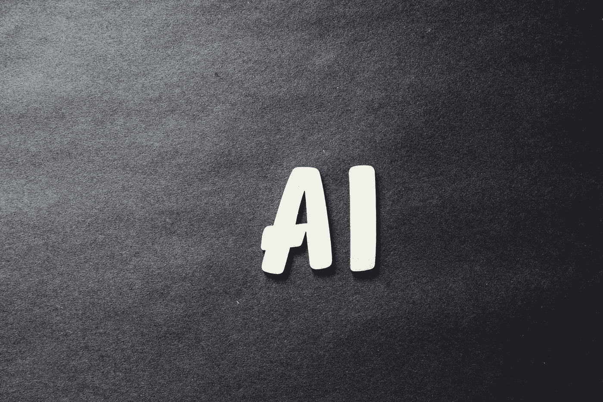

# 智能和未来

> 原文：<https://medium.com/geekculture/smartai-and-future-edf964542f2c?source=collection_archive---------19----------------------->

## 人工智能与未来。

Photo by [Markus Spiske](https://unsplash.com/@markusspiske?utm_source=unsplash&utm_medium=referral&utm_content=creditCopyText) on [Unsplash](https://unsplash.com/s/photos/smart-ai?utm_source=unsplash&utm_medium=referral&utm_content=creditCopyText)

世界正在快速变化，自从计算机、智能手机和互联网出现以来，信息、工作和数据的动态已经发生了变化。不仅是这个世界上的每一个人，甚至是私人公司和政府都在从中获利或改善经济。与此类似，在子层次结构中…