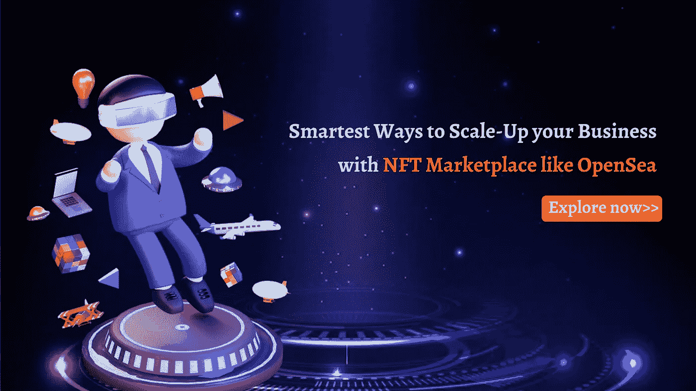

# 通过像 OpenSea 这样的 NFT 市场扩大业务规模的最聪明的方法

> 原文：<https://medium.com/geekculture/smartest-ways-to-scale-up-your-business-with-nft-marketplace-like-opensea-8446dae62c31?source=collection_archive---------14----------------------->

**迅速启动像 OpenSea 这样的 NFT 市场**

开发 NFT 平台真的能获得高收入吗？

负担得起吗？

## **完成需要多长时间？**

同样，你的脑海中也会出现无数的疑问。如果你决定建立一个应用程序开发公司，你明白了吗？

简而言之，这是一种成本有效的方式，为一家公司在 NFT 开展业务创造了很高的收益。

在这个博客中，像你一样的商人开始了解 [**创建类似 OpenSea**](https://www.trioangle.com/opensea-clone/) 的 NFT 市场的优势。

App development enterprise 为商人提供了广泛的解决方案，使他们很快进入了加密领域。

这样，商人可以轻松处理任何类型的收藏品，并为密码爱好者提供多种功能。让我们来看看像 OpenSea 这样的 NFT 市场是如何在行业中普及的。

## 企业家如何利用不可替代的代币获利？

谁不喜欢处理独特、稀有的艺术品呢？在这里，在这一点上，开发 NFT 平台将非常有利于未来的商人，也获得了业界的认可。

平台上列出的收藏品有 metaverses、音乐、域名、摄影、艺术、游戏等。这些都是非常有价值的收藏品，就像博物馆里的财产一样。在 NFT 市场，这些收藏品可以根据他们的需求进行买卖。

## 有趣的统计概述

**你会相信 2022 年市值会达到 133 亿美元吗？**

1.  像 OpenSea 这样的平台已经拥有了 100 万用户。
2.  作为一种趋势，类似 OpenSea 的平台已经达到了 1.217 亿次观看。
3.  在 OpenSea 上有超过 8000 万种不同的非金融交易。
4.  美国贡献了 NFT 类平台总流量的 23%。
5.  2022 年初，类似 OpenSea 的平台注册了 20 亿美元或更多的交易量。
6.  2022 报告称，市场价值已达到 133 亿美元，而数字资产达到 9000 万美元，收藏超过 300 万美元。

## **你能相信 2022 年的销量会达到每周 15，000 到 50，000 辆吗？**

1.  根据 2021 年的报告，在 NFT 市场，收藏品在一周内售出 15，000-50，000 英镑。
2.  根据 2021 年 4 月份的报告，NFT 市场的买家达到 30，000 人。
3.  “每天:前 5000 天”在 NFT 市场的销售额达到 6900 万美元。
4.  一份 2021 年的报告称，类似 OpenSea 的平台收入为 3.65 亿美元。

## OpenSea —增长、预测和投资回报

## 你有兴趣推出像 OpenSea 这样的 NFT 平台吗？

嗯，投资是正确的选择。因为这是一个十亿美元的生意，它吸引你的兴趣来启动像 OpenSea 这样的 NFT 平台。它是基于区块链开发的 P2P 和最大的 NFT 类平台，特别是由区块链网络支持的游戏项目、数字艺术等加密收藏品。

## **类似 OpenSea 平台的收入流**

**挂牌费用**

在用户交易后，通过在 NFT 平台上列出 NFTs，从总 NFTs 成本中获得部分百分比。

**交易费用**

在 OpenSea(如 NFT 平台)上完成的所有类型的交易都要收取一定比例的费用。

**初始设置费用**

为第一次建立账户的用户在类似 OpenSea 的平台上列出他们的收藏品产生费用。

**私下出售**

为 OpenSea like 平台带来独特的功能，允许卖家亲自向买家出售他的收藏品。

**铸造费**

买方/卖方必须支付铸造费来将他们的数字资产铸造为 NFT。

通过一个类似 OpenSea 的平台，用户数量达到 28.85 万笔，62.31 万笔交易，交易额高达 67，852，539.31 美元。类似 OpenSea 的平台排名第 9，活跃市值高达 53，901，180.46 美元。

## 像 Opensea 一样启动 NFT 市场的方法

要发展加密业务，你必须知道如何推出像 OpenSea 这样的 NFT 平台。接下来的过程将指导您从像 OpenSea 这样的 NFT 平台开始。

**商业模式**

集思广益，你希望你的 NFT 平台如何在市场上运作，你还必须决定收入渠道。

**域名购买**

一旦你开始你的商业计划，然后开始购买与你的业务相关的适当的域名网站。简而言之，它应该抓住你的用户的心。

**区块链网络**

像 OpenSea 这样的平台必须依赖于区块链网络。根据您的需求和目标市场选择您的相关连锁店。

**UX/UI 开发**

现在已经到了可以开始开发过程的阶段。其中 UX/UI 提供了对整个应用程序蓝图的良好理解。

**前端&后端开发**

设置好内页设计后，开发人员启动前端和后端开发。

**测试**

在这个阶段，质量保证团队测试平台的缺陷。首先，运行在本地测试服务器上执行。

**部署类似 OpenSea 平台的优势**

## 以下是启动像 OpenSea 这样的 NFT 市场的六大优势

**高回报**

OpenSea like 平台 2022 年创收 100 万用户。利润以百万计，这是通过建立一个考虑用户舒适度的平台来实现的。

**无代码**

该平台可以在没有专业开发人员帮助的情况下开发。无需适当的编码知识就可以轻松访问整个系统。

**性价比**

部署一个拥有 [**NFT 市场开发**](https://www.trioangle.com/nft-marketplace-development/) 集合的团队比开发像 OpenSea 这样的平台成本高。

**简单管理**

任何人都可以在没有人指导的情况下，像处理平台一样轻松处理 OpenSea。

**无懈可击的安全性**

由于 OpenSea-like 平台是基于区块链技术开发的，提供了多层安全性，使平台更加强大，并提高了交易者之间的信任度。

**互操作性**

OpenSea like 平台支持各种代币，它还允许用户轻松地与其他 NFT 平台进行交易

**清盘**

大家总结一下！对 [**OpenSea 克隆**](https://www.trioangle.com/opensea-clone/) 的需求正在迅速增加。这是用一种简单的方式构建你自己的类似 OpenSea 的平台的恰当时机。希望成为一个完美的交易者？

一个完美的类似 OpenSea 的平台可以实现你所有的愿望。这篇博客中强调的因素和原因让你对像 OpenSea 这样的 NFT 平台有一个清晰的认识。让我们现在就开始使用像 OpenSea 这样的平台吧！