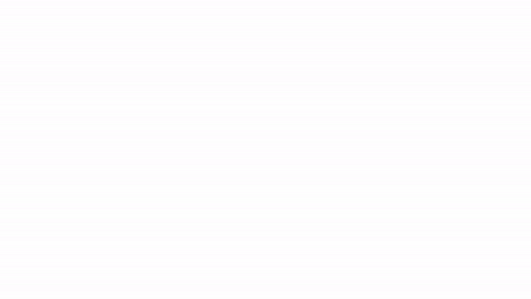
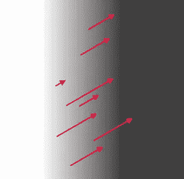

# Vue 中的烟雾屏幕擦拭过渡

> 原文：<https://medium.com/geekculture/smokey-screen-wipe-transitions-in-vue-4472b109e01?source=collection_archive---------14----------------------->

## 我第一次涉足神奇而令人困惑的着色器世界

The smoke effect in question

我偶然发现了一个网站，它列出了一系列具有不可思议转变的网站:[吸烟转变:一种趋势的开始？](https://designmodo.com/smoke-transitions/)很明显，我必须弄清楚这是怎么做到的。目标？任何一种类似滚滚浓烟的屏幕擦拭都非常好。

# 演示和源代码

以我的工作为起点。复制代码并对其进行修改。像我这样的业余爱好者写再多的文章也不能教你理解着色器所需的知识！

[点击这里查看演示](https://weiming-smoke-wipe.netlify.app/)。

[点击这里查看源代码](https://github.com/weimingw/weiming-smoke-transition)。

# 底漆

我将快速阐述一些我在这个项目之前不知道的事情(在我理解它们的程度上)，因为这是最终结果的先决知识。

**Three.js** 是一个 JavaScript 的 web 3D 图形渲染库。3D 渲染需要定位对象、照明和摄像机。

3D 对象具有定义其顶点位置(顶点着色器)或像素颜色(片段着色器)的着色器。从现在开始，我将只讨论碎片着色器。

**着色器**是运行在每个被处理输出的像素上的代码块。它们接受来自外部的参数:统一(不随像素位置变化)或变化(随像素位置变化)。着色器无法知道任何其他像素的输出-这是由设计决定的，因为这意味着它们被优化为通过具有许多内核的硬件(例如 GPU)并行运行。

我们需要一些随机性来模拟烟雾翻腾的混沌方式，但也要以平滑的方式显示这种随机性(因为烟雾强度不会有急剧的变化)。幸运的是，**噪声函数**满足了这两个要求，尽管我完全没有资格描述它们是如何工作的。

关于使用 JavaScript 定制 Vue 过渡的教程，请看我以前的文章。

# 配料

综合结果是多种因素共同作用的结果:

*   `src/transitions/smoke.js`中的自定义 JavaScript 过渡在退出动画开始时创建一个`<canvas />`，在动画结束时被删除。`<canvas />`被附加到父元素上，它的样式掩盖了被过渡出来的内容。
*   在`<canvas />`上渲染场景的 Three.js 渲染器。场景有一个单一的平面，其大小和位置使得它的纹理覆盖了整个`<canvas />`。
*   Three.js 平面上的一个着色器，使用了一个噪波函数和一个移动渐变，这两者结合起来创建了一个对滚滚浓烟的可接受的描述。

# 着色器

仅仅说着色器对效果负责就像说计算机正在通过读取 HTML 来显示这篇文章，所以让我们深入了解更多细节！云着色器在`[/src/transitions/shaders/cloud.frag](https://github.com/weimingw/weiming-smoke-transition/blob/main/src/transitions/shaders/cloud.frag)`中。

在其基础上，着色器只有三个部分:

1.  屏幕被擦拭过的部分，`newUv.x / xScale > uThreshold`，完全不透明。
2.  屏幕上还没有被擦除的部分(T4 声明)，它是完全透明的。
3.  被擦拭的部分，`newUv.x / xScale > uThreshold - uGradientSize,` 数学计算为渐变。

底座沿着屏幕移动，根据传入的`uThreshold`制服来制作简单的屏幕擦拭动画，这本身就是一个时间流逝的函数。效果看起来像这样:

为了添加“翻滚”效果，对于渐变中的每个像素，我们将噪声函数的输出添加到像素坐标，像素返回这些新坐标处的基底颜色，如下所示:

噪声函数的好处是，相邻像素的这种抵消效果的大小大致相同，因此采样的颜色仍然相对接近，并且我们避免了颜色的大偏移。(老实说，对我来说这是某种数学魔法)。这样一遍又一遍地移动梯度，我们就有烟了！

# 结论

我希望这能帮助像我这样有强烈好奇心的前端开发人员解开一些最有趣的网络效应背后的基本机制。着色器开辟了使其他一切看起来原始的可能性。利用他们并留下深刻印象！

正如我所说，这是我第一次深入着色器。如果没有正确的指引，我永远也不会明白这一点，所以我必须感谢那些杰出的人们，他们的工作是我的基础。我使用了这篇文章 *中的* [*云效果作为基础，然后我逆向设计了纤细的边缘并生成了烟雾擦拭的渐变。*](https://tympanus.net/codrops/2020/01/28/how-to-create-procedural-clouds-using-three-js-sprites/)