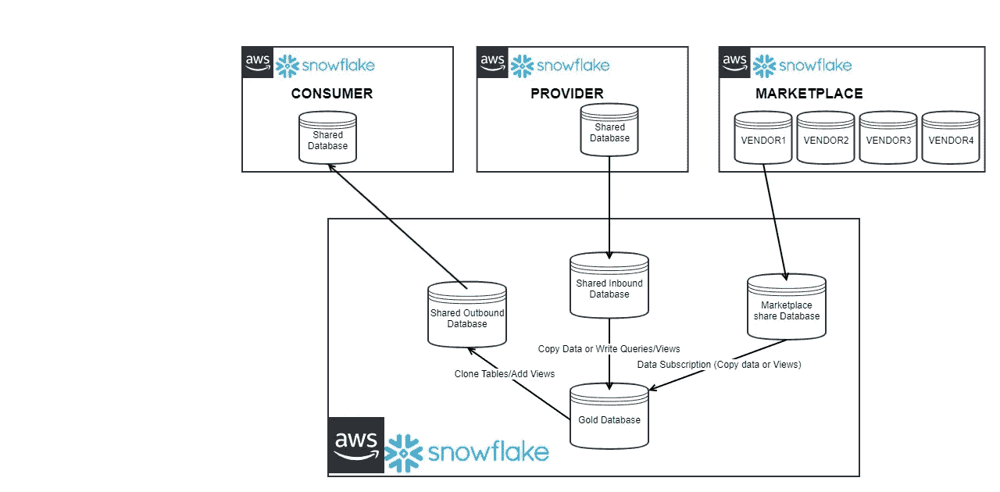
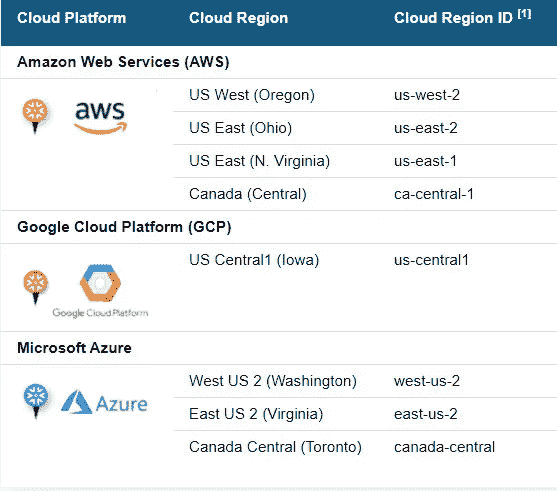
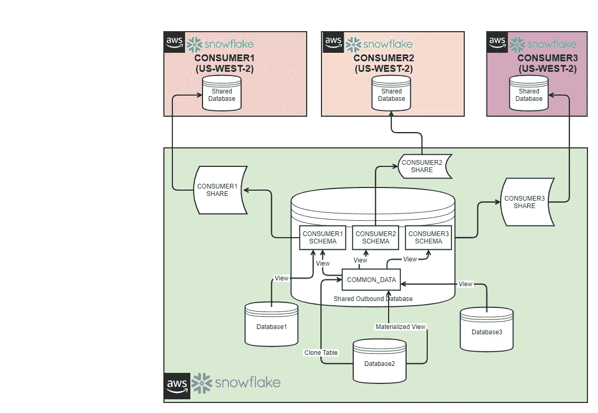

# 雪花数据共享模式—第 1 部分

> 原文：<https://medium.com/geekculture/snowflake-data-sharing-patterns-part-1-621e9dbb4686?source=collection_archive---------6----------------------->

Snowflake Data Sharing

# 介绍

从使用 SFTP 服务器共享数据，到在云中保护数据共享，数据共享已经走过了漫长的道路。雪花已经将这种安全的数据共享向前推进了一步，非常容易和快速地实施数据共享策略。雪花安全数据共享开辟了与其他雪花数据提供商合作或从市场订阅数据集的独特方式。本文将给出雪花安全数据共享的概述，并主要探讨雪花中的数据共享模式。

# 概观

*   **雪花数据共享**:雪花提供安全的数据共享，可选择与其他雪花账户共享选定对象或订阅选定对象
*   **雪花数据共享概念**:

> ***共享*** :命名雪花对象，封装了一个数据库中所有可以共享的雪花对象的相关信息。
> 
> ***提供者*** :数据提供者是任何雪花账户，它创建份额并使它们可供其他雪花账户消费。作为数据提供者，您与一个或多个雪花帐户共享一个数据库。
> 
> ***消费者*** :数据消费者是选择从数据提供者提供的共享中创建数据库的任何帐户。作为数据使用者，一旦将共享数据库添加到您的帐户中，您就可以像使用帐户中的任何其他数据库一样访问和查询数据库中的对象。

*   **雪花数据共享方式**:

> **直接分享**:两个雪花账户之间的账户对账户分享
> 
> **数据市场**:提供发现和访问第三方数据源的能力。通过雪花市场，如果对数据有需求，你可以将数据货币化。
> 
> **数据交换**:提供创建数据中心的能力，以便在您邀请的一组选定成员之间围绕数据进行安全协作。它使提供者能够发布数据，然后被消费者发现。

**支持的云平台和地区**

## 数据共享用途:

雪花中的数据共享有助于支持以下策略:

*   公司内部数据共享策略
*   跨公司数据共享策略
*   数据来源战略
*   通过数据市场的数据分发策略

## 数据共享模式:

*   ***模式一:与另一个雪花账户*** 在同一地区的同一云平台上共享数据

**用法**:

1.模式适用于同一地区的数据共享(例如:美国-西部-2，俄勒冈州)

2.提供商支付存储费用

3.消费者为计算付费

*   **模式二** : ***数据共享在不同的云平台或相同的云平台，但不同的地区有另一个雪花账号***

**用法**:

1.  模式适用于不同云平台之间或同一云平台内不同区域之间的数据共享
2.  提供商支付存储费用
3.  提供商支付数据复制成本
4.  消费者为计算付费

*   ***模式三:非雪花客户*** 同云、同地域、读者账号数据共享

**用法**:

1.  模式适用于与非雪花客户在同一地区的数据共享
2.  提供商支付存储费用
3.  提供商还为消费者支付计算费用并管理阅读器账户

*   ***模式 4:雪花中来自数据提供者的数据共享入站***

**用法**:

1.  模式适用于来自另一个雪花帐户的传入数据共享
2.  提供商支付存储费用
3.  消费者为计算付费

*   ***模式五:雪花数据市场的数据共享***

**用法**:

1.  模式适用于雪花市场的数据共享
2.  如果不是免费的，消费者需要支付订阅费用
3.  消费者为消费数据的计算付费

在本文中，将详细介绍模式 1——同一区域内的数据共享。模式 2 和模式 3 将在本系列的第 2 部分中讨论，模式 4 和模式 5 将在本系列的第 3 部分中讨论。

# 模式 1:同一区域内的数据共享

## 数据模式语句:

该模式将用于同一地区(例如 AWS 中的 US-WEST-2)的一个雪花帐户或多个雪花帐户之间的数据共享。

## 数据模式的使用:

该模式将用于同一地区(美国-西部-2，俄勒冈州)的数据共享

1.  公司内部数据共享策略
2.  跨公司数据共享策略
3.  数据分发策略

## 体系结构

Patter A — Data Sharing within Same Snowflake Region

## 解决办法

该解决方案适用于仅在一个云平台和相同区域(例如 AWS US-WEST-2)中通过雪花共享数据子集或整个数据集的模式。该解决方案需要实施以下步骤:

1.  **任务 1** :创建一个集中的数据库，在这个数据库中，消费者的所有出站数据对象都将驻留在为消费者创建的每个模式中。任何像表或视图这样的公共数据对象都可以驻留在 common_data 模式中，如体系结构图所示。
2.  **任务 2** :使用“创建共享”命令进行共享设置
3.  **任务 3** :添加共享对象

> 对象共享可以在以下级别完成:
> 
> 可以将整个数据库添加到共享中(或)
> 
> 整个模式可以添加到共享(或)
> 
> 特定对象:表、视图、UDF、实体化视图、外部表

**3。任务 4** :授予“共享”中消费账户的访问权限。

# 数据加密、监控、警报和归档

1.  *数据加密*:雪花中的所有数据都被加密。与雪花消费者的数据共享是通过安全对象完成的，默认情况下是加密的。
2.  *监控*:目前现成的雪花不提供任何监控用户账户访问数据共享频率的功能
3.  *数据质量*:对共享数据的所有数据质量检查必须由提供者帐户执行。

# 权衡的

1.  这种模式仅适用于同一地区(美国-西部-2)的用例
2.  这种模式适用于同一云平台中的消费者(美国-西方-2)

# 指南和命名约定

1.  数据库:<account>_ 消费者 _ OB _ 出库</account>
2.  架构:

> COMMON_DATA 保存需要与多个消费者共享以避免重复的公共数据
> 
> <consumer>_OB:每个共享数据的消费者的出站模式</consumer>

3.分享: <account>_ <consumer>_OB</consumer></account>

4.数据对象:

> <consumer>_ <table_name>为表名</table_name></consumer>
> 
> <consumer>_ <view_name>查看视图名称</view_name></consumer>