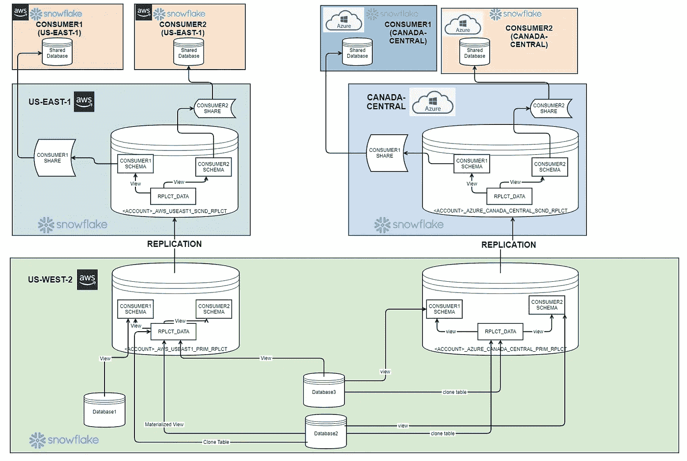
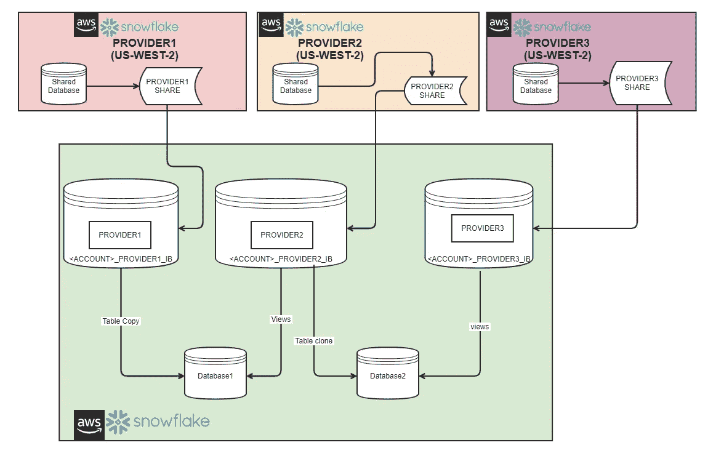

# 雪花数据共享模式—第二部分

> 原文：<https://medium.com/geekculture/snowflake-data-sharing-patterns-part-2-739504c6a295?source=collection_archive---------10----------------------->

## Snowflake 中的数据共享模式，以更快、更有效的方式与数据提供者和数据消费者协作

# 介绍

雪花是一个全面管理的企业分析仓库，可在多个云平台上使用，并与云原生解决方案很好地集成在一起:

1.  自动警报系统
2.  蔚蓝的
3.  GCP

Snowflake supported Platforms and Regions in US and Canada

本文是雪花中数据共享模式的第 2 部分，详细讨论了以下模式:

**模式-B** :不同地域或不同云平台的数据共享

**模式-C** :来自另一个雪花平台的入站数据共享模式

请查看文章的第 1 部分，该部分介绍了数据共享的概念以及您所在地区的数据共享模式的模式 A。

 [## 雪花数据共享模式—第 1 部分

### Snowflake 中的数据共享模式提供了与其他数据提供者或消费者进行协作的简单方式…

medium.com](/geekculture/snowflake-data-sharing-patterns-part-1-621e9dbb4686) 

# 不同地区或不同云平台的 B 模式数据共享

Pattern-B: Data Sharing in AWS and Azure

## 数据模式语句:

该模式将用于不同地区(例如 AWS 中的 US-EAST-1)或不同云平台(例如:Azure CANADA-CENTRAL)与另一个雪花帐户或多个雪花帐户之间的数据共享。

## 数据模式的使用:

该模式将用于不同地区或不同云平台的数据共享

1.  公司内部数据共享策略
2.  跨公司数据共享策略
3.  数据分发策略

## **数据模式的特征**:

1.  模式适用于不同云平台之间或同一云平台内不同区域之间的数据共享
2.  提供商支付存储费用
3.  提供商支付数据复制成本
4.  消费者为计算付费

## 组织概念

1.  雪花中的组织是一个新概念，仍处于预览模式，但可以在雪花客户支持的帮助下启用。
2.  组织可以简化帐户管理、计费、数据库复制和故障转移/回切、雪花安全数据共享以及其他帐户管理任务。
3.  ORGADMIN 角色由雪花为您组织中客户指定的帐户启用。
4.  ORGADMIN 角色将提供组织级别的访问权限，以创建用于数据复制的新帐户或用于数据共享的新读者帐户。

## 解决办法

1.  **数据库创建**:如上图架构图所示，为每个需要共享数据的区域/云平台创建一个集中的数据库。
2.  数据库复制:

> 步骤 1:查看您组织中的所有帐户
> 
> 步骤 2:将本地数据库升级为主数据库
> 
> 步骤 3:为主数据库启用故障转移
> 
> 步骤 4:创建辅助数据库
> 
> 步骤 5:如果有实体化视图，则按调度刷新辅助数据库

3.从辅助数据库(复制数据库)共享设置

4.从辅助数据库添加要共享的对象。对象共享可以在以下级别完成:

> 桌子
> 
> 视图
> 
> 用户定义的函数
> 
> 物化视图
> 
> 外部表格

5.从辅助数据库添加要共享的消费者帐户。

## 权衡取舍

1.  为支持数据共享，将产生数据复制成本
2.  仅在支持数据复制的两个企业帐户或更高级别帐户之间支持数据复制。
3.  不能复制包含外部表的数据库。

## 风险

对于较大的表或变动较大的表，数据复制成本可能会很高。

## 数据加密、数据质量、监控和警报

1.  *监控*:应该使用资源监控器来监控复制成本
2.  *警报*:如果复制成本超过阈值限制，可以配置资源监视器向帐户管理员发出警报。
3.  *数据加密*:雪花中的所有数据都被加密。与雪花消费者的数据共享是通过安全对象完成的，默认情况下是加密的。
4.  *数据质量*:对共享数据的所有数据质量检查必须由提供者帐户执行。

## 指南和命名约定

1.  子帐户: <account>_ <cloud>_ <region>子帐户是将创建辅助(复制)数据库的位置</region></cloud></account>
2.  主数据库: <account>_ <cloud>_ <region>_PRIM_RPLCT 任何需要复制到另一个区域或云平台的数据库对象都需要集中到这个数据库中。</region></cloud></account>
3.  辅助数据库: <account>_ <cloud>_ <region>_SCND_RPLCT 将创建辅助数据库，以支持从主数据库进行复制。</region></cloud></account>
4.  操作数据库: <account>_ <cloud>_ <region>_MGNT 账户管理维护数据库，将用于配置:刷新计划和任务计划。</region></cloud></account>
5.  刷新计划:从主数据库刷新辅助数据库可以以我们选择的任何频率运行。
6.  方案:RPLCT_DATA 是将创建克隆或实体化视图对象的位置。<consumer>为了更好的灵活性，请为每个供应商创建一个模式，模式中包含供应商名称。</consumer>
7.  分享: <account>_ <consumer>_OB</consumer></account>
8.  数据对象:

> *<消费者> _ <表名>为表名*
> 
> *<消费者> _ <视图名称>为视图名称*

# 模式-来自数据提供者的入站数据共享

Pattern C — Inbound Data Sharing from Data Provider

## 数据模式语句:

该模式将用于来自同一地区和同一云平台的数据提供商的数据共享。

## 数据模式的使用:

该模式将用于策略(如数据分发策略)的数据共享

## 数据模式的特征:

1.  提供商支付存储费用
2.  消费者—您的帐户支付计算费用

## 解决方案:

该解决方案适用于数据提供者共享子集或全部数据的模式。该解决方案需要通过以下步骤进行设置:

1.  任务 1:向提供商提供雪花账户信息
2.  任务 2:使用帐户管理员角色访问入站数据共享
3.  任务 3:使用命名约定 <account>_PROVIDER_IB 从共享创建数据库</account>
4.  任务 4:设置访问数据库的角色 <account>_PROVIDER_IB_ROLE</account>
5.  任务 5:向试图访问数据的用户或服务帐户授予角色。

## 风险

数据共享和访问权限由数据提供者控制，需要根据正确的预期来管理依赖关系。

## 结论

雪花上的数据共享模式的第 3 部分将更详细地讨论以下内容:

1.  模式 D:使用读者帐户与消费者共享数据
2.  模式 E:雪花数据市场订阅