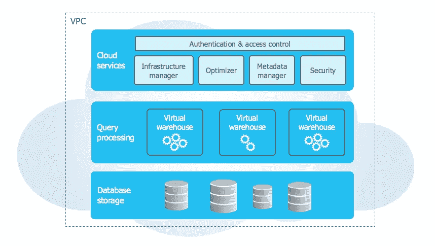
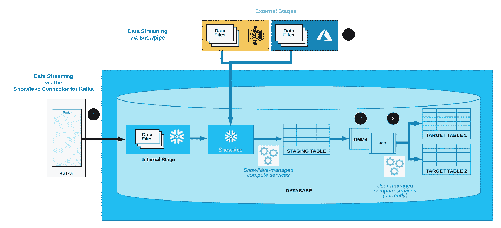

# 五分钟后有雪花

> 原文：<https://medium.com/geekculture/snowflake-in-5-minutes-59fd976c513?source=collection_archive---------14----------------------->

## 云数据仓库已经成为现实！

Photo by [Darius Cotoi](https://unsplash.com/@dariuscotoi?utm_source=medium&utm_medium=referral) on [Unsplash](https://unsplash.com?utm_source=medium&utm_medium=referral)

# 开始使用:

雪花数据仓库是一个基于云的平台，用于存储和检索数据。为了开始学习雪花，让我们来理解为什么公司需要一个仓库。在外界，仓库是什么？为有效储存和处理货物和原材料而设计的空间。同样，传统的数据仓库用于存储大量用于商业决策的数据。然而，当我们提到雪花的数据仓库时，我们通常指的是能够处理数据的计算能力，而不是数据的存储。

# 雪花简介:

雪花是一个领先的基于云的平台，以 SaaS(软件即服务)的形式提供。不需要选择、安装、配置或管理任何硬件(虚拟或物理)。几乎不需要安装、配置或管理任何软件。雪花为你做一切。

那么是什么让雪花如此独特呢？一个词建筑。雪花的独特架构是共享磁盘(对从所有节点访问的数据使用中央 repo)和无共享(查询使用 MPP)架构的混合，由三个关键层组成:每一层的文档都由雪花详细提供。

From SnowFlake

*   [数据库存储](https://docs.snowflake.com/en/user-guide/intro-key-concepts.html#database-storage)
*   [查询处理](https://docs.snowflake.com/en/user-guide/intro-key-concepts.html#query-processing)
*   [云服务](https://docs.snowflake.com/en/user-guide/intro-key-concepts.html#cloud-services)

# 雪花的主要特点:

遗留数据仓库和其他本地数据仓库不可扩展，需要大量维护，并且需要昂贵的支持和许可。此外，on-perm 解决方案还存在数据丢失的风险，这会导致几个问题。有了雪花，你可以两全其美——既可以扩展，又可以保持高效。除了雪花的可伸缩性和云原生弹性，另一个值得一提的特性是它处理结构化和半结构化数据的能力。

## 为什么选择雪花？

与传统仓库相比，雪花能提供什么？

*它是否提供安全性和治理？:*是的，它支持标准用户认证、MFA、OAuth 和单点登录。它还提供数据加密、列级安全性、对象级访问控制。

*数据保护:*雪花**故障安全**功能确保历史数据在系统崩溃或遭到破坏时得到保护。雪花**时间旅行**功能支持在定义的时间段内的任何时间点访问历史数据(即已更改或删除的数据)(1 天是所有帐户的标准时间)。

*标准 SQL 支持&连接性:*市场上已经出现了一些高性能的数据库，但大多数都不提供完整的关系 SQL 支持，如联合查询、跨模式视图等。雪花从一开始就支持大多数 SQL 功能(大多数 DDL 和 DML、瞬态&临时表、横向&物化视图、聚合& Windows 函数、UDF、存储过程和递归 CTE)。

*连接性:*雪花(Python、Spark、Node)支持大量的驱动程序或连接器。JS，。NET，JDBC，ODBBC 等)，它也支持商业智能工具。

*您选择的数据:* Snowflake 支持从压缩文件中加载任何使用支持的字符编码的数据，加载大多数平面的、带分隔符的数据文件(CSV、TSV 等)。)，加载 JSON、Avro、ORC、Parquet 和 XML 格式的数据文件，从 S3 数据源加载。对于从文件中连续批量加载数据:使用 [**SNOWPIPE**](https://docs.snowflake.com/en/user-guide/data-load-snowpipe.html) 从内部(即雪花)阶段或外部**(亚马逊 S3、谷歌云存储或微软 Azure)** 阶段微批量加载数据。

管理:雪花需要零管理。

*现收现付* **:** 雪花账单，客户无需为虚拟仓库闲置的“关闭”时间付费，他们可以根据自己的意愿暂停和恢复仓库

*CDC* :任何仓库都需要变更数据捕获，尤其是对于较大的表格，因此只检索已变更的记录，而不是整个表格。**雪花流**捕获对表的插入和其他 DML 更改

*结果缓存:*在执行查询时，缓存当前持续时间内的结果(当前为 24 小时)。时间期限一过，结果就会被清除。

# 雪花状连续数据管道；

从云仓库到安全数据共享等等。在这里检查[和](https://docs.snowflake.com/en/user-guide/data-pipelines-intro.html)

From SnowFlake Docs

**连续数据加载:**连续数据加载选项包括:

*   Snowpipe:从一个外部暂存位置(S3、Azure、GCP)持续地将小批量数据加载到暂存表中。
*   Kafka 的雪花连接器:Kafka 连接器不断地将 Apache Kafka 主题中的记录加载到内部暂存阶段(雪花)，然后使用 Snowpipe 加载到暂存表中。
*   第三方数据集成工具

**变更数据捕获:**一个或多个表流捕获变更数据和。使其可供查询。

**循环任务:**为了处理变更数据，**雪花任务**执行 SQL 语句(可以调用存储过程)并将优化的数据集移动到目标表中进行分析。当这个转换过程运行时，它选择流中的变更数据，以便可以对目标表执行 DML 操作，然后在提交事务时使用变更数据。

# **最终想法:**

总的来说，雪花提供了卓越的性能，并行处理，多集群和最高生产力的仓库。由于雪花架构，公司可以从小仓库开始，然后发展成大仓库。多集群和扩展策略是无与伦比的功能，仓库具有自动暂停设置，可以在不使用时暂停它们。在许多传统仓库中，数据集市可能无法访问公司的所有数据，并可能由于数据复制而导致不准确。然而，雪花可以随时访问其所有数据。根据所需的计算能力，用户可以手动扩大(从小到中)和缩小(从 X 大到大)仓库，但是恢复(从最大类到最小类)和扩大(从最小类到最大类)会自动进行。雪花可以成为任何企业的有效解决方案。

免费结帐在线自定进度课程:[**雪花动手要领**](https://www.snowflake.com/snowflake-essentials-training/)

**资源:**

 [## 雪花社区

### 加入我们的数据专业人士社区，一起学习、交流、分享和创新

community.snowflake.co](https://community.snowflake.com/)  [## 欢迎来到雪花文档-雪花文档

### 在这些主题中，您将找到访问您的雪花帐户和执行所有…

docs.snowflake.com](https://docs.snowflake.com/en/index.html)