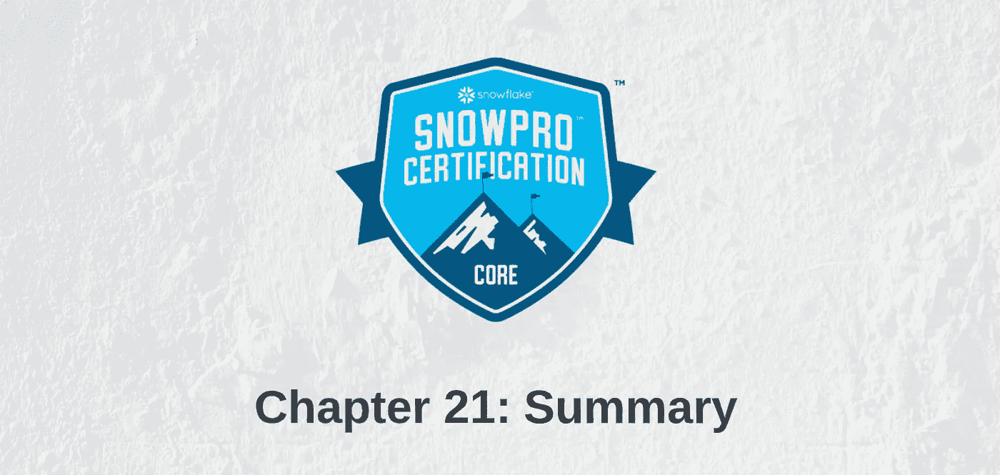
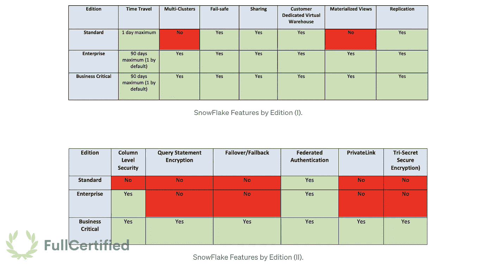
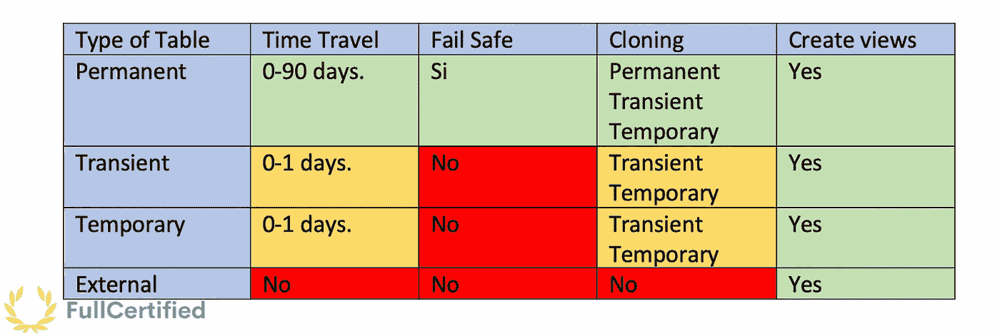
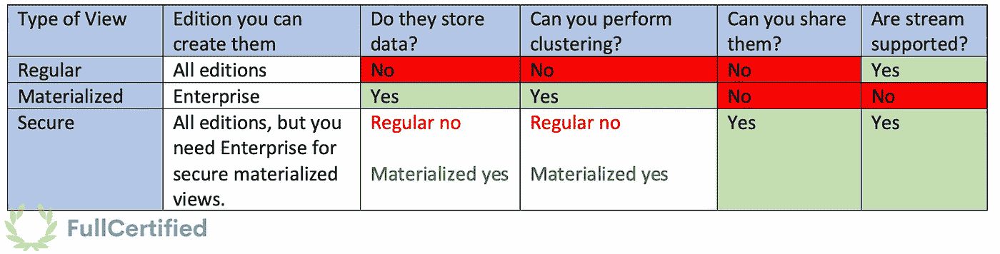
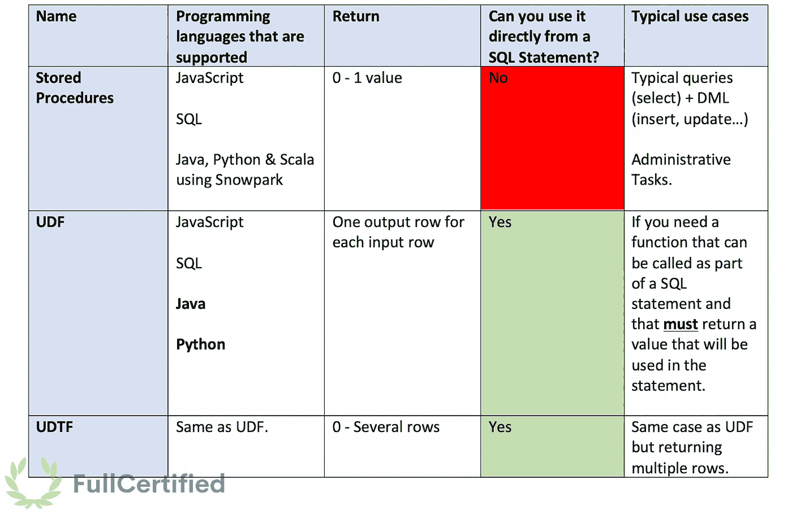

# 雪花 SnowPro 核心认证摘要

> 原文：<https://medium.com/geekculture/snowflake-snowpro-core-certification-summary-fbe9135c86c0?source=collection_archive---------3----------------------->

## 第 21 章:雪花 SnowPro 课程总结

几个月后，我们到达了雪花 SnowPro 核心认证课程的最后一章。所有的理论都已经解释过了。虽然这是一个紧张的旅程，但我希望它是有益的，并让您实现通过考试和了解这项宏伟技术的目标。我也希望你喜欢读它，就像我喜欢写它一样。

Summary of the SnowPro Core Certification Exam.

在这最后一章，我将总结我们在课程中看到的一些概念，使它们更加详细和有条理。我们一起去吧！

> *请记住，您可以通过以下链接找到本课程的所有章节:*

 [## 通往雪花 SnowPro 核心认证之路:完整课程

### 概述了雪花 SnowPro 核心认证准备课程，数据仓库平台的建立…

plazagonzalo.medium.com](https://plazagonzalo.medium.com/snowflake-snowpro-certification-complete-course-68f54cda4a4b) 

# 雪花摘要

## 雪花建筑

*   **DDL** →数据定义语言。它指的是与表、模式等交互的命令。→创建、删除、更改…
*   **DML** →数据操作语言。→插入、更新、删除…
*   **雪花版** →标准版、企业版、关键业务版。
*   **云提供商** → AWS、Azure、GCP。
*   **雪花 CLI 客户端** → SnowSQL。
*   **雪花层** →集中式存储、计算数据、云服务&云不可知层。

Snowflake Features by Edition (II).

*解释这些概念的章节:*

 [## 通往雪花 SnowPro 核心认证之路:简介

### 雪花雪 Pro 完整课程的第一章。我们将学习雪花版本，支持的云…

plazagonzalo.medium.com](https://plazagonzalo.medium.com/road-to-snowflake-snowpro-core-certification-introduction-3483c54a75a4)  [## 通往雪花 SnowPro 核心认证之路:雪花架构

### 雪花 SnowPro 核心认证课程的第二章，关于雪花共享磁盘和无共享…

plazagonzalo.medium.com](https://plazagonzalo.medium.com/road-to-snowflake-snowpro-core-certification-snowflake-architecture-b5e590a8abee)  [## 通往雪花 SnowPro 核心认证之路:定价

### 雪花 SnowPro 认证完整课程的第三章，我们将了解定价如何运作，以及…

medium.com](/geekculture/road-to-snowflake-snowpro-core-certification-pricing-28e8404c43c3) 

## 微分区和聚集键

*   **存储微分区** →在 **50 和 500MB 之间以列方式组织的未压缩数据**。
*   **微分区中的元数据** →每列的值的范围、不同值的数量以及其他用于优化的属性。
*   **获取聚类深度的命令** → SYSTEM$CLUSTERING_DEPTH，SYSTEM$CLUSTERING_INFORMATION。
*   **指标确定是否需要定义聚类键** →查询运行缓慢&聚类深度大。

*解释这些概念的章节:*

 [## 通往雪花 SnowPro 核心认证之路:微分区

### 雪花 SnowPro 认证课程的第四章，我们将看到雪花中的微分区是如何工作的&…

plazagonzalo.medium.com](https://plazagonzalo.medium.com/road-to-snowflake-snowpro-core-certification-micro-partitions-965b97612409)  [## 通往雪花 SnowPro 核心认证之路:集群

### 在 SnowPro 认证课程的第五章中，我们将了解群集键、重新群集和群集深度…

plazagonzalo.medium.com](https://plazagonzalo.medium.com/road-to-snowflake-snowpro-core-certification-clustering-c5ae6384b661) 

## 桌子

Difference between Snowflake tables.

## 视图

*   能否在物化视图中定义聚类键？ →是的。
*   **物化视图限制** →时间旅行//当前时间。

Differences between Snowflake views.

*解释这些概念的章节:*

 [## 通往雪花 SnowPro 核心认证之路:表格和视图

### SnowPro 认证课程的第六章，我们将看到不同类型的视图和表格…

plazagonzalo.medium.com](https://plazagonzalo.medium.com/snowflake-snowpro-certification-tables-views-5c2f75f8297) 

## 阶段

*   **载物台类型** →外部&内部
*   **内部阶段的类型** →用户、表、命名内部
*   **用户阶段的标识符**→“@ ~”
*   **工作台标识符**→“@ %”
*   **阶段元数据** →元数据$文件名&元数据$文件 _ 行 _ 编号

*解释这些概念的章节:*

 [## 通往雪花 SnowPro 核心认证之路:阶段和存储集成

### SnowPro 认证课程的第七章。我们将看到外部、内部、用户和表阶段，以及…

plazagonzalo.medium.com](https://plazagonzalo.medium.com/snowflake-snowpro-core-certification-stages-24be111e65ea) 

## 复制命令

*   **它在哪些阶段起作用？** →全部都在。
*   如果失败，它会执行什么命令？ →中止 _ 声明。
*   **使用雪花 UI 的最大文件大小** → 50 MB。如果你想复制更大的文件，你应该使用 SnowSQL。
*   **忽略元数据缓存的命令** → FORCE = TRUE。
*   **元数据缓存持续时间** → 64 天。

## 雪管

*   如果失败，它会执行什么命令？ → SKIP_FILE。
*   **元数据缓存持续时间** → 14 天。
*   **SnowPipe 可以使用资源监视器吗？** →否。

*解释这些概念的章节:*

 [## 通往雪花 SnowPro 核心认证之路:数据加载

### SnowFlake SnowPro 认证课程的第八章，我们将学习使用复制到和…

plazagonzalo.medium.com](https://plazagonzalo.medium.com/snowflake-snowpro-data-loading-f88afaef7eb9) 

## 放置和获取

*   他们在哪个阶段工作？→仅内部阶段。
*   可从雪花 UI 执行？→否

*解释这些概念的章节:*

 [## 通往雪花 SnowPro 核心认证之路:上传和获取命令

### 雪花 SnowPro 核心认证课程的第九章解释上传和获取命令…

plazagonzalo.medium.com](https://plazagonzalo.medium.com/snowflake-snowpro-put-get-commands-b7a5bdc0fc70) 

## 仓库

*   **您可以配置的参数** →自动挂起&自动恢复&最大/最小簇&缩放策略&大小&名称。
*   **多群仓库的最低版本** →企业。
*   **多仓模式** →最大化&自动秤。
*   **缩放政策** →标准&经济。

*解释这些概念的章节:*

 [## 雪花 SnowPro 核心认证的数据仓库

### 雪花 SnowPro 中级课程的第十章解释了如何使用数据仓库在雪花中进行计算…

plazagonzalo.medium.com](https://plazagonzalo.medium.com/snowflake-snowpro-certification-data-warehouses-76956b82ab) 

## 资源监视器

*   **参数** →信用额度、监控级别、计划&行动。
*   **动作类型** →通知，通知&暂停，通知&立即暂停。

*解释这些概念的章节:*

 [## 通往雪花 SnowPro 核心认证之路:资源监控器

### SnowPro 核心课程的第十一章，我们将学习如何使用…

plazagonzalo.medium.com](https://plazagonzalo.medium.com/road-to-snowflake-snowpro-core-certification-resource-monitors-1a77e842a368) 

## 隐藏物

*   **类型** →元数据、查询结果、仓库。
*   **元数据缓存将结果存储多长时间？** → 64 天。
*   **查询结果缓存将结果存储多长时间？** →一天。
*   仓库缓存将结果存储多长时间？ →直到仓库断开。

*解释这些概念的章节:*

 [## 通往 SnowFlake SnowPro 核心认证之路:缓存和查询性能

### 雪花 SnowPro 核心认证课程中关于雪花缓存(元数据、结果和仓库)的新章节…

plazagonzalo.medium.com](https://plazagonzalo.medium.com/snowflake-snowpro-core-certification-caches-d34c9238273) 

## 存储功能

*   **时间旅行数据默认保留期限** →一天。我们可以延长到 90 天，但是默认是一天。
*   **瞬变和临时表的时间行程** →一天。
*   **永久表的时间旅行** →直到 90 天。
*   **雪花版将时间旅行延长至 90 天** →企业
*   **如何使用自动防故障装置恢复数据** →联系雪花支持。
*   **负责执行零拷贝克隆的层** →云服务层。
*   我能克隆一个外部表吗？ →否。

*解释这些概念的章节:*

 [## 通往雪花 SnowPro 核心认证之路:时间旅行、故障安全和零拷贝克隆

### 雪花 SnowPro 核心课程的新章节，我们将学习雪花存储功能(时间旅行、故障安全…

plazagonzalo.medium.com](https://plazagonzalo.medium.com/snowflake-snowpro-core-storage-features-d4836eadb456) 

## 角色

*   **访问管理方法** → DAC & RBAC。
*   **关键概念** →用户、角色、安全对象、权限
*   **默认角色** →帐户管理员、安全管理员、系统管理员、用户管理员&公共

*解释这些概念的章节:*

 [## 通往雪花之路 SnowPro 核心认证:雪花中的角色

### 让我们看看雪花中的访问管理，解释角色如何工作，最重要的命令和…

plazagonzalo.medium.com](https://plazagonzalo.medium.com/snowflake-roles-a700bac4c46b) 

## 分享

*   **股票种类** →入库&出库。
*   **可以创建股份的角色** →账户管理员。
*   **您能从入站共享中克隆对象吗？** →否。
*   你能在一个共享的物体中进行时间旅行吗？ →否。
*   **能否将入站份额分享给不同的账户？** →否。
*   **将< db >上的使用权授予<共享>** →将权限分配给共享。

*解释这些概念的章节:*

 [## 雪花 SnowPro 核心认证的安全数据共享

### 在这一章中，我们将看到如何在不同的雪花账户(提供商和消费者)之间共享数据，这得益于…

plazagonzalo.medium.com](https://plazagonzalo.medium.com/data-sharing-for-the-snowflake-snowpro-core-certification-871f94bdf0c4) 

## 存储过程和 UDF

Differences between Stored Procedures & User-Defined Functions.

*解释这些概念的章节:*

 [## 雪花中的存储过程和用户定义函数

### SnowPro 核心认证课程的一章，我们将学习用户定义函数(UDF)和存储…

plazagonzalo.medium.com](https://plazagonzalo.medium.com/stored-procedures-and-udfs-in-snowflake-f1e50e7cf375) 

## 任务

*   **子任务的最大数量** → 100。一个任务只能有 100 个子任务。
*   **任务树的最大数量** → 1000。

## 处理

*   **如果交易进入分离状态，雪花将中止交易的小时数** → 4 小时。

*解释这些概念的章节:*

 [## 任务和事务:雪花 SnowPro 核心认证

### 雪花 SnowPro 核心课程的一章，我们将在其中学习计划任务、任务树和事务…

plazagonzalo.medium.com](https://plazagonzalo.medium.com/tasks-transactions-snowflake-snowpro-core-certification-95c4de440777) 

## 流

*   **不同类型的流** →标准、仅附加&仅插入流。
*   **流中的列** →元数据$操作，元数据$ I 更新，元数据$行标识。
*   我们可以从外部表创建流吗？ →是的。仅插入流。
*   我们可以从视图中创建流吗？ →作为 2022 年 3 月的新功能，视图和安全视图中支持流！

*解释这些概念的章节:*

 [## 雪花中的流是如何工作的

### 雪花 SnowPro 课程的新章节，我们将解释雪花中的流是如何工作的，所有不同的…

plazagonzalo.medium.com](https://plazagonzalo.medium.com/streams-in-snowflake-fd16f1657b53) 

## 文件格式

*   **结构化数据格式** → CSV。
*   **半结构化数据格式** → JSON、Parquet、XML、Avro、ORC。
*   **将半结构化数据存储为数组或对象的数据类型→** 变量。
*   **变量数据类型的限制大小** → 16 MB。
*   **一个变量的非原生值是如何存储的？** →作为字符串。

## 顺序

*   **生成一组不同值的函数→** nextval。

*解释这些概念的章节:*

 [## 通往雪花 SnowPro 核心认证之路:文件格式和序列

### 从雪花 SnowPro 核心课程的一章，我们将看到其他雪花对象，如文件格式(csv…

plazagonzalo.medium.com](https://plazagonzalo.medium.com/file-formats-sequences-snowflake-snowpro-a5aa27884233) 

## 生态系统、合规性、数据市场和安全性

*   **合作伙伴类型连接雪花** →技术&解决方案合作伙伴。
*   **对雪花合作伙伴进行分类的类别→** 数据集成、ML &数据科学、安全&治理、商业智能、SQL 编辑器和编程接口。
*   **雪花兼容…** → HITRUST / HIPAA、ISO/IEC 27001、FedRAMP Moderate、PCI-DSS、SOC 2 Type II、SOC 1 Type II 和 GxP。
*   **数据市场列表** → **标准数据列表**和个性化数据列表。
*   **雪花提供的安全特性** →动态数据屏蔽和外部令牌化。

*解释这些概念的章节:*

 [## SnowPro 核心认证的雪花生态系统

### 雪花 SnowPro 认证课程的章节，我们将了解雪花生态系统、合规性、数据…

plazagonzalo.medium.com](https://plazagonzalo.medium.com/snowflake-ecosystem-snowpro-core-certification-course-315860f9d271) 

## 授权和其他有用的命令

*   显示角色<角色>的授权**→查看角色的用户。**
*   显示授予角色<角色>的权限**→查看角色的权限。**
*   **克隆表格所需的授权** →选择。
*   **克隆管道/流/任务的必要授权** →所有权。
*   **克隆其他对象的必要授权** →使用。
*   **查看 TASK_HISTORY** → ACCOUNTADMIN 或任务所有权或 MONITOR_EXECUTION 的必要授权。

## 练习试题

*   [点击此处](https://plazagonzalo.medium.com/snowflake-snowpro-core-practice-exam-c1e71abcdab0)参加一次完整的 Medium 考试。
*   在 FullCertified 上找到**400 多个 Snowflake SnowPro** 问题，包括一个真正的**考试模拟器**以彻底准备考试，以及**下载 PDF 上所有问题的可能性**。

 [## 全面认证的实践考试，以提高您的技术技能

### 雪花和亚马逊网络服务的实践测试。通过 FullCertified 认证并提高您的技能…

www.fullcertified.com](https://www.fullcertified.com/) 

# 感谢阅读！

课程到此结束；希望对你有帮助！如果是这样，并且你想支持我的工作，你可以通过以下方式:

1.  *最好的办法就是跟着我上中等* [*这里*](https://plazagonzalo.medium.com/) *。*
2.  ***还不是中等会员？通过注册会员，你可以支持成千上万的其他作家和我。它每月只需 5 美元，可以无限制地访问所有的故事。你可以点击下面的链接，我会给你一点佣金，但不会额外收费。我会非常感激:-)*** 。

 [## 通过我的推荐链接加入 Medium-Gonzalo Fernandez Plaza

### 作为一个媒体会员，你的会员费的一部分会给你阅读的作家，你可以完全接触到每一个故事…

plazagonzalo.medium.com](https://plazagonzalo.medium.com/membership) 

最后，我想告诉你，你可以问我任何问题，如果你有任何你想看的另一门课程的建议，你可以评论！再见