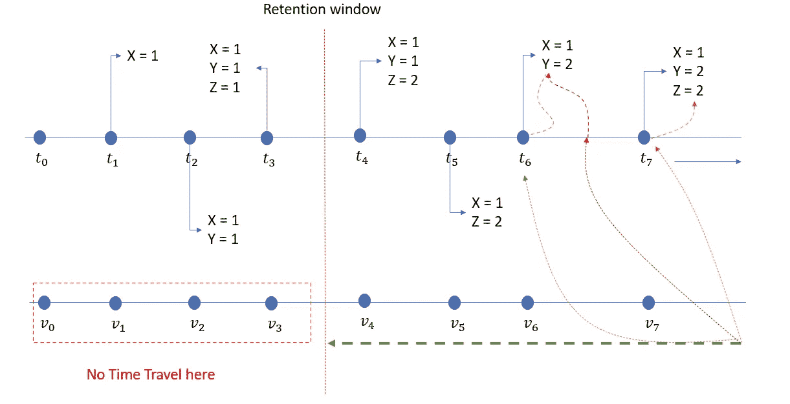
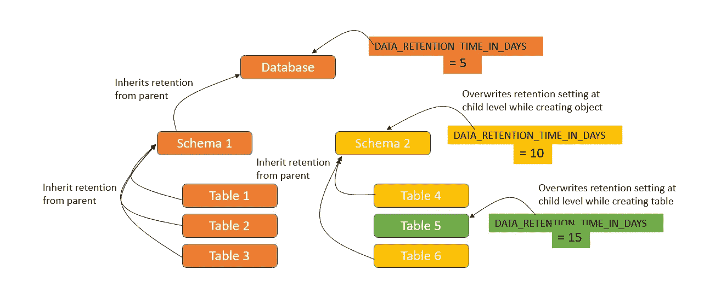

# 雪花——时间旅行

> 原文：<https://medium.com/geekculture/snowflake-time-travel-d7c8436f6ebe?source=collection_archive---------7----------------------->


Photo by [Aron Visuals](https://unsplash.com/@aronvisuals?utm_source=unsplash&utm_medium=referral&utm_content=creditCopyText) on [Unsplash](https://unsplash.com/s/photos/time-tarvel?utm_source=unsplash&utm_medium=referral&utm_content=creditCopyText)

回到过去查看当时的表状态。

> 我想回到过去。不是改变什么，而是重新感受什么。—美世

雪花时间旅行是一个有趣的工具，它允许我们访问过去某个特定时期内任何一点的历史数据(已被修改/删除的数据)。我们可以在保留期之前访问数据的历史版本，在此之后，数据将被移动到 Snowflake Fail-safe。



Snowflake Time Travel

该功能有助于我们实现以下目标:

*   用“当时看起来的”数据调试 ETL
*   还原可能已被修改/删除的数据库对象。
*   复制或备份过去关键点的数据。
*   分析指定时间段内的数据使用/操作情况。

当一个对象的保留期到期时，历史数据被移动到雪花故障保护。在此期间:

*   我们不能再查询历史数据
*   我们不能再从过去的状态克隆对象
*   我们不能再恢复被丢弃的物体

## 保持期和参数

基于雪花版本和对象类型，我们对不同的数据库对象有不同的保留期。下表总结了这些值:

```
Object         | Retention period            | Fail-Safe days
---------------+-----------------------------+------------------Temporary      | 0 or 1 (default - 1)        |    0
Transient      | 0 or 1 (default - 1)        |    0
Permanent(Std) | 0 or 1 (default - 1)        |    7
Permanent(Ent) | 0-90 (default configurable) |    7
```

我们可以用`SHOW PARAMETERS`来寻找雪花状物体的时间旅行保持期。

```
SHOW PARAMETERS in DATABASE db_name;
```

## 设置保留期

创建对象时，我们可以指定所需的保留期

```
CREATE TABLE <TABLE_NAME>(...) data_retention_time_in_days=30;
```

对于现有对象，可以使用 ALTER 更改保留时间，如下所示:

```
ALTER TABLE <TABLE_NAME> set data_retention_time_in_days=15;
```



Inheritance of retention property

更改我们的帐户或单个对象的保留期会更改所有未明确设置保留期的低级对象的值。例如，如果我们在帐户级别更改保留期，所有没有明确保留期的数据库、模式和表都会自动继承新的保留期。

删除数据库时，如果子对象的数据保持期被显式设置为不同于数据库的保持期，则不会考虑该保持期。子对象的保留时间与数据库相同。为了保证这些子对象的数据保持期，我们需要在删除数据库之前显式地删除它们。

## 时间旅行的存储成本

存储成本是从数据更改开始每 24 小时(即 1 天)计算一次。此外，雪花通过只维护恢复被更新或删除的单个表行所需的信息，最大限度地减少了历史数据所需的存储量。我们可以通过以下查询来查看时间旅行的存储成本:

```
SELECT * FROM "snowflake"."account_usage"."table_storage_mterics" WHERE schema = <schema_name>;
```

对于上面的 select 语句，下面的属性是感兴趣的。

> *活动 _ 字节* —实际表开销
> *时间 _ 行程 _ 字节* —时间行程开销
> *故障 _ 安全 _ 字节* —故障安全开销

## 时间旅行在行动

雪花时间旅行 SQL 扩展提供了两个带有 FROM 子句的子子句(AT & BEFORE)。

*   **在** —包括时间戳/语句运行时间
*   **BEFORE** —指定日期时间或语句运行时间之前的点

上述分条款有三个不同的论点

> **偏移量** —与当前时间的秒数差
> **时间戳**
> **语句** —语句标识符(ID)

```
-- Query the table at a particular timestamp
SELECT * 
FROM <table_name>
at(timestamp => 'Sat, 06 June 2022 01:00:00 +0200'::timestamp_tz);-- Query the table at 10 minutes before
SELECT * 
FROM <table_name>
at(offset => -60*10);-- Query the table before a statement is executed
SELECT *
FROM <table_name> 
before(statement => '8e5d0ca9-005e-44e6-b858-a8f5b37c5726');SELECT * 
FROM <table_name>
before(timestamp => '2022-06-05 13:31:56.786'::timestamp)-- Create a clone from previous data using timestamp
CREATE TABLE <NEW_TABLE_NAME> 
CLONE <CURRENT_TABLE_NAME> 
AT(timestamp => 'Sat, 05 June 2022 14:00:00 +0200'::timestamp_tz);-- Create a clone from previous data using statement
CREATE TABLE <NEW_TABLE_NAME> 
CLONE <CURRENT_TABLE_NAME> 
AT(statement => '8e5d0ca9-005e-44e6-b858-a8f5b37c5726');-- Create a clone from previous data using offset
CREATE TABLE <NEW_TABLE_NAME> 
CLONE <CURRENT_TABLE_NAME> 
AT(offset=>-60*10);-- Create a clone from previous data using query_id
CREATE TABLE <NEW_TABLE_NAME> 
CLONE <CURRENT_TABLE_NAME> 
BEFORE(statement => '8e5d0ca9-005e-44e6-b858-a8f5b37c5726');
```

## 恢复丢弃的对象

我们可以检查历史表，找出被删除的表。活动表的行将把列`is_active`设置为真。对于删除的表，我们为列`dropped_on`设置了一个值。

```
-- Check table history 
SHOW TABLES HISTORY; -- is_current & dropped_on column
UNDROP TABLE <TABLE_NAME>;
```

数据仓库快乐！！