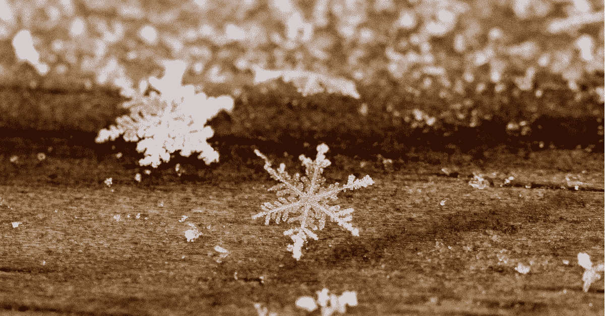

# 简单地说，雪花时间旅行

> 原文：<https://medium.com/geekculture/snowflake-time-travel-in-a-nutshell-f6d27aae8351?source=collection_archive---------9----------------------->

## 至少是一部分

Photo by [Maddy Baker](https://unsplash.com/@maddybakes?utm_source=unsplash&utm_medium=referral&utm_content=creditCopyText) on [Unsplash](https://unsplash.com/s/photos/snowflakes?utm_source=unsplash&utm_medium=referral&utm_content=creditCopyText)

是的，这个标题有点 clickbaity，所以如果你太敏感，请停止阅读，因为文章不会向你解释雪花的所有细节。尽管如此，它将展示文档中没有提到的一些有趣的东西，并且它将有助于回答认证考试中的至少一个问题。所以，我觉得…