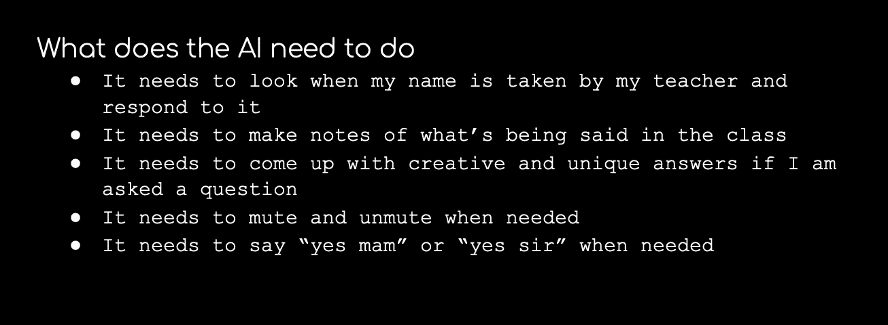
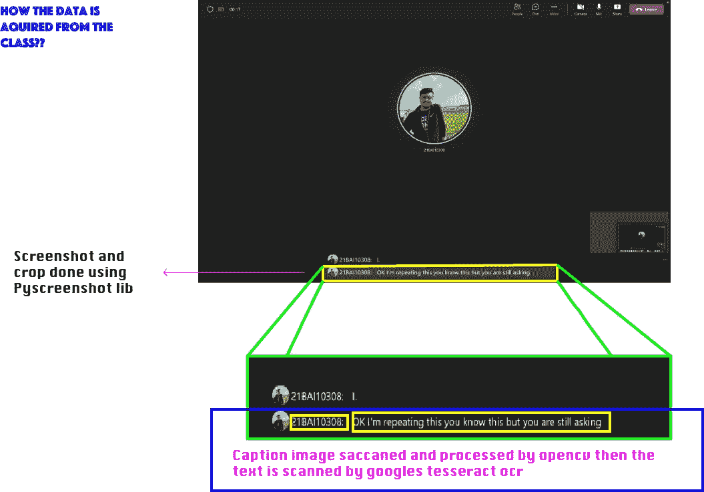
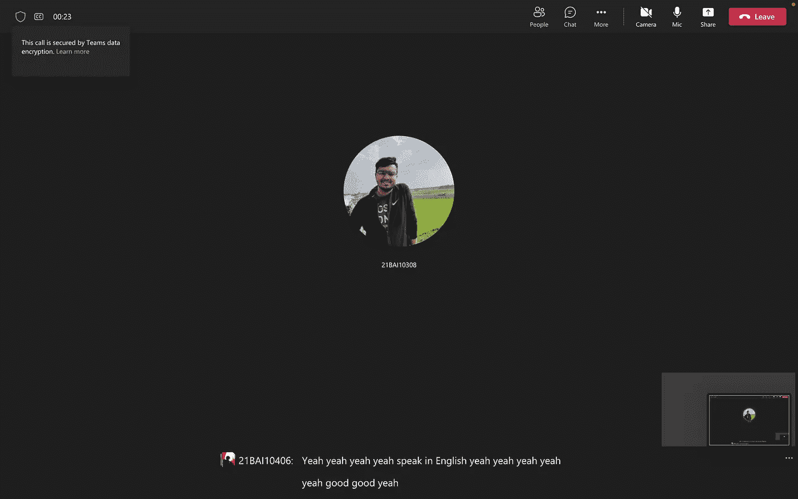
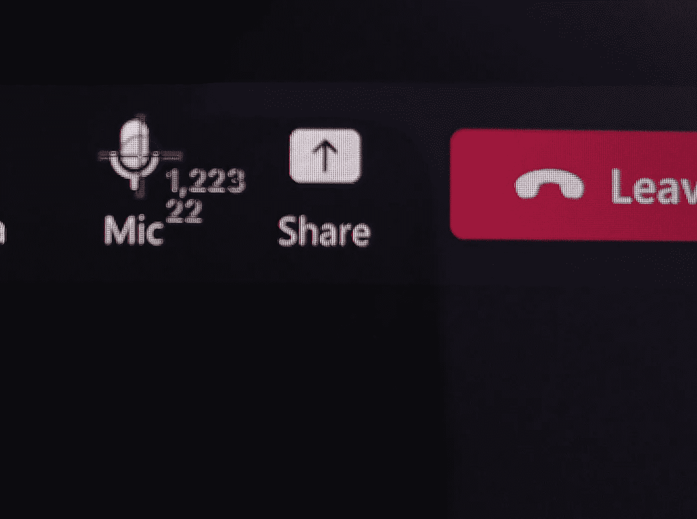
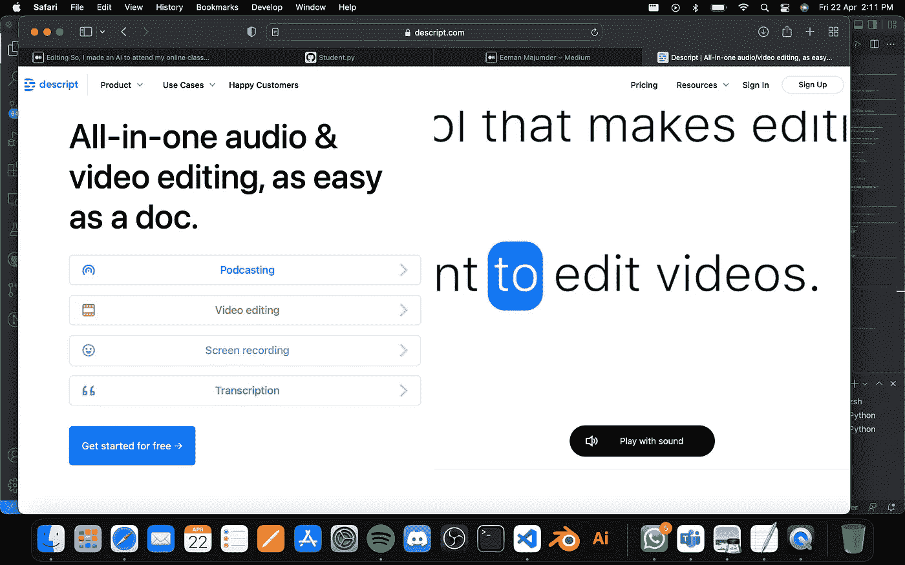
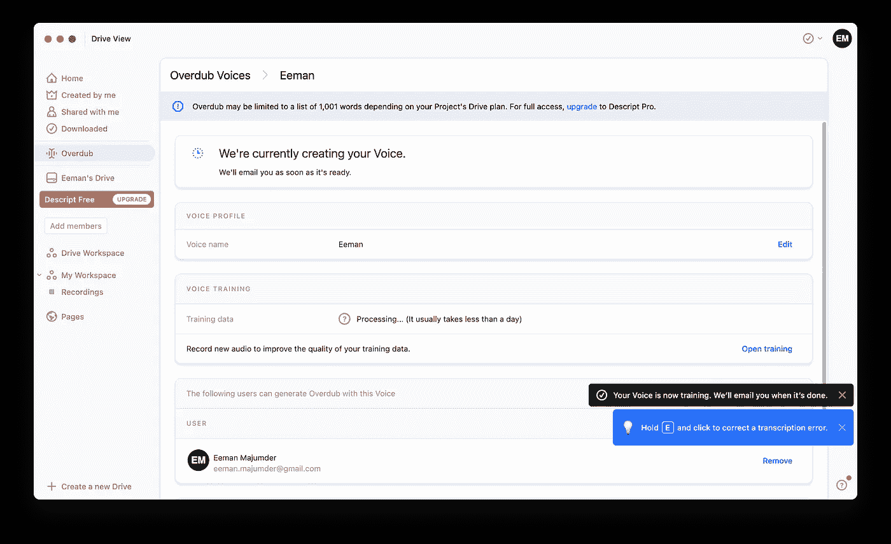
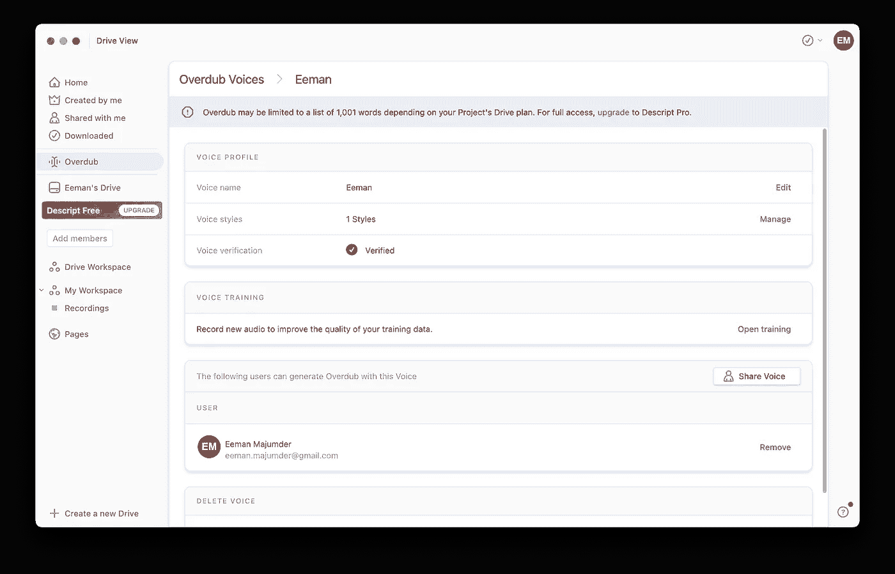
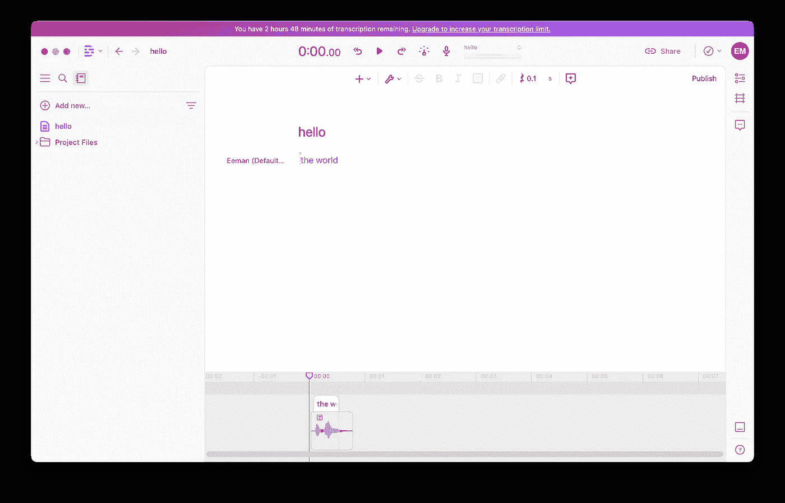
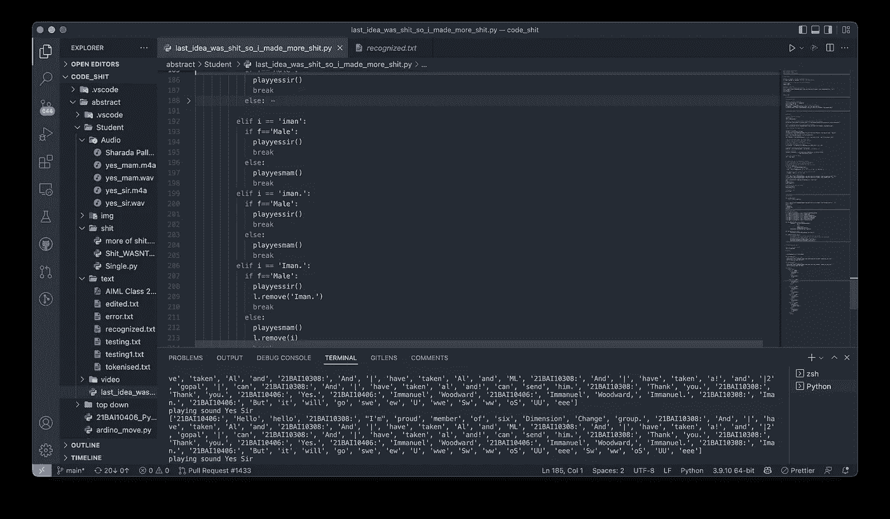

# 所以，我做了一个人工智能来帮我参加在线课程。

> 原文：<https://medium.com/geekculture/so-i-made-an-ai-to-attend-my-online-classes-for-me-ab2e0ad650c?source=collection_archive---------2----------------------->

我们都知道参加网络课程一段时间后会变得多么无聊。所以，我做了一个人工智能来帮我照顾他们。

所以，让我们开始讨论人工智能需要做什么:

These are the things I roughed up the AI needs to do

让我们看看人工智能如何从类中获取数据？

所以从上面的图片中，我希望你能了解数据收集工作的基本要点。

**让我们从数据收集和处理开始:**

首先，让我们从我们需要的安装开始:

现在让我们开始设置，比如设置我们需要的所有代码:

you will know why we need gender or teacher later in this article

现在让我们开始截图部分:

suppose this is my screen so upon running the code

This is the screenshot

现在，让我们获取这张图像，并使用 OpenCV 对其进行预处理，以进行 tesseract OCR:

所以，基本上上面的代码所做的就是把截屏图像变成负片，这样黑色变成白色，白色变成黑色，然后检测文本并在原始图像上围绕它画矩形。

Negative image

original image with rectangles

现在图像可以进行 OCR 了！！

**OCR 代码为:**

所以，上面的代码基本上是对预处理的图像使用 OCR，并将输出粘贴到一个文本文件中，从而制作一个文档，记录课堂上所说的内容。这是我在大学 AIML 班上得到认可的文件:

 [## 4 月 20 日，2022.pdf

### 编辑描述

drive.google.com](https://drive.google.com/file/d/1o-y0zwNRN9gUmohMEnxa8cWPp2Lzhx_A/view?usp=sharing) 

正如你所看到的，OCR 是如此之快，它扫描句子不止一次，甚至在他们完成之前(我正在解决这个问题)。

现在让我们将每个单词作为一个列表的元素，这样遍历它就更容易了:

**现在我们有了一个列表，让我们浏览单词，看看教授是否说了我的名字，并根据老师的性别回答“是，先生/是”**

所以，现在在上面的程序中，正在发生的事情是遍历包含所有单词的列表并搜索我的名字“Eeman ”,但由于它是标题，所以老师说它的方式可能会有变化，所以它检查拼写 Eeman 的所有可能的拼写。现在，一旦找到我的名字，它就会根据老师的性别播放预先录制的“是，先生”或“是，女士”的声音。

**现在让我们进入音符部分:**

它想做的事情之一是在课程结束时总结课堂上发生的所有事情。

**首先让我们用 GPT-3 做一个:**

因此，在上面的代码中，它从我的 google drive 中获取 recognised.txt 文件，将其转换为一个列表，并将其转换为 4001 个令牌的数据包，然后通过 GPT-3 传递它。然后人工智能会提取文本并对其进行总结。

**现在让我们试试 GPT-尼奥方法:**

所以，GPT-3 是付费的，我穷，免费试用结束了，所以让我们在 GPT-尼奥做一个替代版本，因为它是免费的🙂

下面是几乎相同的代码:

我的笔记已经完成了一部分。

**人工智能如何静音和取消静音:**

所以，人工智能知道什么时候说“是，先生/是，女士”,但它不知道如何静音。

我屏幕上静音/取消静音按钮的准确坐标是这样的:

1223 X 22

代码非常简单，如下所示:

Using MacOs so code is so long

现在我的 AI 可以在需要的时候静音/取消静音。

现在我们需要我的声音，因为我的人工智能需要用我的声音说话:

为此，我将使用[描述](https://www.descript.com)。这是一个神奇的工具，用来复制你的声音，并让它说出你想要的。(吓人但是牛逼)。

[Descript](https://www.descript.com)

creating my voice over dub

这个过程需要时间，所以你必须等待🙂让我们等待…

Still waiting 🙂

这比我预期的要花更多的时间。

Its done!!!

Text can be said in my voice using the app in our case we use the API

一旦完成，我就有了自己的声音，并用它让我的人工智能说出我想说的任何话！

**让我们从问题检测和回答部分开始:**

让我们从从我的驱动器中获取 recognised.txt 文件开始:

让我们下载所需的库:

让我们创建一个名为 line-maker 的函数，将行划分为列表的元素:

现在让我们使用这个函数:

现在让我们用谷歌搜索句子并找到答案:

对于创造性的问题，让我们用 GPT-尼奥来回答:

现在我们的人工智能可以回答问题了。

这段代码到此结束。我打算拍一部续集，我想用 3d 和更可信的人工智能来做一些事情。所以，敬请关注。

这是我的人工智能参加我的课程的录音，它很有效，让我参加了😁：

我忘了录一堂真正的课。所以，这是我朋友做的一个样本类。

[The Video](https://youtu.be/2jTXy0eOxmo)

我会制作一个更好的视频，并尽快发布。

这很有效。！！！

如果你喜欢这篇文章，欢迎关注 medium😁

有关代码，请点击此处:

 [## GitHub-eeman 1113/AI _ to _ attend _ my _ online _ classes

### 此时您不能执行该操作。您已使用另一个标签页或窗口登录。您已在另一个选项卡中注销，或者…

github.com](https://github.com/Eeman1113/AI_to_attend_my_online_classes) 

请在 twitter 上关注我的每日 AIML 研究动态:

感谢阅读，下周见👋🏼。

**这部电影会有续集，所以请关注我，当它上映时我会得到通知，那部会比这部好得多，所以请继续关注😁**

 [## Eeman Majumder - Medium

### 阅读 Eeman Majumder 在媒体上的文章。一个编码爱好者。主要关注人工智能的发展。目前就读于…

medium.com](/@eeman.majumder) 

这是一个小小的人工智能剧透来参加我的在线课程(续集)😉：

The face is in making yet