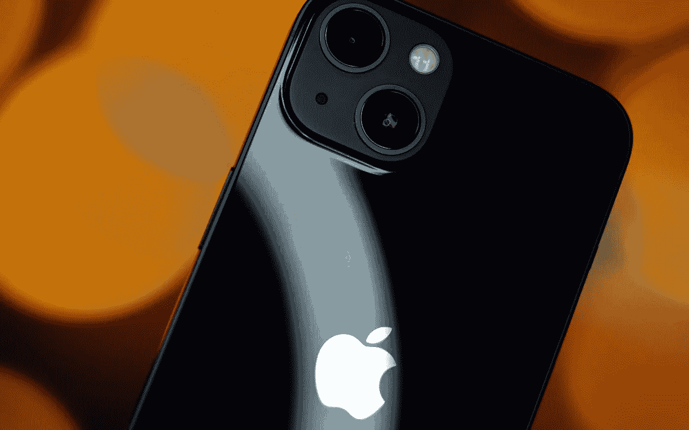

# 你说，现在 iPhones 似乎没那么贵了？

> 原文：<https://medium.com/geekculture/so-iphones-dont-seem-all-that-expensive-now-you-say-a01201367997?source=collection_archive---------5----------------------->

## 长期支持很重要，以下是它如何在智能手机市场下滑的情况下改变事情

The smartphone market is already seeing a notable decline in sales worldwide because of the current economic climate — and it’s Apple that could help consumers weather the recession coming in the most meaningful way possible. (Image: Nilay Patel, Unsplash)

无论如何，2022 年似乎并没有以积极的方式开始——另一波 COVID 浪潮席卷了许多国家，俄罗斯入侵乌克兰都发生在第一季度——但现在看来我们…