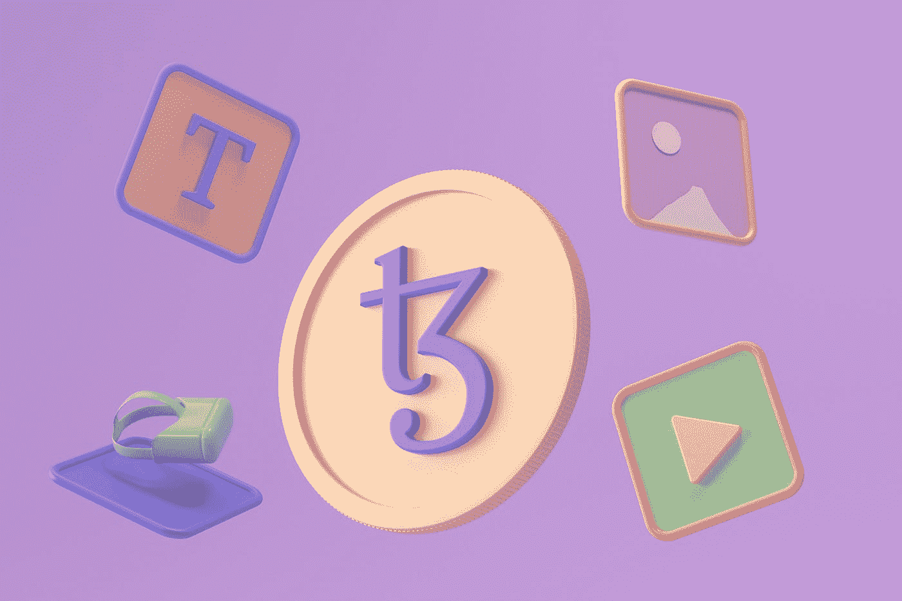

# 那么，什么是 NFT，为什么每个人都对它们如此着迷

> 原文：<https://medium.com/geekculture/so-just-what-are-nfts-and-why-is-everyone-so-obsessed-with-them-289e9bc354c5?source=collection_archive---------4----------------------->

## 尽可能简单地解释区块链热

Photo by [Tezos](https://unsplash.com/@tezos?utm_source=medium&utm_medium=referral) on [Unsplash](https://unsplash.com?utm_source=medium&utm_medium=referral)

随着区块链背后的技术不断改进，每个人对虚拟资产的普遍看法也开始转变。

企业和创业公司开始采用加密货币作为支付方式。政府是…