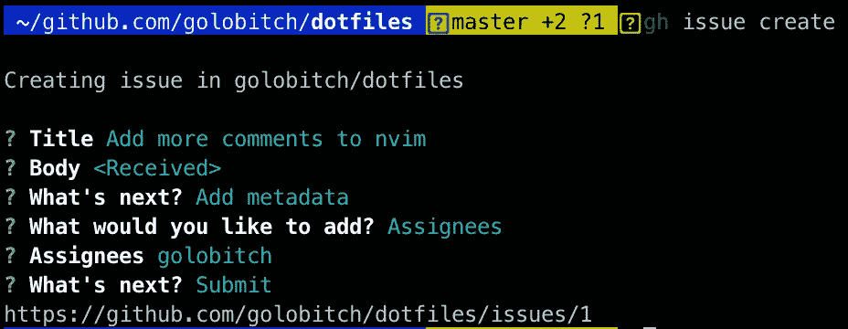
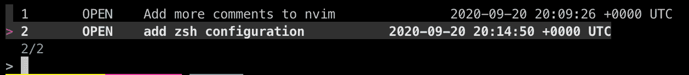
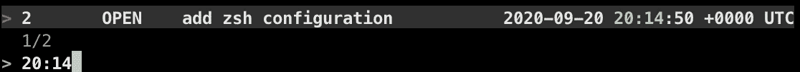
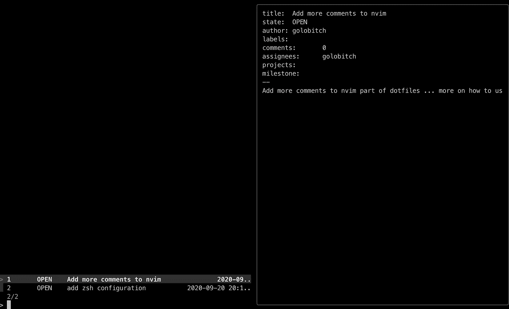

# GitHub CLI 与 fzf 结合使用

> 原文：<https://medium.com/geekculture/so-lets-talk-about-github-cli-5155f299d88c?source=collection_archive---------0----------------------->

那么，让我们来谈谈 GitHub CLI。上周，2020 年 9 月 17 日，GitHub 发布了其 CLI 工具的首个稳定版本。该工具可以帮助我们创建和列出拉动式请求，我们还可以创建新问题、列出问题等。让我们在实践中检验一下，这个工具能做什么。

首先，我们需要安装它。在 macOS 上，事情很简单:

```
brew install gh
```

接下来，您需要做的是身份验证。您可以使用两种不同的方法进行身份验证。

*   凭证认证
*   GitHub 令牌认证(必须设置 env 变量)

首先，让我们选择类型，并运行以下命令

```
gh auth login
```

系统会提示您选择要登录哪个帐户，以及如何进行身份验证。我将把这一部分留给您来决定如何进行身份验证。

现在我们已经通过了认证，让我们来看看更有趣的东西:)

让我们创建我们的第一期。要创建问题，我们必须运行以下命令

```
gh issue create
```

我认为这个命令是不言自明的:)你会被提示输入标题，正文，然后你会选择如果你想添加一些元数据，如受让人等。最后，提交。



Created issue with gh

继续，创造一些其他问题。完成后，您可以使用以下命令列出您的问题:

```
gh issue list
```

如果您想查看具体问题，只需运行以下命令

```
gh issue view #numberOfIssue
```

我们可以通过拉取请求来完成所有这些事情。只需输入 pr 关键字，而不是 issue 关键字，一切都会变得很有魅力。

但是让我们面对它，我们不想看到问题列表，特别是如果有数百个问题。我们想搜索这个问题或拉请求。fzf 工具来了。我爱上了这个工具。如果您不知道这个工具，请查看一下。但这是 fzf 工具的快速介绍:

> fzf 是一个通用的命令行模糊查找器。这是一个交互式的 Unix 命令行过滤器，可用于任何列表；文件、命令历史、进程、主机名、书签、git 提交等。

让我们试着把 gh 和 fzf 结合起来。我们可以搜索这样的问题

```
gh issue list | fzf
```

这会给你这样的东西



gh issue list in combination with fzf

所以现在，你只要去开始打字。所有这些的美妙之处在于，你可以通过状态(开放)、标题或日期进行搜索。去试试吧。


Search by title



Search by date

这不是很棒吗？确实是，但是对我们没有大的好处。我们需要在终端中看到问题，我们想打开这个问题等。我们可以像这样使用 fzf 的预览选项

```
gh issue list | fzf --preview "gh issue view {-1}"
```

使用此命令，我们能够预览问题。我们仍然可以搜索问题，但是我们也将能够看到关于这个问题的更多信息



gh issue with fzf preview

但是如果您愿意，也可以在浏览器中打开该问题，如下所示:

```
gh issue list | fzf --preview "gh issue view {+1}" | awk '{print $1}' | xargs gh issue view --web
```

由于 fzf 正在返回问题(您在 fzf 中看到的行)，我们需要提取问题编号(第一列)并将其传递给 gh 问题视图命令。要在浏览器中打开问题，我们必须将 web 开关附加到命令中。

正如我之前已经说过的，您也可以通过拉请求来实现这一点。要检查拉请求中的所有差异，可以使用以下命令:

```
gh pr list | fzf --preview "gh pr diff --color=always {+1}"
```

现在，您应该清楚这一行是做什么的了。没什么特别的。它只是预览拉取请求中的更改。我还没有在大型拉取请求上测试过这一点。

我相信这个工具将帮助我节省一些时间来创建 PR、创建发布等。但还是有些东西是我想拥有的。我想用(n)vim 代替 nano 来写 issue body。我还想有一些选项，看看什么文件/提交在两个版本之间发生了变化，等等。但是这只是一些小事情，并不能抵消第一个稳定版本中所有好的东西。