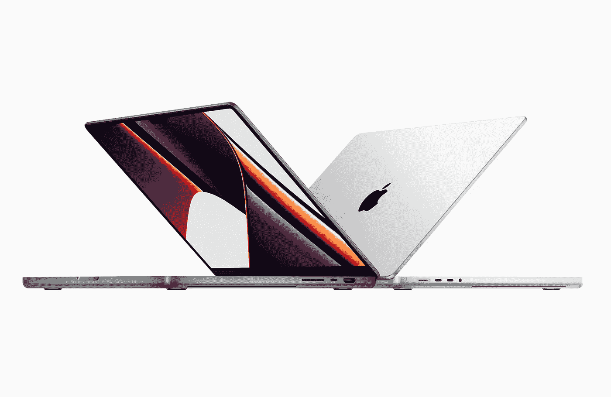
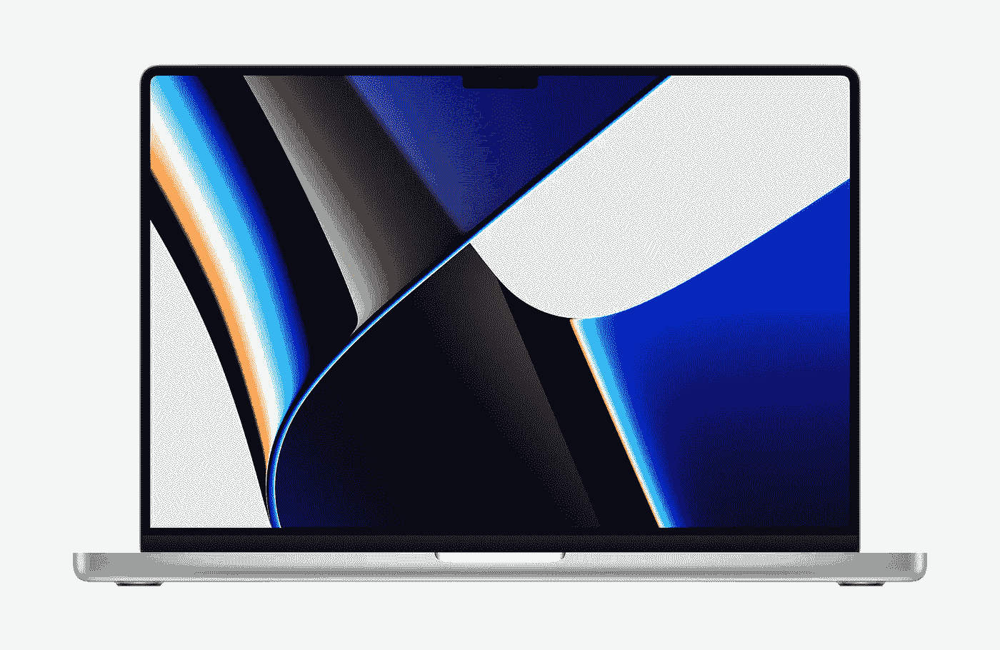
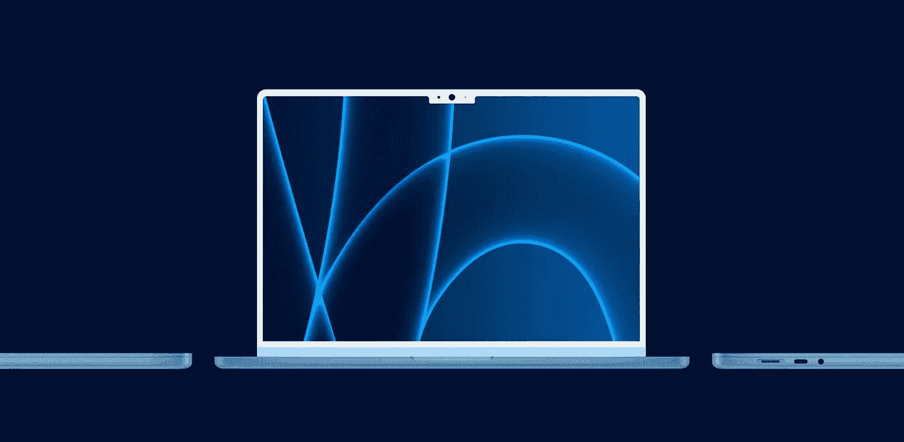
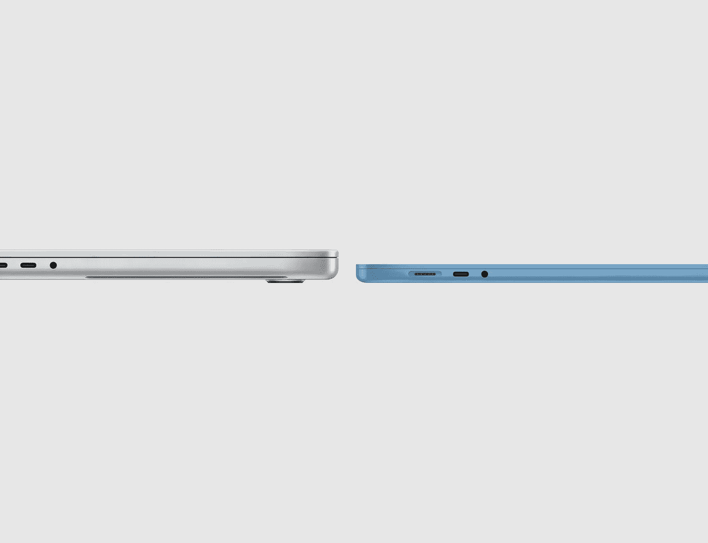
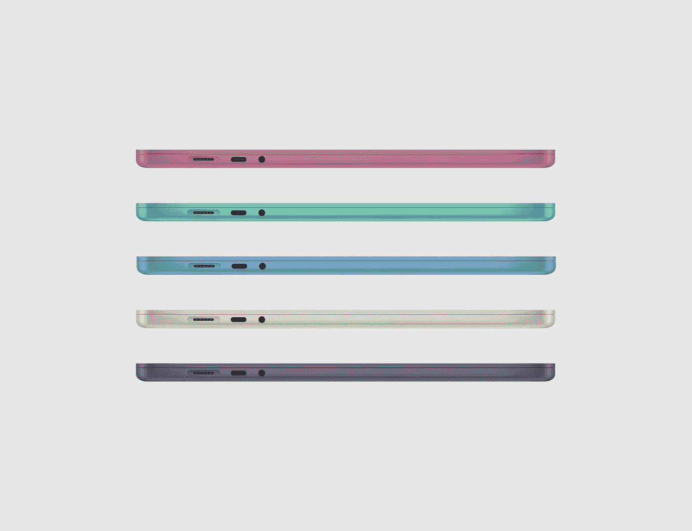
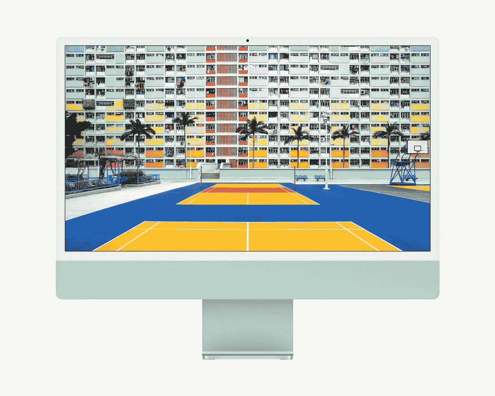

# 那么 2022 年 Mac 的下一步是什么？

> 原文：<https://medium.com/geekculture/so-whats-next-for-the-mac-in-2022-2c5ad3a62e9a?source=collection_archive---------12----------------------->

新款 MacBook Pro 和 iMac 引领潮流。

今年我们终于得到了大家期待多年的 MacBook，全新的设计，新的 M1 Pro 和 M1 Max 硅芯片，新的 XDR 显示器，当然还有新的价格。

这是一个漫长的 5 年，但我们终于得到了名副其实的 MacBook Pro，以及 HDMI 和 SD 卡插槽等端口的回归。苹果还给了我们两个型号(14 英寸和 16 英寸)，配有 120 赫兹迷你 LED 显示屏，微型挡板和 MagSafe returned。

**The new MacBook Pro**

我们今年还推出了配有苹果 M1 的全新 24 英寸 iMac，全新的设计和颜色，适合那些想要出色桌面体验的人。

**The new iMac**

那么，苹果将何去何从？

让我们先从 MacBook 系列和 MacBook Air 开始，MacBook Air 最后一次更新是在 2020 年，采用了 M1 芯片，它的电池寿命和性能都很好，价格为 999/ 999 美元。

我的问题是，这是一个旧的设计，与同价位的其他笔记本电脑相比已经相当过时了。苹果将他们所有新的强大的硅芯片植入旧的 MacBook Air，尽管它的内部很棒，但它看起来与旧的英特尔 MacBook 没有任何不同。

现在，MacBook Pro 得到了彻底的重新设计，据报道，Air 将在 2022 年得到同样的待遇。

我们应该期待更薄的边框和更符合 MacBook Pro 的设计，但更薄更轻，迷你 LED 显示屏，轻微规格凸起的 M2 芯片和多种颜色可供选择。就我个人而言，如果报道属实，这将是我的日常笔记本电脑，它们符合这些从[9 到 5mac](https://9to5mac.com/2021/10/22/concept-how-a-new-macbook-air-could-adopt-the-best-parts-of-the-imac-and-macbook-pro/) 的伟大渲染。

**MacBook Air concept** by [9to5mac](https://9to5mac.com/2021/10/22/concept-how-a-new-macbook-air-could-adopt-the-best-parts-of-the-imac-and-macbook-pro/)

iPhone 和 iPad 系列目前支持的锐利工业外观在 MacBook Pro 上得到了调整，使其更柔软，具有弯曲的边缘和平坦的侧面，我预计 MacBook Air 也将获得这种新的设计语言，甚至可能是下一代 iPad Pro 和 iPhone 14，因为它感觉更像是一种设计进化，而不是设计大修。

当然，白色边框和凹口不是每个人的口味，但苹果喜欢让他们的产品脱颖而出，如果这些泄露是真的，它肯定会这样做。

**The new MacBook Pro industrial design with MacBook Air concept** by [9to5mac](https://9to5mac.com/2021/10/22/concept-how-a-new-macbook-air-could-adopt-the-best-parts-of-the-imac-and-macbook-pro/)

由此看来，苹果正在为 MacBooks 和 iMacs 的低端机型创造一种独特的设计，就像他们对 iPhone 和 iPad 所做的那样。

看着这些报道，我绝对会喜欢 iPhone 13 和 Apple Watch Series 7 上的新午夜色 MacBook。

**Possible new MacBook Air colours, Pink, Green, Blue, Starlight and Midnight** by [9to5mac](https://9to5mac.com/2021/10/22/concept-how-a-new-macbook-air-could-adopt-the-best-parts-of-the-imac-and-macbook-pro/)

目前，iMac 有白色挡板，并有多种颜色，而 MacBook Air 据传也有相同的颜色，但 iMac Pro 将与 MacBook Pro 搭配黑色挡板和经典的太空灰或银色。

**iMac with white bezels**

为了进一步区分机型，我希望 MacBook Air 去掉“Air”这个名字，只叫 MacBook 来搭配 MacBook Pro，而 iMac 和 iMac Pro 在名称上已经完美地排列在一起了。

iMac Pro 最有可能类似于 iMac，但更大，配有 27 英寸迷你 LED 显示屏和 120 赫兹刷新率，它应该也配有 M1 Pro 或 M1 Max 芯片。

新产品通常会涨价，新款 MacBook 的起价可能为 1299 美元/ 1199 美元，而 MacBook Pro 目前的起价为 1999 美元/ 1899 美元。然而，iMac 系列有点难以预测，因为 iMac 的起价为 1299 美元/ 1249 美元，所以下一代 iMac Pro 也可能是 1999 美元/ 1899 美元，但如果稍微高一点也不要惊讶。

2020 年的 MacBook Pro、MacBook Air 和采用 M1 芯片的 Mac mini 预计都将继续作为价格较低的低端入门级 Mac 电脑存在，因此学生或临时用户不希望价格过高。

所以你有了它，快速展望和一系列令人惊叹的规格，新设计的设备可供选择，我们可能会在 2022 年 3 月第一次看到这些机器。

Mac 系列的未来看起来非常光明，设计和内部功能都是行业领先的，我迫不及待地想在 2022 年拿到下一台 MacBook。

*所有宣传图片来自苹果，概念和渲染来自* [*9to5mac*](https://9to5mac.com/2021/10/22/concept-how-a-new-macbook-air-could-adopt-the-best-parts-of-the-imac-and-macbook-pro/) *。*