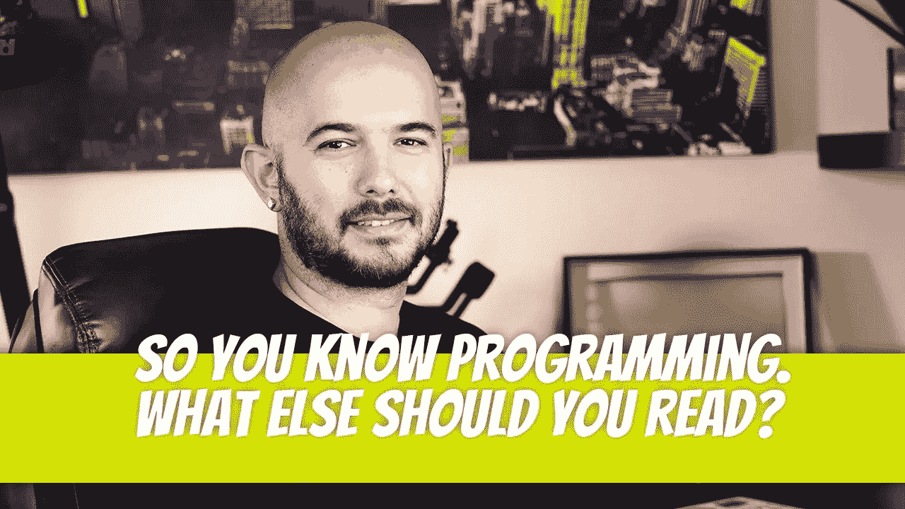

# 原来你懂编程。你还应该读什么？

> 原文：<https://medium.com/geekculture/so-you-know-programming-what-else-should-you-read-20860cf37b9c?source=collection_archive---------15----------------------->

作为软件开发人员，学习永远不会停止。如果你最近刚学会如何编程，你可能会问自己还应该读些什么。还有什么好学的？更多…相信我。下面是我个人推荐给初级到中级开发人员的一些书籍，除了他们的常规编程内容之外。