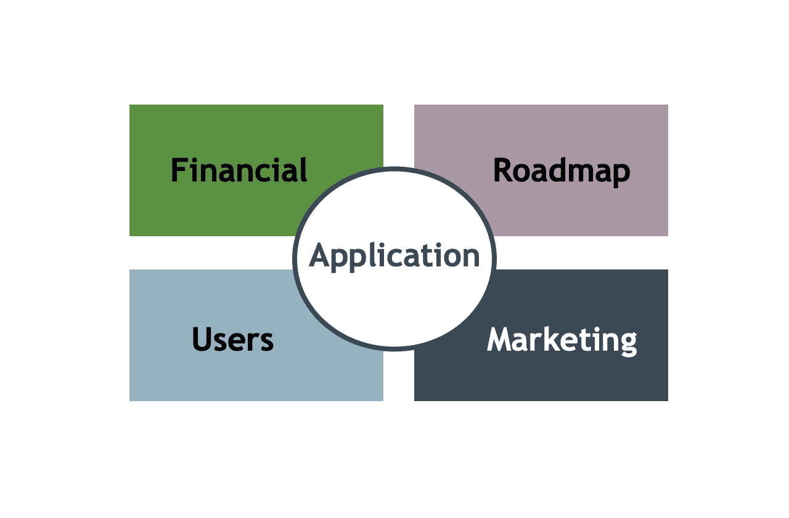

# 所以你想做一个 app？

> 原文：<https://medium.com/geekculture/so-you-want-to-make-an-app-240ec4e8373d?source=collection_archive---------13----------------------->

## 了解如何规划应用程序的开发！

Image by Author

大约一个月前，我使用亚马逊的 Kindle Direct Publishing 发布了我的“[构建你的个人元数据日志](https://www.amazon.com/dp/B09H96YNR6)”，这是一个帮助人们开始构建第二个大脑的模拟工具。这是我创作旅程中的一大步。我的一个朋友伸出手问我…为什么我的手机上没有这个？