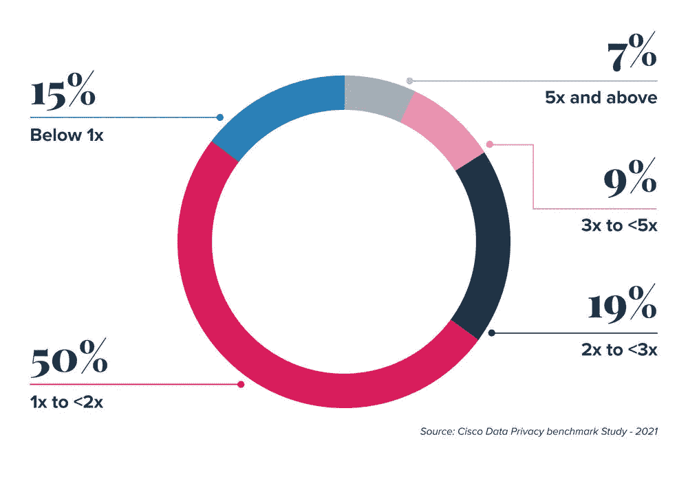

# SOC 2 认证:它是什么以及我们为什么获得它

> 原文：<https://medium.com/geekculture/soc-2-certification-what-it-is-and-why-we-got-it-eb97697cba87?source=collection_archive---------18----------------------->

有很多方法可以从数据中获得乐趣。可用信息的广度会导致一些令人发指的分析，比如 [**为什么素食者错过的航班少**](https://www.youtube.com/watch?v=NOrZ-uuBkbA) 或者著名的 [**虚假相关性**](http://www.tylervigen.com/spurious-correlations) 网站。在 ThinkData，我们庆祝有趣的事情，但我们也严肃对待严肃的事情。这就是我们优先考虑获得 SOC 2 认证的原因。

## 数据安全不能也很好玩吗？

这是一个公平的观点，数据安全可以很有趣——只要你站在胜利的一方，遵循规则和最佳实践。否则，事情会变得不那么有趣。从全球平均水平来看，[**2020 年数据泄露**](https://www.ibm.com/security/digital-assets/cost-data-breach-report/#/) 的成本为 386 万美元，具体到美国，为 864 万美元。

企业正在意识到这种需求，因为从防御立场投资数据和人工智能的公司比例增加了近两倍，风险缓解可能是一个驱动因素。

## 数据安全要花多少钱？

我们已经看到了忽视数据安全的代价——但是实施这些复杂的系统和规则肯定是有代价的，对吗？

绝对有。但更重要的是结果。根据思科的一份报告，投资安全的好处是，公司在 2020 年看到了 1.9 倍的隐私支出投资回报。

## 什么是 SOC 2 认证？

美国注册会计师协会 [**创立了服务和组织控制(SOC)标准来衡量公司。对于组织如何管理和响应问题、维护机密性和隐私、处理数据并确保其完整性，有专门的、特定于公司的标准，以及许多其他以流程为中心的组件。**](https://www.aicpa.org/)

在接受评估时，公司必须证明他们达到并超过了美国注册会计师协会根据其信托服务标准制定的标准。这些标准的五大类别是:隐私、安全性、可用性、处理完整性和机密性。

## SOC 2 认证为什么重要？

信任是获得 SOC 2 认证的最好理由之一。当服务提供商通过认证流程后，经验证明他们正在遵循行业最佳实践，并且他们有适当的协议来确保其服务的整体质量和安全性。

标准化和记录内部程序还有一个额外的好处。例如，对于公司来说，正式编纂他们的事件管理协议和隐私标准是一个很好的练习，这样就有了一个黄金标准，并有了一个在入职过程中指引新员工的地方。

## 什么是信托服务标准？

信托服务标准(TSC)是公司为满足 SOC 2 认证要求而必须满足的个人标准。TSC 分为几个类别，乍看之下可能有些模糊，但肯定是相互关联的。这五个类别中的每一个都定义了评估标准的特定部分。

**安全**:采取保护措施，确保没有未经授权的信息或系统访问，包括未经授权的信息泄露。安全性还确保系统免受损害，以免损害公司在保持其他 4 个类别标准的同时实现其目标的能力。

**可用性**:简单来说，需要有一种方法让组织的特权成员访问信息。最终的安全将是一个埋在地下几千英里的硬盘，没有人能够访问。可用性确保信息实际上是可用的。

**处理完整性**:每一项评估都是针对申请人的具体业务和运营方法量身定制的，但总体而言，流经组织的信息需要完整、准确、有效和最新，并且组织必须具备处理这些信息的基础。

保密性:敏感信息必须以支持组织目标的方式得到保护。这相当简单——申请人需要证明他们能够以保密的方式处理机密信息。

**隐私**:这一类别主要涉及个人信息的处理，确保组织有访问这些信息的法律依据。他们必须以适当的方式收集、使用、保留和丢弃信息，以满足隐私要求。

## ThinkData Works 为什么获得 SOC 2 认证？

我们合作的组织跨越了广泛的行业，随之而来的是广泛的需求。对我们来说，能够证明我们遵循了行业最佳实践非常重要，而做到这一点的最佳方式是通过第三方评估。

通过满足 AICPA 制定的严格要求，我们可以轻松地证明我们已经制定了在企业层面开展业务所需的适当协议、基础设施和保护措施。

SOC 2 认证的重要部分是它被接受为行业标准。当有人想开车时，他们要通过考试才能拿到驾照。同样，我们获得了“许可证”,表明我们知道如何负责任地经营我们的业务，并在适当考虑信息的保护和完整性的情况下处理信息。我们能每次都向每个客户逐项证明吗？当然——但 SOC 2 是有效证明这一点的标准方法。

## 数据安全是关键

我们坚信，在任何数字化转型工作中，首先要考虑的都应该是数据保护。当涉及到交付车辆或团队时，可以找到变通办法和支点，但是安全性必须是坚定不移的。

我们的希望是当前和新的法规引导每个行业走向负责任的数据管理标准。它允许公司建立消费者信任，保护他们的业务，并确保负责任地使用和管理 [**数据**](https://blog.thinkdataworks.com/data-governance-the-next-big-thing-in-business-strategy) ，避免代价高昂的罚款。

ThinkData 的平台旨在确保使用它的组织拥有巩固其数据安全实践的工具，包括驻留要求、访问控制和审计功能。我们的工具为前面提到的巨大投资回报做出了贡献，我们对此感到非常自豪。

我们正在构建支持可持续数据运营的工具，通过 SOC 2 认证，我们很高兴地说我们言行一致。

您的企业是否需要一个数据目录来查找、理解和使用可信数据来推动业务成果？[**伸出手**](https://www.thinkdataworks.com/contact) 开始学习如何从组织中的每一个数据点获得更多价值。

*原载于*[*https://blog.thinkdataworks.com*](https://blog.thinkdataworks.com/soc-2-what-it-is-and-why-we-got-it)*。*