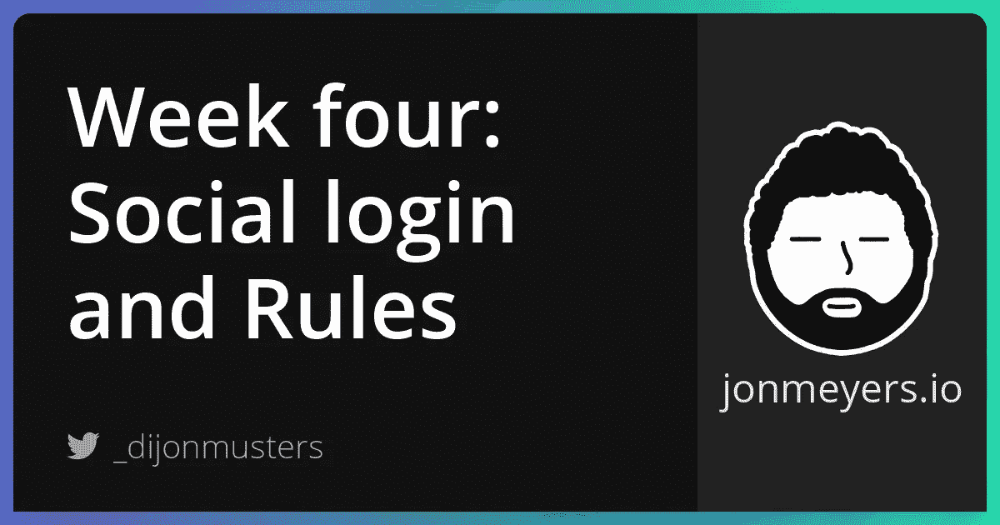
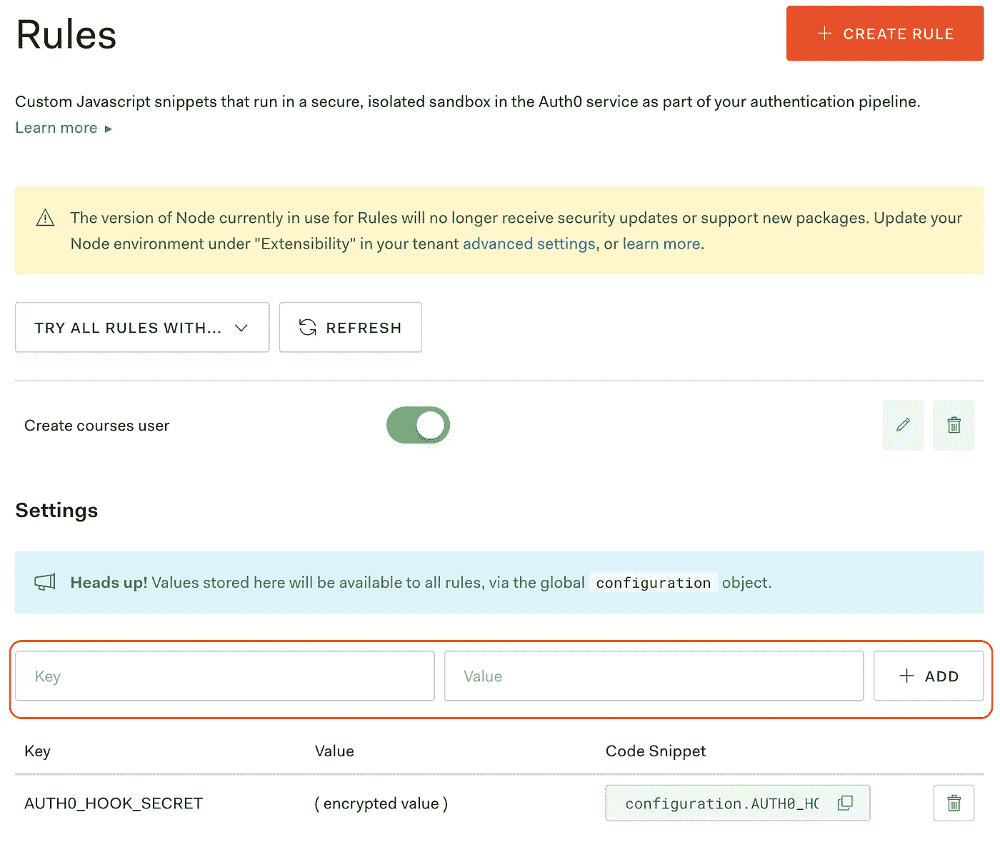

# 构建 SaaS 项目第四周:使用 GitHub 和 Auth0 规则进行社交登录

> 原文：<https://medium.com/geekculture/social-login-with-github-and-auth0-rules-9d6ca2f66347?source=collection_archive---------18----------------------->

## 这个星期都是关于 Auth0 的牛逼！我们实现了社交登录，因此我们的用户可以使用现有的 GitHub 帐户进行身份验证，而不是为我们的应用程序创建另一个用户名和密码。我们还考虑用 Auth0 实现 webhooks，让我们的 Next.js 应用程序知道新用户何时首次登录！我们可以使用它在我们的 Prisma 数据库中创建一个本地用户来存储附加信息——比如他们已经购买的课程！



[项目回购](https://github.com/dijonmusters/courses)

本周我们来看看如何使用 Auth0 的社交登录来认证 GitHub。我们还设置了 webhooks，以便在新用户登录 Auth0 时在 Prisma 数据库中创建一个本地用户。

## 使用 GitHub 进行社交登录

使用 Auth0 启用不同的社交提供者非常简单。遵循[这一指南](https://auth0.com/docs/get-started/dashboard/set-up-social-connections)来配置一系列社交提供商——谷歌、脸书、推特等。我正要安装 GitHub。

> 默认情况下，Auth0 配置了本地用户名和密码。禁用此项以强制仅登录社交提供商。

## Auth0 挂钩

我们将设置一个 webhook，每当有新用户登录 Auth0 时，它都会向我们的一个无服务器函数发送请求。我们可以在 Auth0 中创建一个规则来做到这一点。

```
async function (user, context, callback) {
  // do some stuff
  callback(null, user, context);
}
```

> 规则是用户登录时 Auth0 将调用的无服务器函数

Auth0 告诉我们登录的用户是谁，给我们一个带有附加数据的上下文对象和一个回调函数，我们可以调用这个函数来继续登录过程。

回调期望的第一个参数是一个错误。如果为空或未定义，它将继续登录过程。如果这个参数是任何真值，它将抛出一个异常并停止登录过程。

> 如果我们不调用回调函数，登录过程最终会超时。

让我们在 Next.js 应用程序中设置一个新的 API 路由来处理来自 Auth0 钩子的请求。

```
// pages/api/auth/hooks.js

module.exports = async (req, res) => {
  const { email } = JSON.parse(req.body)
  // create user in prisma
  console.log('created user')
  res.send({ received: true })
}
```

> 我们需要调用 res.send，以便钩子接收 200 状态代码，并继续进行登录过程。

现在让我们更新我们的 Auth0 钩子，向我们的新端点发送一个请求。我们将提供用户的电子邮件作为我们请求的主体。

```
async function (user, context, callback) {
  await request.post('http://localhost:3000/api/auth/hooks', {
    body: JSON.stringify({
      email: user.email,
    })
  });

  callback(null, user, context);
}
```

> 像分号一样的 Auth0 挂钩——你可以在别处选择你喜欢的，但是最好把它们放在这里！

现在让我们通过登录 Next.js 应用程序来触发挂钩。

## 错误！

问题是这个 Auth0 钩子运行在某个远程 Auth0 服务器上，而不是我们的本地机器上。因此，它不知道什么是 localhost。去营救吧！

## Ngrok

这是一个将互联网上的公共 URL 转发到本地主机(我们的 Next.js dev 服务器)上运行的特定端口的工具。这通常被称为隧道效应。

我们可以使用 npm 安装它。

```
npm i -g ngrok
```

然后转发到端口:3000。

```
ngrok http 3000
```

这将为您提供一个 URL，您可以用它来替换我们的 Auth0 钩子请求中的“http://localhost:3000”。

```
async function (user, context, callback) {
  await request.post('https://0d4d01c96799.au.ngrok.io/api/auth/hooks', {
    body: JSON.stringify({
      email: user.email,
    })
  });
  callback(null, user, context);
}
```

现在，您应该能够通过 Next.js 应用程序的登录流程触发对我们新的 API 路由的请求。

> 当您部署应用程序时，请记住将此设置为您的生产 URL！

您应该看到这个将“创建的用户”注销到终端控制台，但是我们还没有这样做。让我们在 Prisma 中创建新用户。

```
// pages/api/auth/hooks.js

import { PrismaClient } from '@prisma/client'
const prisma = new PrismaClient()

module.exports = async (req, res) => {
  const { email } = JSON.parse(req.body)

  const user = await prisma.user.create({
    data: { email },
  })

  await prisma.$disconnect()

  console.log('created user')
  res.send({ received: true })
}
```

让我们用一个 try，catch 块来包装它，这样如果我们不能创建一个用户，我们仍然可以向钩子发送一个响应，并且不会阻塞认证过程。

```
// pages/api/auth/hooks.js

import { PrismaClient } from '@prisma/client'
const prisma = new PrismaClient()

module.exports = async (req, res) => {
  try {
    const { email } = JSON.parse(req.body)
    const user = await prisma.user.create({
      data: { email },
    })
    console.log('created user')
  } catch (err) {
    console.log(err)
  } finally {
    await prisma.$disconnect()
    res.send({ received: true })
  }
}
```

> 不管我们是否成功地创建了一个用户或者抛出了一个异常，最后的块都将运行。在这里编写清理逻辑有助于[弄干](https://en.wikipedia.org/wiki/Don%27t_repeat_yourself)我们的代码。

现在，每次用户登录时，都会在 Prisma 中创建一个新用户。等等，每次都这样吗？！？！那不行！

## 问题 1:新用户每次登录！

幸运的是，我们还没有推动任何东西。在高流量应用程序中，这可能会让我们损失一些钱！

我们只想在用户第一次登录时创建一个用户，因此，我们需要某种方法来知道我们过去是否成功地创建了一个用户。我们可以公开另一个 API 路由来 ping Prisma 数据库，并确保使用此电子邮件的用户尚不存在，但这将需要从 Auth0 服务器到 Vercel 的另一次旅行。我们不想让用户不必要地等待。

谢天谢地，Auth0 给了我们为用户设置元数据的能力。

我们可以像这样在创建用户后设置元数据。

```
user.app_metadata = user.app_metadata || {};
user.app_metadata.localUserCreated = true;
```

我们需要手动告诉 Auth0 像这样保存元数据。

```
await auth0.users.updateAppMetadata(user.user_id, user.app_metadata);
```

并且可以读取元数据以确保我们想要创建这样的用户。

```
if (!user.app_metadata.localUserCreated) {
  // create prisma user
}
```

完整的规则应该是这样的。

```
async function (user, context, callback) {
  user.app_metadata = user.app_metadata || {};

  if (!user.app_metadata.localUserCreated) {
    await request.post('https://0d4d01c96799.au.ngrok.io/api/auth/hooks', {
      body: JSON.stringify({
        email: user.email,
      })
    });
    user.app_metadata.localUserCreated = true;
    await auth0.users.updateAppMetadata(user.user_id, user.app_metadata);
  }
  callback(null, user, context);
}
```

让我们也将它包装在一个 try catch 块中，以确保我们在抛出异常时做出响应。

```
async function (user, context, callback) {
  try {
    user.app_metadata = user.app_metadata || {};

    if (!user.app_metadata.localUserCreated) {
      await request.post('https://0d4d01c96799.au.ngrok.io/api/auth/hooks', {
        body: JSON.stringify({
          email: user.email,
        })
      });
      user.app_metadata.localUserCreated = true;
      await auth0.users.updateAppMetadata(user.user_id, user.app_metadata);
    }
    callback(null, user, context);
  } catch (err) {
    callback(err);
  }
}
```

太好了！因此，现在只要有用户登录，而我们在 prisma 中没有帐户，它就会调用我们的 API 路由来创建用户。

等等！我们是否有一个开放的 API 路由，可以在我们向它发送请求时创建一个用户？！？那不行！我们如何知道这是来自 Auth0？！？

## 问题 2:我们处理认证的 API 路由没有认证！

好吧，有几种方法可以解决这个问题。您可能会想“这不正是我们拥有 Auth0 库的目的吗？只要把它包装在你大谈特谈的 withApiAuthRequired 函数中就行了！”

由于这是来自 Auth0，而不是我们的 Next.js 应用程序，会话实际上并不存在！

我们需要从 Auth0 钩子手动发送一个秘密值，并验证它在 API 路由中是否存在和正确。这是一个类似于映射到特定用户的 API 键的解决方案。

在规则菜单中，我们可以创建一个新的秘密。



我建议将该值设置为一个长的随机生成的字符串。

现在我们可以像这样在 Auth0 钩子中访问这个值。

```
configuration.AUTH0_HOOK_SECRET
```

让我们将此与我们对 API 路由的请求一起发布。

```
async function (user, context, callback) {
  try {
    user.app_metadata = user.app_metadata || {};

    if (!user.app_metadata.localUserCreated) {
      await request.post('https://0d4d01c96799.au.ngrok.io/api/auth/hooks', {
        body: JSON.stringify({
          email: user.email,
          secret: configuration.AUTH0_HOOK_SECRET,
        })
      });
      user.app_metadata.localUserCreated = true;
      await auth0.users.updateAppMetadata(user.user_id, user.app_metadata);
    }
    callback(null, user, context);
  } catch (err) {
    callback(err);
  }
}
```

现在我们需要更新我们的 Next.js 应用程序。包含该值的 env 文件。

```
// .env

// other secrets
AUTH0_HOOK_SECRET=that-super-secret-value-that-no-one-else-knows
```

并将我们创建用户逻辑封装在一个检查中，以确保值是正确的。

```
const { email, secret } = JSON.parse(req.body)

if (secret === process.env.AUTH0_HOOK_SECRET) {
  // create user
} else {
  console.log('You forgot to send me your secret!')
}
```

整个 API 路线应该看起来像这样。

```
// pages/api/auth/hooks.js

import { PrismaClient } from '@prisma/client'
const prisma = new PrismaClient()

module.exports = async (req, res) => {
  try {
    const { email, secret } = JSON.parse(req.body)
    if (secret === process.env.AUTH0_HOOK_SECRET) {
      const user = await prisma.user.create({
        data: { email },
      })
      console.log('created user')
    } else {
      console.log('You forgot to send me your secret!')
    }
  } catch (err) {
    console.log(err)
  } finally {
    await prisma.$disconnect()
    res.send({ received: true })
  }
}
```

遵循相同的逻辑从[托管在 Vercel，自动部署与 GitHub 和配置自定义域](https://jonmeyers.io/blog/build-a-saas-platform-with-stripe/hosting-on-vercel-automatic-deploys-with-github-and-configuring-custom-domains)添加我们新的 Auth0 秘密在 Vercel-没有这个我们的托管应用将无法工作。

太棒了。就是这样！我们做到了！

现在，每当有新用户登录我们的 Next.js 应用程序时，Auth0 都会通知我们，这样我们就可以在 Prisma 数据库中创建一个用户，以跟踪我们的应用程序所关心的那些额外的数据！

## 跟我来

[网站](https://jonmeyers.io/)

[推特](https://twitter.com/_dijonmusters)

[YouTube](https://www.youtube.com/channel/UCPitAIwktfCfcMR4kDWebDQ)

## 下星期

[使用 Stripe 和 webhooks 处理支付](https://jonmeyers.io/blog/build-a-saas-platform-with-stripe/processing-payments-with-stripe-and-webhooks)